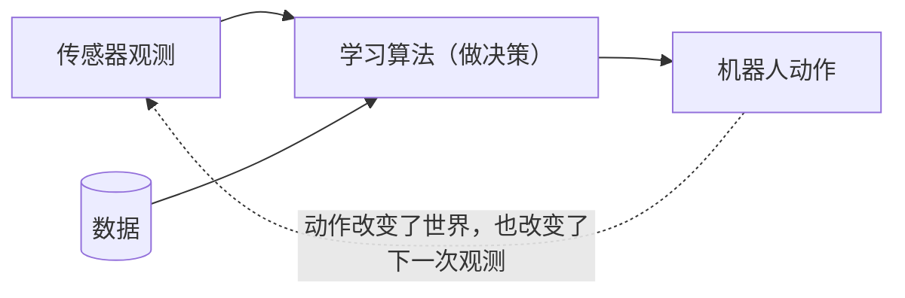
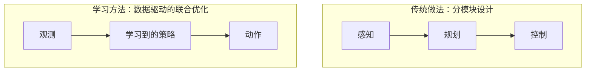

# 机器人学习（一）：是什么、为什么、怎么做

## 1. 什么是机器人学习

一句话定义：**在物理世界中，通过学习来做序列决策**（learning to make sequential decisions in the physical world）。这句话里三个词各有讲究，少一个就变成别的领域了。

**学习**：指方法是数据驱动的，能从数据中不断改进。搜索与规划、经典控制、最优控制 (optimal control) 这类传统方法不依赖数据，就不算"学习"。

**序列**：当前动作会改变下一个状态，从而影响之后所有的决策。图像分类不是序列问题，第一张图分错了并不影响第二张；老虎机 (bandit) 问题也不是，每次拉杆相互独立。下棋、开车才是，每一步都在改变局面。

**物理世界**：机器人要和真实世界闭环交互，这也叫具身智能 (embodied intelligence)。AlphaGo 满足序列性，但棋盘是数字的；大语言模型同理，都不在此列。

三个条件同时满足的例子：四足机器人走碎石路。整个过程是一个闭环：

这条反馈回路是机器人学习和普通监督学习最本质的区别：监督学习是"输入进、输出出"的单向过程，而这里动作会反过来影响输入。

## 2. 难点在哪里

### 2.1 数据的两个根本问题

和 NLP、CV 相比，机器人学习首先要回答两个问题。

一是数据从哪来。网上有海量的文本和图片，却没有大规模的"观测-动作"配对数据；用真机采集又贵又慢，还有摔坏机器的风险。

二是数据怎么用。监督信号是什么？从人类示范里学，从试错里学，还是用事先收集好的数据？这三条路分别对应后面会学到的模仿学习、强化学习和离线强化学习。

### 2.2 GPT 的成功经验能搬过来多少

GPT 这类大模型的配方大致是：Transformer 架构，互联网规模的文本数据，下一词预测 (next token prediction) 作为损失，SGD 优化，自回归 (autoregressive) 生成。

逐项对照到机器人上：架构和优化器可以直接借用；数据是最大的瓶颈，因为不存在互联网级别的机器人数据；损失函数也是开放问题，机器人的"下一个 token"该是动作还是未来状态，目前没有定论；自回归生成在实时控制下可能也太慢。

### 2.3 和游戏里的强化学习有什么不同

DQN 打 Atari、AlphaGo 下围棋都是深度强化学习的标志性成果，但它们都发生在数字世界。同样的思路搬到真实机器人上（比如 OpenAI 用五指机械手转魔方），难度完全不是一个量级。区别可以列成七条：

| # | 游戏 | 机器人 |
|---|------|--------|
| 1 | 环境已知且静态 | 环境未知且动态 |
| 2 | 只做一个任务 | 要应对很多任务 |
| 3 | 目标清晰，奖励明确 | 目标往往说不清 |
| 4 | 离线训练就够了 | 需要在线适应 (online adaptation) |
| 5 | 每一步可以慢慢算 | 要实时输出动作，比如 50 Hz |
| 6 | 失败了可以重来 | 失败代价高，物理世界不原谅错误 |
| 7 | 离散的数字世界 | 连续的状态和动作空间 |

有几条值得展开。第 3 条：围棋赢了就是 +1，但"把房间收拾干净"很难写成奖励函数。第 5 条：50 Hz 意味着每 0.02 秒就要给出一次控制指令，AlphaGo 一步想几分钟的做法行不通。第 6 条：游戏里可以死一百万次，真机摔一次可能就是几万块，还可能伤到人。

## 3. 目标：通用具身智能

机器人学习的终极目标是构建通用具身智能 (general-purpose embodied intelligence)：让机器人能在成千上万种环境里完成成千上万种任务，比如在任何一个厨房做任何一道菜，而不是只能在实验室摆好的桌上抓固定的杯子。

实现路径可以概括为算法、数据、算力、硬件四者的结合。目前的进展是：在特定领域 (domain-specific) 内，不管用不用学习，机器人已经做得相当好；但离"通用"还差得很远。

## 4. 不用学习能做到什么程度

在回答"为什么要学习"之前，先看看传统方法的上限，其实相当高：

- 阿波罗 11 号（1969）：靠最优控制和鲁棒控制 (robust control) 完成登月轨迹，完全没有用到学习。
- Boston Dynamics 的 Atlas 人形机器人：轨迹优化 (trajectory optimization) 加模型预测控制，能跑酷、跳箱子。
- 越野自动驾驶：采样式 MPC，在崎岖地形上高速行驶。
- 高速机械手（Ishikawa Komuro 实验室，2009 年）：高速视觉反馈加经典控制，抓取速度超过人眼。
- MIT 的尾座式飞行器：轨迹生成加非线性控制，能做空中特技。

顺带记一下 MPC (Model Predictive Control，模型预测控制) 的思路：每个控制周期用动力学模型往前预测一小段，解一个优化问题得到动作序列，但只执行第一步，下个周期重新算。有点像开车时不断根据前方几秒的路况微调方向盘。

这些系统的共同点是：物理模型建得准，任务相对固定。满足这两个条件时，传统方法可以做到极致；一旦模型难建、环境多变，就碰到天花板了。

## 5. 那为什么还需要学习

核心理由一句话：数据能抬高算法、算力和硬件的上限。人写不准、写不全的部分，让数据来补。

具体来说，传统方法有五个绕不开的局限：

1. 世界很难精确建模，接触、摩擦、形变这些物理现象写不出准确的方程；
2. 环境和任务会变，而模型是死的；
3. 手工设计的控制器结构表达能力有限；
4. 优化求解器可能陷入局部最优，甚至直接求解失败；
5. 建模时的假设（线性化、刚体等）在现实中经常不成立。

还有一个结构性的问题：传统方案通常把感知、规划、控制三个模块分开设计，各模块目标不一致，误差会一级一级往下传。学习方法可以用数据把整条流水线联合起来优化：

## 6. 方法总览

后面会陆续接触这些方法，先把名字和核心思想对上号：

- 模仿学习 (imitation learning)：从专家示范数据中学策略。
- 无模型强化学习 (model-free RL)：不建环境模型，直接从试错中学。
- 基于模型的强化学习 (model-based RL)：先学动力学模型，再用模型做规划或训练。
- 离线强化学习 (offline RL)：只用事先收集好的数据学，训练时不再和环境交互。
- Sim2Real（仿真到现实迁移）：在仿真里大规模训练，再搬到真机上。
- 在线适应 (online adaptation)：部署之后根据实时数据继续调整。

## 7. 几个思考题

**微波炉算机器人吗？**

用"感知-决策-行动"的闭环来判断。传统微波炉有行动（加热）和很弱的感知（定时器、重量），但不会根据食物的实时状态做序列决策，也不和环境闭环交互，所以更像自动化电器。带红外测温、能实时调功率的智能微波炉才开始有闭环的雏形。这题其实是在问机器人和普通电器的分界线在哪，答案就是有没有闭环的序列决策。

**机器人学习的定义是什么？三个关键词分别排除了哪些方法？**

定义是在物理世界中学习做序列决策。"学习"排除了搜索规划、经典控制、最优控制这些不依赖数据的方法；"序列"排除了 bandit 和标准监督学习；"物理世界"排除了游戏强化学习和大语言模型。

**下面哪些属于物理世界中的序列决策：图像分类、AlphaGo、四足机器人过碎石路、单次广告投放、大模型生成代码？**

只有四足机器人过碎石路。图像分类既不序列也不物理；AlphaGo 和大模型生成代码是序列的，但发生在数字世界；单次广告投放是 bandit 问题，单步决策不影响下一个状态。

**相比游戏里的强化学习，机器人学习难在哪？（至少说四条）**

七条里任选：环境未知且动态；要做多任务；目标和奖励难定义；需要在线适应；要求实时快速动作（如 50 Hz）；失败代价高；状态和动作空间是连续的。

**"数据抬高上限"怎么理解？举两个例子。**

传统方法的上限由人能写进系统的模型和假设决定，数据可以补上人写不出的部分。比如碎石地、雪地上的接触动力学几乎无法精确建模，从交互数据里学到的策略却能隐式掌握；又比如无人机每次飞行的风况和负载都不同，固定模型覆盖不了，数据驱动的在线适应可以边飞边修正。

**GPT 的配方里，哪些能搬到机器人上？最大瓶颈是什么？**

架构（Transformer）和优化器（SGD）能搬；最大瓶颈是数据，互联网上没有大规模的观测-动作数据，真机采集又贵又有风险，仿真数据则存在 Sim2Real 差距。损失函数（机器人的"下一个 token"是什么）和自回归生成的实时性也都是开放问题。