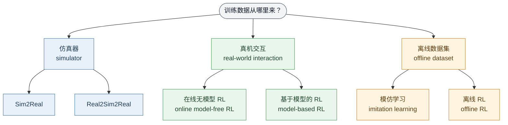
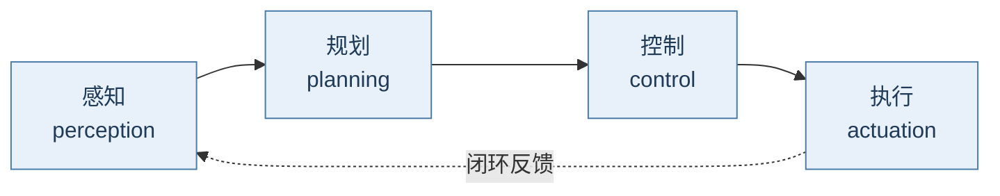

# 机器人学习（二）：现状全景、莫拉维克悖论与课程地图

## 1. 今天的机器人学习走到哪了

上一讲看了不用学习的传统方法能做到什么程度，这一讲换个问题：**用上学习之后，机器人现在到底行不行？** 结论先行：单点上已经有不少惊艳成果，但离通用具身智能 (general-purpose embodied intelligence) 还很远。

上一讲末尾列的六类方法，其实可以用一个问题串起来记：训练数据从哪里来？

在线适应 (online adaptation) 不单独占一格，它是能叠加到任何一条路线上的"外挂"：部署之后继续用实时数据微调。下面按这张图逐条看代表性工作。

### 1.1 纯仿真 (in simulation)

最早一批标志性成果都发生在纯数字世界里：

- 仿真人形运动控制（Schulman et al., 2015/2017——TRPO 和 PPO 这两个策略优化 (policy optimization) 算法就是这里来的），以及 DM Control Soccer 的多智能体仿真足球。
- GT Sophy（Sony AI，Nature 2022 封面）：在赛车游戏 Gran Turismo 里赢下人类冠军车手，而且赢得干净——不碰撞、不恶意阻挡 (fair overtaking)。配方是深度强化学习 (deep reinforcement learning, DRL) + 分布式训练平台 (distributed training platform) + 精心设计的奖励 (reward design)。
- Eureka：仿真五指灵巧手 (dexterous hand) 转笔 (pen spinning)，亮点是用大语言模型 (LLM) 自动写奖励函数，算是"奖励难写"这个老大难的新解法。

小结：仿真器够好、算力够大时，DRL 在数字世界能到超人水平——这是上一讲"游戏 RL 很强"结论的延续。

### 1.2 Sim2Real：仿真训练、真机部署

代表作是 DeepMind 的双足机器人 1v1 足球（2023）：完全在仿真里训练，直接搬到真实的小型人形机器人上，会摔倒爬起、带球、射门。口号就一句：train in simulation, deploy in the real world。

### 1.3 Sim2Real + 在线适应 (online adaptation)

光靠仿真训练不够稳，部署时再加一层实时适应：

- RMA (Rapid Motor Adaptation)：四足机器人边走边在线估计地形、负载这些环境隐参数并即时调整策略，沙地、草地、碎石滩都能走。
- DATT (Deep Adaptive Trajectory Tracking)（CoRL 2023 oral）：无人机轨迹跟踪 (trajectory tracking) 叠加自适应控制 (adaptive control)，扛住未知风扰和负载变化。

### 1.4 Real2Sim2Real：先学一个仿真器

Swift 无人机竞速（Nature 2023 封面，苏黎世大学）走的是另一条路：先采真实飞行数据，学出感知残差 (perception residual) 和动力学残差 (dynamics residual) 去校正仿真器，再在校正过的仿真里训练 DRL 策略，最后部署真机——赢了多位人类世界冠军。

### 1.5 从演示中学习 (learning from demonstrations)

- Mobile ALOHA（Stanford）：便宜的双臂移动操作 (bimanual mobile manipulation) 平台，人先遥操作 (teleoperation) 采集演示，再做模仿学习，之后能自主 (autonomous) 炒虾、擦台面。
- Diffusion Policy：用扩散模型 (diffusion model) 生成动作序列的视觉运动策略 (visuomotor policy)，对演示数据里的多模态动作分布 (multimodal action distribution) 特别管用。

### 1.6 基于模型的 RL (model-based RL)：没有仿真器

没有仿真器怎么办？真机采数据 → 学动力学模型 (dynamics model / world model) → 用模型做规划或训练策略 → 部署。

- Neural-Fly（Science Robotics 2022, Caltech）：元学习 (meta-learning) 出风场动力学表征，加上在线自适应控制 (online adaptive control)，无人机顶着强风精准飞行。
- Iterative Residual Policy：甩绳子这种柔性物体 (deformable object) 写不出解析模型，那就学一个"增量"动力学模型 (delta dynamics model)，迭代地把绳梢甩到目标点。
- MPPI (Model Predictive Path Integral)：深度网络动力学 + 采样式模型预测控制 (sampling-based MPC)，越野小车高速过弯漂移——上一讲提到的越野驾驶就是它。

### 1.7 在线无模型 RL (online model-free RL)：真机从零试错

A Walk in the Park（UC Berkeley）：不用仿真器，四足机器人直接在真实世界从零开始 (from scratch) 学走路，大约 20 分钟学会。样本效率 (sample efficiency) 够高，真机试错就变得可行。

### 1.8 离线 RL (offline RL)

GNM (General Navigation Models)：把多种机器人、多种来源的导航数据攒到一起离线训练，得到能零样本 (zero-shot) 迁移到新机器人的通用导航策略。它和模仿学习最大的区别：不要求数据来自专家 (does not rely on expert data)，混合质量的数据也能用。

## 2. 失败还很多

上面每个 demo 都很帅，但失败合集同样精彩：DARPA 机器人挑战赛（2015）上，人形机器人开个门、下个车就摔倒，堪称大型翻车现场；Atlas 搬箱子也会失手滑倒；Mobile ALOHA 官方自己放出的失败集锦里，锅铲乱飞、酒杯整个被扫到地上。

共同点是：这些任务在人类看来"非常简单" (very simple for humans)。为什么会这样？这就引出——

## 3. 莫拉维克悖论 (Moravec's Paradox)

一句话版本：难的问题容易，容易的问题难 (the hard problems are easy and the easy problems are hard)。

莫拉维克（Hans Moravec，CMU 机器人研究所）1988 年就指出：让计算机在智力测验或跳棋上达到成人水平相对容易，而要让它具备一岁孩子的感知 (perception) 与移动 (mobility) 能力却极其困难、甚至不可能。

进化视角的解释：一种能力被自然选择打磨得越久，我们越觉得它"毫不费力"，对 AI 反而越难——复杂度全被进化藏在底层了。

大众直觉以为难度从左到右递增，实际上对 AI 恰好反过来（红 → 绿 = 由难到易）：语言（LLM 已经很强）< 高层规划 < 底层运动技能。

### 3.1 是硬件的锅吗？

课堂投票：运动控制 (motor control) 难，是因为人类的"电机"远好于机器人吗？

答案很可能是否定的。证据是 Mobile ALOHA：整机很便宜（3.2 万美元以内），自由度 (degrees of freedom, DoF) 也不多——底盘 2 + 双臂 12 + 夹爪 2，一共 16 个。可一旦换人来遥操作，它就能炒菜、浇花、吸地、铺被子。**硬件一点没变，把"算法"换成人脑，能力立刻天翻地覆**——瓶颈显然主要不在硬件。

### 3.2 那能反过来说算法/数据/算力比硬件更重要吗？

也没那么简单 (not that simple)。真正的关键是组件之间的耦合 (coupling)：人类遥操作者理解并利用了硬件结构，把感知-规划-控制-执行 (perception–planning–control–actuation) 跑成了一个紧密的闭环 (closed loop)。

### 3.3 佐证：无人机竞速

- Swift 团队花了 7 年以上才在竞速中击败人类冠军；
- 人类选手看似劣势明显——视觉反馈延迟超过 0.2 秒、通过遥控器"离机" (offboard) 控制——却依然极难战胜；
- 而 AI 只是在一条固定已知的赛道上险胜 (barely wins)，换条赛道就不行（无法泛化, cannot generalize）。

人类强就强在那个浑然一体的感知-规划-控制-执行闭环。

## 4. 认知科学旁证：感知与动作是耦合的

这一讲还引了一串认知科学的证据，核心观点是感知与动作是耦合的 (perception and action are coupled)，大脑本质上是为运动服务的：

- 运动神经科学家 Daniel Wolpert 有个著名论断：大脑存在的唯一目的，就是产生可适应的复杂运动 (adaptable and complex movements)。
- 海鞘 (sea squirt) 是极端例子：幼体阶段在海里游动；一旦附着到岩石上、决定不再移动，就会把自己的大脑和神经系统消化掉——不需要动，就不需要脑。
- 乌鸦投石取食：典型的控制-感知闭环 (control–perception loop)，边观察水位边决定下一步动作。
- 人在自然地形上行走的注视研究（Matthis et al., Current Biology, 2018）：地形越崎岖，视线越紧锁未来两三步的落脚点 (foot placement)——感知实时服务于运动。

但"把感知和控制统一起来"知易行难：感知端是高维输入 (high-dimensional input)，要从原始像素里提炼出有意义事物的低维流形 (low-dimensional manifold)；控制端是高维输出 (high-dimensional output)，搜索空间随步数和动作数指数爆炸；两个一起做，输入输出都高维，难上加难。所以传统方案才切成两段——计算机视觉负责"原始输入 → 显式状态估计 (explicit state estimation)"，机器人学负责"决策 → 原始输出"。

机器人学习在这里的价值有两层：一是统一（或至少打通）感知、规划、控制这几个模块，让它们端到端 (end-to-end) 联合优化；二是在具身 (embodied) 场景里改进每一个单独模块。老师的判断：第二层的进展远多于第一层，真正的统一还是开放问题。

## 5. 课程结构

1. 课程导论：机器人学习是什么、为什么（就是这两讲）。
2. 机器学习 / 深度学习复习 (ML/DL refresher)：快速过一遍范式（监督 / 无监督 / 生成模型 (generative model) / 非参数学习 (non-parametric learning)）、架构（MLP、CNN、ResNet、GNN、RNN/LSTM、Transformer）和优化（GD、SGD），外加不确定性量化 (uncertainty quantification) 这类机器人特别关心的话题。老师声明这不是机器学习课，只讲直觉，细节自己看 DL 教材。
3. 模仿学习 (imitation learning)：它和标准监督学习到底差在哪，以及怎么设计高效好用的算法。
4. 无模型 RL (model-free RL)：从策略迭代 / 价值迭代 (policy/value iteration) 讲起，到 Q-learning 及变体、策略梯度 (policy gradient)、actor-critic，再到实用的深度 RL 算法。
5. 基于模型的控制与 RL (model-based control & RL)：已知模型时的 PID、Lyapunov、LQR、iLQR、DDP、SQP；要学模型时的 CEM、MPPI、NeuralControl；深度 MBRL 的 Dreamer、TD-MPC。客座：Yunzhu Li，讲结构化世界模型 (structured world models)，代表作 RoboCook（CoRL 2023 最佳系统论文）。
6. 离线数据的 RL (offline RL)：动机是在线交互又贵又不安全 (expensive and unsafe)；重点是它怎么学、和模仿学习差在哪，另外会讲逆强化学习 (inverse RL)。客座：Aviral Kumar。
7. 老虎机与探索 (bandit & exploration)：bandit 是最简单的 RL（没有状态），适合从根上理解探索与利用 (exploration vs. exploitation) 的权衡；还会讲基于偏好的学习 (preference-based learning)——没有奖励，只有相对偏好。
8. 专题 (specialized topics)：安全 RL (safe RL)，要求无碰撞、平滑、稳定；多任务 / 自适应 / 可迁移学习，比如目标条件 RL (goal-conditioned RL)；仿真器与 Sim2Real（MuJoCo、NVIDIA Isaac Gym）；LLM 和视觉语言模型 (VLM) 在机器人里的应用，从高层任务规划（VoxPoser）到底层控制（Eureka）。客座：Yafei Hu，讲机器人基础模型 (foundation models) 综述。

