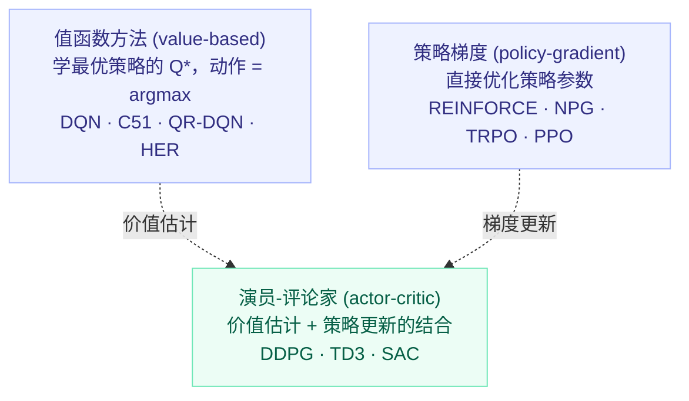
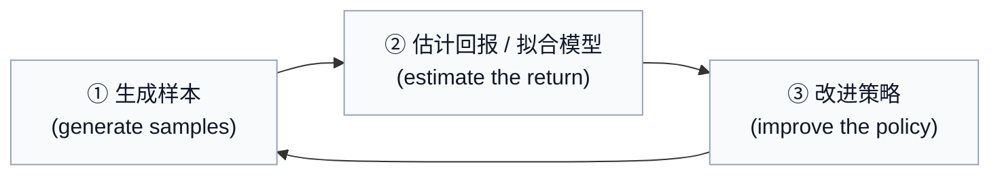
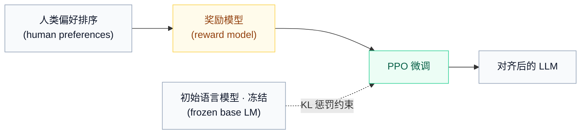

# 机器人学习（十一）：高级 RL 算法——从策略梯度到 PPO

前面几讲把无模型强化学习 (model-free RL, MFRL) 的基本件都摸过了：Q 学习 (Q-learning)、策略梯度 (policy gradient)、演员-评论家 (actor-critic)。这一讲做两件事：先把这些算法放进一张分类图，回答"为什么需要这么多算法"；然后沿着普通策略梯度的毛病，一路推出 **NPG → TRPO → PPO** 这条改进链——也就是今天机器人学习（乃至大模型 RLHF）里的默认算法是怎么来的。

## 0. 开读之前：符号速查与读公式的心法

这一讲公式密度比前几讲高，先把全篇反复出现的符号列成一张表，读的时候随时回来查：

| 符号 | 名称 | 含义 |
|---|---|---|
| $s,\ a,\ r,\ s'$ | 状态、动作、奖励、下一状态 | 一次交互记为四元组 $(s,a,s',r)$ |
| $\pi_\theta(a\mid s)$ | 策略 (policy) | 在状态 $s$ 下选动作 $a$ 的概率；$\theta$ 是策略网络的参数 |
| $\tau$ | 轨迹 (trajectory) | 一整局的完整记录：$s_0,a_0,r_0,s_1,a_1,\dots$ |
| $\gamma$ | 折扣因子 (discount factor) | 0 到 1 之间；越远的奖励打的折越狠，$\gamma^t$ 是第 $t$ 步的折扣 |
| $R(\tau)$ | 回报 (return) | 一条轨迹的折扣奖励总和 $\sum_t\gamma^t r_t$，就是一个标量分数 |
| $J(\theta)$ | 目标函数 (objective) | 当前策略的"平均总分"；训练 = 最大化 $J(\theta)$ |
| $\mathbb{E}_{x\sim p}[\,\cdot\,]$ | 期望 (expectation) | 按分布 $p$ 采很多个 $x$，对括号里的量求平均 |
| $\nabla_\theta f$ | 梯度 (gradient) | 指向"让 $f$ 增长最快"的参数方向；沿它走一步就是梯度上升 |
| $Q^\pi,\ V^\pi,\ A^\pi$ | 动作价值、状态价值、优势 | 见 2.3 节的拆解 |
| $\phi$ | 价值网络参数 | 专门留给 critic / Q 网络用，和策略参数 $\theta$ 区分开 |
| $\alpha,\ \eta$ | 学习率 (learning rate) | 每次参数更新的步长 |
| $\text{s.t.}$ | subject to | "在满足如下约束的前提下" |

读公式的心法就一条：每见到一个期望 $\mathbb{E}$，先问三个问题——**在哪个分布下取平均？平均的对象是什么？谁在当权重？** 本讲所有难点（重要性采样、鸡生蛋问题）本质上都是"期望下标里的分布"在捣鬼。

## 1. 无模型 RL 的三大家族

按"学什么、怎么改进策略"，MFRL 分三类：

- **值函数方法 (value-based)**：估计**最优策略**的值函数 (value function) 或 Q 函数，不显式维护策略，动作由 $\arg\max_a Q$ 隐式给出。代表：FQI (Fitted Q-Iteration)、DQN。
- **策略梯度 (policy-gradient)**：直接对策略参数 $\theta$ 做梯度上升 (gradient ascent)。代表：REINFORCE、NPG。
- **演员-评论家 (actor-critic)**：估计**当前策略**的值函数或 Q 函数（评论家 critic），用它来改进策略（演员 actor）。代表：DDPG、SAC。

一个容易忽略的措辞差别：value-based 学的是最优策略的 $Q^*$，actor-critic 学的是当前策略的 $Q^\pi$ / $V^\pi$——一词之差，机制完全不同。

不管哪一家，训练都在跑同一个三步循环：

三个家族的差别，只在 ②③ 两步怎么填：

| 家族 | ② 估计什么 | ③ 怎么改进策略 |
|---|---|---|
| 值函数方法 | 最优 Q 函数 $Q^*$ | $a=\arg\max_a Q_\phi(s,a)$，策略是隐式的 |
| 策略梯度 | 轨迹回报 $R(\tau)$（蒙特卡洛, Monte Carlo） | $\theta\leftarrow\theta+\alpha\nabla_\theta J(\theta)$ |
| 演员-评论家 | 当前策略的 $V^\pi$、优势 $A^\pi$ | 用优势加权的策略梯度更新 actor |

## 2. 三大家族快速回顾

### 2.1 Q 学习：贝尔曼最优方程

理论根基是贝尔曼最优方程 (Bellman optimality equation)：

$$Q^*(s,a)=\sum_{s',r}p(s',r\mid s,a)\big[\,r+\gamma\max_{a'}Q^*(s',a')\,\big]$$

**怎么读（从里往外）：**

- $Q^*(s,a)$：在状态 $s$ 做动作 $a$、之后一路按最优策略走，最终能拿到的期望总回报——它回答"这步棋值多少分"；
- $p(s',r\mid s,a)$：环境的转移概率——做完这步后，落到新状态 $s'$、顺便拿到即时奖励 $r$ 的概率。前面的 $\sum_{s',r}$ 就是对所有可能结果按概率加权平均（因为环境有随机性）；
- 方括号里是"某一种结果的价值"= 马上到手的奖励 $r$ + 折扣 $\gamma$ × 新状态下继续走最优一步的价值 $\max_{a'}Q^*(s',a')$。

一句话：**这一步的价值 = 即时奖励 + 打折后的未来最优价值**。注意它是递归定义——用未来的 $Q^*$ 定义现在的 $Q^*$，整个 Q 学习家族都在解这个方程。

DQN (Deep Q-Network) 用神经网络 $Q_\phi$ 逼近 $Q^*$，一轮迭代五步：

1. 用 ε-贪心策略 (epsilon-greedy) 选动作 $a$，观测到转移 $(s,a,s',r)$；
2. 存入经验回放池 (replay buffer)；
3. 从池中采一批样本，计算目标 (target)：$y_i=r(s_i,a_i)+\gamma\max_{a_i'}Q_{\phi^-}(s_i',a_i')$；
4. 梯度更新：$\phi\leftarrow\phi-\eta\sum_i\big(Q_\phi(s_i,a_i)-y_i\big)\nabla_\phi Q_\phi(s_i,a_i)$；
5. 每隔一段时间同步目标网络 (target network)：$\phi^-\leftarrow\phi$。

第 3、4 步的式子拆开看：$y_i$ 是"标准答案"，由**旧**网络 $\phi^-$ 按贝尔曼方程右边算出来（把 $y_i$ 当常数、不对它求梯度，这正是目标网络存在的意义）；第 4 步就是最小化均方误差 $\frac{1}{2}\sum_i(Q_\phi(s_i,a_i)-y_i)^2$ 的一步梯度下降——$(Q_\phi-y_i)$ 是预测误差，$\nabla_\phi Q_\phi$ 告诉每个参数往哪儿调能抬高输出，$\eta$ 控制步长。本质是把 RL 不断转化成一个个监督回归 (regression) 小问题。

回放池和目标网络是两件"稳定器"：前者打散样本相关性、让旧数据能反复利用（这正是它离策略 (off-policy) 的来源），后者避免回归目标追着自己跑。

### 2.2 策略梯度：策略梯度定理

目标是最大化期望回报 $J(\theta)=\mathbb{E}_{\tau\sim p_\theta(\tau)}\big[\sum_t \gamma^t r(s_t,a_t)\big]$，即"按当前策略反复开局，折扣总分的平均"。策略梯度定理 (policy gradient theorem) 给出它对参数的梯度：

$$\nabla_\theta J(\theta)=\mathbb{E}_{\tau\sim p_\theta(\tau)}\Big[R(\tau)\sum_t\nabla_\theta\log\pi_\theta(a_t\mid s_t)\Big]$$

**怎么读：**

- 期望下标 $\tau\sim p_\theta(\tau)$：让**当前策略**去跑、收集很多条轨迹取平均——实践中就是"多跑几局求均值"；
- $\nabla_\theta\log\pi_\theta(a_t\mid s_t)$：指向"让策略更愿意在 $s_t$ 选 $a_t$"的参数方向；对 $t$ 求和 = 把这条轨迹里**每一个**动作的"加大概率方向"都叠起来；
- $R(\tau)$ 当权重：这局总分为正，就整体提高这局所有动作的概率；总分为负就统统压低。

像"考完试按总分给整场考试的每个答题动作统一发奖惩"——很粗暴（一局里明明有好有坏的动作被一视同仁），这正是它方差大的原因，也是 2.3 节改进的入口。至于为什么带个 $\log$：数学上有恒等式 $\nabla_\theta p=p\,\nabla_\theta\log p$（似然比技巧, likelihood ratio trick），代入后环境转移概率那部分在梯度里正好消掉——于是**不需要知道环境模型**、只靠采样就能估计梯度，这是策略梯度能成立的关键。

REINFORCE 就是它的蒙特卡洛版本：跑 $\pi_\theta$ 采一批轨迹 $\{\tau^i\}$ → 按上式估计 $\nabla_\theta J$ → 梯度上升 $\theta\leftarrow\theta+\alpha\nabla_\theta J(\theta)$。

### 2.3 演员-评论家：带基线的策略梯度

先把三个价值函数掰开：

- $V^\pi(s)$：站在状态 $s$，按当前策略走到底的期望回报——"这个局面平均值多少分"；
- $Q^\pi(s,a)$：在 $s$ **先做指定动作 $a$**、之后按当前策略走的期望回报——"这个局面下走这步值多少分"；
- $A^\pi(s,a)=Q^\pi(s,a)-V^\pi(s)$：优势 (advantage)——**这步动作比该局面的平均水平好多少**。高于平均为正，低于平均为负。

REINFORCE 拿整局总分当权重，方差 (variance) 很大。改进：减去基线 (baseline) $V^\pi(s)$，改用优势当权重：

$$\nabla_\theta J(\theta)\propto\mathbb{E}_{s\sim p_\theta,\,a\sim\pi_\theta}\big[\big(Q^\pi(s,a)-V^\pi(s)\big)\nabla_\theta\log\pi_\theta(a\mid s)\big]$$

**怎么读：** 期望下标 $s\sim p_\theta,\ a\sim\pi_\theta$ 是说状态来自当前策略实际会到访的分布、动作由当前策略现场给出——还是"自己跑自己学"(on-policy)。和 2.2 的式子相比只换了权重：从"整局总分"换成"每步的相对分"。评分标准从"按全班总分奖惩所有人"变成"按超出平均几分奖惩每个人"，方差立刻小很多。

实践中学一个价值网络 $V_\phi^\pi(s)$（critic），用时序差分 (temporal difference, TD) 误差近似优势：

$$\hat A^\pi(s,a)=r+\gamma V_\phi^\pi(s')-V_\phi^\pi(s)$$

读法：前两项是"实际走了一步之后看到的价值"（真实奖励 + 新局面的估值），最后减去"没走之前的预期"。**惊喜为正、失望为负**——这就是 TD 误差，拿它当优势的近似，只需单步数据、不用等整局结束。

在线演员-评论家 (online actor-critic) 一轮：

1. 执行 $a\sim\pi_\theta(a\mid s)$，得到 $(s,a,s',r)$；
2. 用目标 $r+\gamma\hat V_\phi^\pi(s')$ 更新 critic $\hat V_\phi^\pi$；
3. 估计优势 $\hat A^\pi(s,a)=r+\gamma\hat V_\phi^\pi(s')-\hat V_\phi^\pi(s)$；
4. $\nabla_\theta J(\theta)\approx\nabla_\theta\log\pi_\theta(a\mid s)\,\hat A^\pi(s,a)$；
5. $\theta\leftarrow\theta+\alpha\nabla_\theta J(\theta)$。

## 3. 为什么需要这么多算法

因为没有"完美"的 RL 算法，只有不同的权衡 (trade-off)，选哪个取决于应用：

- **采样效率 (sample efficiency)**：达到同样性能需要多少次环境交互；
- **稳定性与易用性 (stability & ease of use)**：会不会一言不合就发散、要调多少超参。

再加上各算法的假设 (assumption) 不同——策略是随机 (stochastic) 还是确定性 (deterministic)？状态动作空间连续 (continuous) 还是离散 (discrete)？时域有限 (finite horizon) 还是无限 (infinite horizon)？——以及在不同问题里，学值函数、学策略、学模型三件事的难易排序也不同。

单看采样效率，有一条大致的谱系（从左到右越来越费样本）：

分水岭在中间：离策略 (off-policy) 方法的旧数据可以进回放池反复利用；同策略 (on-policy) 方法每次更新都要用当前策略新采的数据，旧数据即弃。

两个警告（讲义原话的意思）：其一，这只是大趋势 (general trend)，不是定律；其二，**"更省样本"不等于"墙钟时间 (wall-clock time) 更短"**——在仿真 (simulation) 里生成样本可能快到近乎免费，这时 on-policy 算法的总训练时间反而可能更短。这一条是理解"为什么最后大家都在用 PPO"的伏笔。

## 4. NPG：把步长约束从参数空间搬到策略空间

### 4.1 普通策略梯度的问题

普通策略梯度 (vanilla policy gradient)：rollout $\pi_\theta$ 算出 $\nabla_\theta J(\theta)$，走一步 $\theta'=\theta+\alpha\nabla_\theta J(\theta)$。学习率 (learning rate) $\alpha$ 其实在回答"这一步敢走多远"。把它显式写成约束优化 (constrained optimization)：

$$\max_{\theta'}\ (\theta'-\theta)^\top\nabla_\theta J(\theta)\qquad\text{s.t.}\ \ \|\theta-\theta'\|^2\le\epsilon$$

**怎么读：** $(\theta'-\theta)$ 是这一步要走的位移向量；它和梯度做点积 (dot product)，衡量"走的方向跟梯度方向有多一致 × 走了多远"，越顺着梯度、值越大。约束说位移的长度不许超过 $\sqrt\epsilon$，即步子被限制在一个小球里。这个问题的最优解就是"沿梯度方向走到球边界"——所以它和普通梯度上升完全等价，只是把学习率 $\alpha$ 改写成了球半径 $\epsilon$。改写的价值在于：**它把"步长该用什么尺子量"这个问题摆上了台面**。

问题恰恰出在这把尺子：约束用的是参数的 2-范数 (2-norm)，可**参数距离 ≠ 策略距离**。$\theta$ 的某些维度动一点点，$\pi_\theta$ 就翻天覆地；另一些维度大动，策略却几乎不变。

经典反例（Peters & Schaal, 2008）：一维线性高斯策略 (Gaussian policy)，$r(s_t,a_t)=-s_t^2-a_t^2$，$\log\pi_\theta(a_t\mid s_t)=-\frac{1}{2\sigma^2}(ks_t-a_t)^2+\mathrm{const}$，参数 $\theta=(k,\sigma)$——$k$ 是控制增益，$\sigma$ 是探索噪声的大小。注意式子里有个 $\frac{1}{\sigma^2}$：当 $\sigma$ 很小时，同样大小的参数变化对动作分布的影响被放大 $1/\sigma^2$ 倍。画出梯度场会看到：vanilla PG 的箭头几乎全在竖直方向压 $\sigma$——策略"过早自信"，增益 $k$ 还没学对，梯度就几乎消失，学习卡死。

### 4.2 自然策略梯度

NPG (Natural Policy Gradient, Kakade 2001) 的想法：约束不该量参数的距离，该直接量**策略之间的距离** $D(\pi_\theta,\pi_{\theta'})\le\epsilon$。取 $D$ 为 KL 散度 (KL divergence) 并做二阶近似，得到的正是费雪信息矩阵 (Fisher information matrix) 定义的二次型：

$$\max_{\theta'}\ (\theta'-\theta)^\top\nabla_\theta J(\theta)\qquad\text{s.t.}\ \ (\theta'-\theta)^\top\mathbf F\,(\theta'-\theta)\le\epsilon$$

$$\mathbf F=\mathbb{E}_{\pi_\theta}\big[\nabla_\theta\log\pi_\theta(a\mid s)\,\nabla_\theta\log\pi_\theta(a\mid s)^\top\big]$$

**怎么读：**

- 约束左边 $(\theta'-\theta)^\top\mathbf F\,(\theta'-\theta)$ 是一个"加权的距离平方"：普通 2-范数对每个参数方向一视同仁，这里不同方向按 $\mathbf F$ 计价——对策略敏感的方向，走一小步就"很贵"，很快顶到 $\epsilon$；不敏感的方向"便宜"，可以多走；
- $\mathbf F$ 本身是向量 $\nabla_\theta\log\pi_\theta$ 与自己的外积 (outer product) 取期望，粗略读作"策略输出对每个参数方向的敏感度表"，数学上它正是 KL 散度在 $\theta$ 附近的二阶近似（局部曲率）。

解这个问题，更新律 (update law) 变成：

$$\theta'=\theta+\alpha\,\mathbf F^{-1}\nabla_\theta J(\theta)$$

多出来的 $\mathbf F^{-1}$ 就是按敏感度给梯度**重新定价**：敏感方向除以大数、步子自动变小，不敏感方向除以小数、步子放大——这类"先乘个矩阵再走"的操作叫预条件 (preconditioning)。直觉上，$\mathbf F$ 像一张"汇率表"，把参数空间的一步换算成策略空间的一步。在上面的高斯例子里，自然梯度的箭头不再一味压 $\sigma$，而是指向真正的最优增益 $k$。

## 5. TRPO：策略迭代视角 + 信任域

NPG 修好了"往哪儿走"，TRPO (Trust Region Policy Optimization, Schulman et al. 2015) 进一步追问：目标函数本身能不能更聪明？

### 5.1 一个关键恒等式

$$J(\theta')-J(\theta)=\mathbb{E}_{\tau\sim p_{\theta'}(\tau)}\Big[\sum_t\gamma^t A^{\pi_\theta}(s_t,a_t)\Big]$$

**先学会读它：** 左边是"换成新策略后，总分涨了多少"。右边是"派**新**策略去跑（期望在 $p_{\theta'}$ 下取），路上每一步都拿**旧**策略的尺子 $A^{\pi_\theta}$ 量一下——这步动作比旧策略在此处的平均水平好多少——再折扣求和"。直白版：**新策略更好 ⇔ 新策略走的路上，做的事在旧策略看来平均是加分的。**

证明只用一个望远镜求和 (telescoping) 技巧：

$$
\begin{aligned}
J(\theta')-J(\theta)
&= J(\theta')-\mathbb{E}_{\tau\sim p_{\theta'}(\tau)}\left[V^{\pi_\theta}(s_0)\right]\\
&= \mathbb{E}_{\tau\sim p_{\theta'}}\left[\sum_{t}\gamma^t r(s_t,a_t)\right]+\mathbb{E}_{\tau\sim p_{\theta'}}\left[\sum_{t}\gamma^t\big(\gamma V^{\pi_\theta}(s_{t+1})-V^{\pi_\theta}(s_t)\big)\right]\\
&= \mathbb{E}_{\tau\sim p_{\theta'}}\left[\sum_t\gamma^t\, A^{\pi_\theta}(s_t,a_t)\right]
\end{aligned}
$$

三行分别在做什么：第一行用 $J(\theta)=\mathbb{E}_{s_0}[V^{\pi_\theta}(s_0)]$（旧策略的总分就是初始状态价值的平均），且初始状态 $s_0$ 的分布与策略无关，所以期望可以换到 $\tau\sim p_{\theta'}$ 下取；第二行把 $-V^{\pi_\theta}(s_0)$ 望远镜展开成 $\sum_t\gamma^t(\gamma V(s_{t+1})-V(s_t))$——中间项两两相消、只剩队首——再把 $J(\theta')$ 写成折扣奖励和；第三行把两个求和逐项合并，出现 $r+\gamma V(s')-V(s)$，这正是 2.3 节的优势 $A^{\pi_\theta}$。

它有用在哪？直接 $\max_{\theta'}\,[J(\theta')-J(\theta)]$ 就是在改进策略——这正是策略迭代 (policy iteration) 的味道。

### 5.2 鸡生蛋问题，以及"信任域"怎么破

麻烦来了：右边的期望在 $\tau\sim p_{\theta'}(\tau)$ 下取，可 $\theta'$ 正是要求解的未知量——没有 $\theta'$ 就采不了样，采不了样又解不出 $\theta'$。鸡生蛋，蛋生鸡。

分两步拆。动作分布那一层用重要性采样 (importance sampling) 换回旧策略，代价是乘一个概率比：

$$\mathbb{E}_{\tau\sim p_{\theta'}}\Big[\sum_t\gamma^tA^{\pi_\theta}\Big]=\sum_t\mathbb{E}_{s_t\sim p_{\theta'}(s_t)}\Big[\mathbb{E}_{a_t\sim\pi_\theta(a_t\mid s_t)}\Big[\frac{\pi_{\theta'}(a_t\mid s_t)}{\pi_\theta(a_t\mid s_t)}\,\gamma^tA^{\pi_\theta}(s_t,a_t)\Big]\Big]$$

**重要性采样的原理一句话：** 想算"新策略下的平均"，手里的样本却是旧策略采的，那就给每个样本乘一个校正系数 $\frac{\pi_{\theta'}(a_t\mid s_t)}{\pi_\theta(a_t\mid s_t)}$——新策略比旧策略**更爱**这个动作，系数大于 1，加权；更嫌弃，系数小于 1，打折。像用美元账本算人民币总账：每笔乘个汇率就行。再看式子结构：内层动作的期望下标已经换成了 $a_t\sim\pi_\theta$（问题解决），但外层 $\mathbb{E}_{s_t\sim p_{\theta'}(s_t)}$——"第 $t$ 步时身处状态 $s_t$ 的分布"——**还挂在新策略名下**。动作的账好换，状态的账不好换：走哪条路是策略一步步决定的。

TRPO 的关键一步：**只要 $D(\pi_\theta,\pi_{\theta'})$ 足够小，就可以放心用 $p_\theta$ 近似 $p_{\theta'}$**。"信任域" (trust region) 由此得名——旧数据只在新旧策略足够接近的这一小片区域内可信。于是得到 TRPO 的优化问题：

$$\theta'\leftarrow\arg\max_{\theta'}\ \sum_t\mathbb{E}_{s_t\sim p_\theta(s_t)}\Big[\mathbb{E}_{a_t\sim\pi_\theta}\Big[\frac{\pi_{\theta'}(a_t\mid s_t)}{\pi_\theta(a_t\mid s_t)}\,\gamma^tA^{\pi_\theta}(s_t,a_t)\Big]\Big]\quad\text{s.t.}\ \ D_{\mathrm{KL}}\big(\pi_{\theta'}\,\|\,\pi_\theta\big)\le\epsilon$$

**逐块读：** 两层期望的下标现在都是 $\theta$——意思是全部用**旧**策略的数据采 $(s_t,a_t)$；每个样本乘概率比、乘旧策略的优势；最大化这个加权和。约束里的 $D_{\mathrm{KL}}(\pi_{\theta'}\,\|\,\pi_\theta)$ 是 KL 散度：衡量两个概率分布差多远的量，完全相同时为 0，差得越远越大。它就是"信任域"的数学化身——优化只许在旧策略身边一小圈里进行，出圈上面的近似就不成立了。

新问题：这是带约束的非凸优化 (constrained non-convex optimization)，复杂、难解、慢——实现上要用共轭梯度 (conjugate gradient) 近似自然梯度方向，再加线搜索 (line search) 保证约束，工程上很不友好。

## 6. PPO：一个 min、一个 clip，把约束焊进目标

PPO (Proximal Policy Optimization, Schulman et al. 2017) 的思路：干脆不解约束问题了，设计一个**代理目标函数 (surrogate objective)**，把"别走太远"直接写进目标本身，然后用普通一阶优化器 (first-order optimizer) 随便训。

定义概率比 (probability ratio)：

$$r_t(\theta')=\frac{\pi_{\theta'}(a_t\mid s_t)}{\pi_\theta(a_t\mid s_t)}$$

读作"同一个动作，新策略选它的概率是旧策略的几倍"：等于 1 表示没变，大于 1 表示新策略更爱它，小于 1 表示更嫌弃它——它就是上一节重要性采样里的那个"汇率"。把 TRPO 目标里的这一项换成裁剪 (clip) 版本，取 $\epsilon=0.2$ 通常就很好用：

$$L_t^{\mathrm{CLIP}}(\theta')=\min\Big(\,r_t(\theta')\,\gamma^tA^{\pi_\theta}(s_t,a_t),\ \ \mathrm{clip}\big(r_t(\theta'),\,1-\epsilon,\,1+\epsilon\big)\,\gamma^tA^{\pi_\theta}(s_t,a_t)\Big)$$

**先认两个记号：** $\mathrm{clip}(x,\,1-\epsilon,\,1+\epsilon)$ 把 $x$ 硬卡在区间里，出界就取边界值；$\min(\cdot,\cdot)$ 在两个候选里**永远取更小、更悲观的那个**。所以整个式子是在两套估计里选保守的一套：一套用原始比值 $r_t$，一套用卡过界的比值。优势 $A$ 为正时我们希望 $r_t$ 涨（多选好动作），为负时希望 $r_t$ 跌（少选坏动作）；但涨跌一旦越过 $[1-\epsilon,\,1+\epsilon]$ 的界，"好处"就被冻结不再增长——而"坏处"仍照常计入（这由 min 保证）。

两个设计点，一个都不能少：

1. 恒有 $L_t^{\mathrm{CLIP}}(\theta')\le r_t(\theta')\,\gamma^tA^{\pi_\theta}$（min 取小，天然不超过未截断项），即它是原目标的**悲观下界 (pessimistic lower bound)**——报忧不报喜：好消息打折听，坏消息全额听。
2. **min 不能省。** 若只保留 clip 项：当 $A>0$ 而 $r_t(\theta')\ll 1$（新策略把一个好动作的概率压得极低，"非常糟糕"）时，正好落在 clip 的平坦段，梯度为零，这个错误**不会被惩罚**；带上 min 后，这一段取回未截断项 $r_tA$，梯度会把概率拉回来。

分四种情形看它的行为（表中略去 $\gamma^t$）：

| 情形 | $\min$ 选中谁 | 效果 |
|---|---|---|
| $A>0$，$r_t>1+\epsilon$ | 截断项 $(1+\epsilon)A$ | 收益封顶：不奖励过于激进的更新 |
| $A>0$，$r_t<1-\epsilon$ | 未截断项 $r_tA$ | 保留梯度：好动作概率被压太低要拉回 |
| $A<0$，$r_t>1+\epsilon$ | 未截断项 $r_tA$ | 全额惩罚：坏动作概率涨了必须压下去 |
| $A<0$，$r_t<1-\epsilon$ | 截断项 $(1-\epsilon)A$ | 好处封底：躲坏动作躲出界外也不加分 |

一句话直觉：clip 给每步更新设了 $[1-\epsilon,\ 1+\epsilon]$ 的涨跌停板——板外的好处一律不计，板外的坏处照单全收。

三代算法的演进关系：

## 7. PPO 落地：机器人与 RLHF

**机器人这边**，PPO 已是足式机器人 (legged robots) 训练的主力，讲义给了两个例子：

- **ABS**（Agile But Safe，He et al.，CMU）：学习无碰撞的高速足式运动 (collision-free high-speed legged locomotion)；
- **RMA**（Rapid Motor Adaptation，Kumar et al.）：快速运动适应，让四足在草地、沙地、乱石滩上即插即用。

回收第 3 节的伏笔：PPO 是同策略、费样本，但配合大规模并行仿真 (massively parallel simulation)，样本近乎免费，短板被抹平，而稳定、好调、易并行的长处全部兑现——这正是"更省样本 ≠ 墙钟更快"的现实版本。

**大模型这边**，RLHF (Reinforcement Learning from Human Feedback) 的核心优化器同样是 PPO：先拿人类对回答的偏好排序训练一个奖励模型 (reward model)，再用 PPO 微调 (fine-tune) 语言模型去最大化奖励，同时加一项对初始模型的 KL 惩罚 (KL penalty)，防止模型为了刷分把语言能力跑偏。"别离参考策略太远"的信任域思想，在这里又出现了一次。

## 8. 小结

到这一讲，在线无模型 RL (online model-free RL) 的主力算法就凑齐了：

| 算法 | 家族 | 数据 | 一句话 |
|---|---|---|---|
| DQN 及扩展（DDQN） | 值函数 | 离策略 (off-policy) | 深度 Q 学习 + 回放池 + 目标网络 |
| DDPG | 演员-评论家 | 离策略 | 连续动作版的"确定性 DQN" |
| SAC | 演员-评论家 | 离策略 | 最大熵 (maximum entropy)，稳定且省样本 |
| NPG | 策略梯度 | 同策略 (on-policy) | Fisher 度量下的最速上升 |
| TRPO | 策略梯度 | 同策略 | KL 信任域里做策略迭代 |
| PPO | 策略梯度 | 同策略 | min + clip 代理目标，一阶、好写、好调 |

其他值得知道名字的：A2C / A3C（并行训练版 actor-critic）、D4PG（分布价值 (distributional) 版 DDPG）、MADDPG（多智能体 (multi-agent) 版 DDPG）。

讲义最后一句忠告：**学会这些算法的最好方式，是亲手把它们实现一遍 (implement them yourself)。**

## 9. 几个思考题

**MFRL 的三大家族分别"学什么、怎么动策略"？各举一两个代表。**

值函数方法学最优策略的 Q 函数，不存显式策略，动作靠 argmax，代表 FQI、DQN；策略梯度直接对策略参数做梯度上升，代表 REINFORCE、NPG；演员-评论家学当前策略的值函数（critic），拿优势去加权策略梯度更新 actor，代表 DDPG、SAC。区分点记一句：value-based 估计的是**最优**策略的 Q，actor-critic 估计的是**当前**策略的 Q。

**为什么说普通策略梯度的 $\|\theta-\theta'\|^2$ 约束不合理？NPG 怎么改？**

因为参数距离不等于策略距离：$\theta$ 的不同维度对策略的影响可以差好几个量级。高斯策略的例子里，$\sigma$ 很小时参数微动、策略巨变，vanilla PG 会先把探索 $\sigma$ 压没，然后卡死。NPG 把约束换成策略间的 KL 距离，二阶近似后是 Fisher 矩阵二次型 $(\theta'-\theta)^\top\mathbf F(\theta'-\theta)\le\epsilon$，更新变为 $\theta'=\theta+\alpha\mathbf F^{-1}\nabla_\theta J$——$\mathbf F^{-1}$ 的作用是按"策略敏感度"给各方向的步长重新定价。

**TRPO 推导里的"鸡生蛋"问题指什么？靠哪两步绕开？**

性能差恒等式的期望要在新策略 $\theta'$ 的轨迹分布下取，但 $\theta'$ 是未知量，没法先采样。第一步用重要性采样把**动作**分布换到 $\pi_\theta$ 下（每个样本乘概率比 $\pi_{\theta'}/\pi_\theta$，相当于乘汇率）；第二步是关键假设：只要 $D(\pi_\theta,\pi_{\theta'})$ 足够小，就用旧策略的**状态**分布 $p_\theta$ 近似 $p_{\theta'}$——这就是"信任域"三个字的含义。

**PPO 的 $L^{\mathrm{CLIP}}$ 为什么必须带 min？只留 clip 项会怎样？**

min 让 $L^{\mathrm{CLIP}}\le r_t\gamma^tA$ 恒成立，目标成为原目标的悲观下界。只留 clip 项时，"很坏"的更新不会被惩罚：例如 $A>0$ 而 $r_t\ll1$（把好动作的概率压得极低），落在 clip 的平坦区、梯度为零；带上 min 后这一段取未截断项，梯度会把概率拉回来。

**off-policy 为什么普遍比 on-policy 省样本？"省样本"就等于"训练快"吗？**

off-policy 的旧数据可以进回放池反复利用；on-policy 每次更新必须用当前策略新采的数据，旧数据即弃。但省样本 ≠ 墙钟时间短：总时间 = 采样时间 + 计算时间，仿真里采样可能快到近乎免费，这时 on-policy 的 PPO 靠稳定、易并行反而总时间最短——足式机器人训练就是活例子。

**为什么机器人学界（乃至 RLHF）最后大量收敛到 PPO？**

它把 NPG / TRPO 的"别离旧策略太远"用 min + clip 焊进了目标函数，只需一阶优化：实现简单、稳定性好、对超参不敏感（$\epsilon=0.2$ 即可开跑）、天然适合大规模并行。费样本的缺点在大规模并行仿真下无关痛痒；RLHF 里对初始模型加 KL 惩罚，也与它的信任域思想一脉相承。