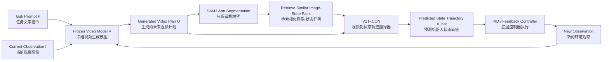
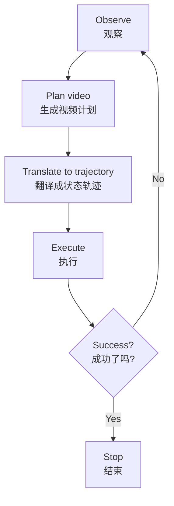
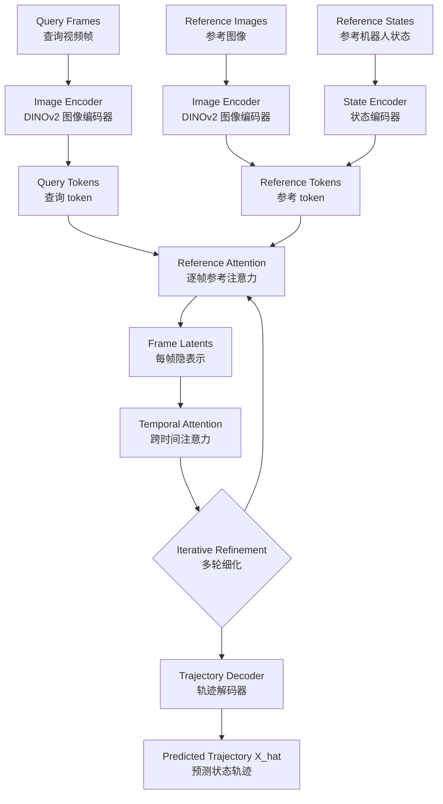
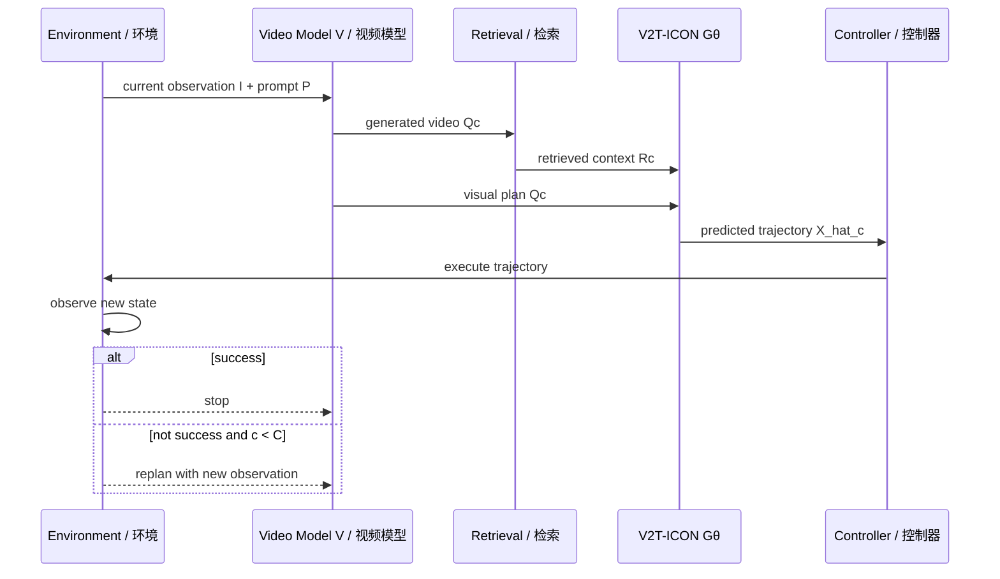
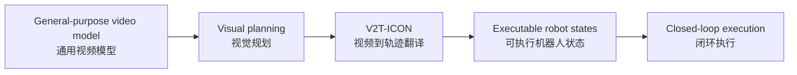

# Lecture 12｜VICX：用视频生成 + In-Context Operator Network 做可泛化机器人操作

> **Paper / 论文**: *VICX: Generalizable Robot Manipulation via Video Generation and In-Context Operator Network*  
> **Theme / 主题**: Generalizable Robot Manipulation｜可泛化机器人操作  
> **Main idea / 一句话核心**: 先让一个冻结的视频生成模型“想象机器人应该怎么动”，再用 V2T-ICON 把这个视频计划翻译成真实机器人能执行的状态轨迹。

---

## 0. 这篇 Lecture 12 在讲什么？｜What is this lecture about?

这节课讲的是一个机器人操作框架 **VICX**。它想解决一个很现实的问题：

> 机器人看到一个新任务，比如“打开抽屉”或“按按钮”，即使它能通过视觉和语言理解目标，也不一定知道自己的机械臂应该怎样移动。  
> A robot may understand the goal from vision and language, but it still needs a reliable way to convert a visual plan into executable robot motion.

作者把问题拆成两个部分：

| 部分 | 中文解释 | English |
|---|---|---|
| 高层视觉规划 | 用冻结的视频生成模型根据当前图像和文字指令生成未来视频 | High-level visual planning by a frozen video generation model |
| 低层状态执行 | 用 V2T-ICON 把视频中的机械臂运动转成机器人状态轨迹 | Low-level state execution by translating video into robot-state trajectories |

这篇文章最重要的贡献不是“又训练了一个更大的机器人模型”，而是提出一个**解耦式接口**：视频模型负责“计划”，V2T-ICON 负责“落地执行”。

---

## 1. 核心术语速查｜Key Terms

| Term | 中文 | 通俗解释 |
|---|---|---|
| VICX | Video generation and In-Context eXecution | 整个机器人操作框架：视频生成负责规划，V2T-ICON 负责执行落地 |
| V2T-ICON | Video-to-Trajectory In-Context Operator Network | 把“机器人运动视频”翻译成“机器人状态轨迹”的网络 |
| Frozen video generation model | 冻结的视频生成模型 | 参数不更新，直接拿来生成未来视频计划，例如 Wan、Sora、Veo 这类模型都可以作为接口思路 |
| Visual plan | 视觉计划 | 视频模型生成的未来画面，看起来像机器人应该如何移动 |
| Robot-state trajectory | 机器人状态轨迹 | 每一帧对应的机器人状态序列，比直接预测动作更几何、更通用 |
| In-context prompt | 上下文提示 | 检索出来的相似“图像-状态”样例，帮助模型现场校准 |
| Arm-only observation | 只保留机械臂的图像 | 用分割方法去掉背景和物体，只让模型关注机械臂姿态 |
| Closed-loop replanning | 闭环重规划 | 执行一段后重新观察环境，再让视频模型重新计划，降低错误累积 |
| Cross-task generalization | 跨任务泛化 | 在没训练过的新任务上也能做 |
| Cross-embodiment transfer | 跨机器人形态迁移 | 训练在红色 Sawyer 风格机械臂上，测试到橙色工业机械臂上 |
| PPC | Penalized Planning Count | 惩罚式规划次数，越低代表越快成功；失败按满预算计算 |

---

## 2. 背景问题：为什么需要 VICX？｜Why do we need VICX?

### 2.1 传统 VLA 模型的问题｜Problem with end-to-end VLA models

当前很多机器人模型是 **Vision-Language-Action (VLA)**：输入视觉、语言，直接输出动作。它们看起来很强，但有一个大问题：

> 它们要同时学会“理解任务”和“控制机械臂”，所以需要大量真实机器人示范数据。  
> They must learn both task reasoning and low-level control, so they require many robot-specific demonstrations.

真实机器人数据很贵，也很难覆盖不同机器人、环境和任务。比如同样是“打开抽屉”，不同机械臂、不同视角、不同灯光都会让图像变化很大。

### 2.2 世界动作模型的启发｜Inspiration from World-Action Models

World-Action Models 的思路是：预训练视频模型已经从大量视频中学到了一些物理常识，例如物体会碰撞、抽屉会滑动、机械臂运动应该连续。作者认为：

> 既然视频模型能生成“未来会发生什么”，那么它可以先做视觉层面的规划。  
> If a video model can predict future visual states, it can serve as a planner in pixel space.

但视频本身不能直接控制机器人，所以关键问题变成：

> **How should predicted visual futures be grounded into executable robot control?**  
> **怎样把预测出来的未来视频，落地成真实机器人能执行的控制？**

这就是 VICX 要解决的核心桥梁问题：**vision-to-execution bridge｜视觉到执行的桥梁**。

---

## 3. VICX 总览｜Overall Framework

### 3.1 简化流程图｜Simplified Diagram

### 3.2 一句话理解每个模块｜Module-by-module intuition

| 模块 | 它做什么 | 为什么重要 |
|---|---|---|
| Frozen video model | 根据当前图像和指令生成短期未来视频 | 给机器人一个“视觉计划” |
| Arm-only segmentation | 从视频帧中切出机械臂，去掉背景和任务物体 | 减少模型被背景、物体类别误导 |
| Retrieval | 对每个查询帧找 top-N 相似机械臂图片和对应状态 | 像考试时给模型几道相似例题 |
| V2T-ICON | 根据视频和检索样例预测状态轨迹 | 把“看起来怎么动”变成“状态应该是多少” |
| Controller | 跟踪预测状态轨迹 | 最终在仿真环境中真正执行 |
| Closed loop | 执行后再观察、再规划 | 让系统可以纠错，而不是一次错到底 |

---

## 4. 方法一：VICX 闭环机器人操作框架｜Closed-loop Manipulation Framework

### 4.1 视频模型如何做计划？｜How does the video model plan?

给定当前观察图像 $I_0$ 和任务提示词 $P$，冻结视频生成模型 $V$ 生成短期未来视频：

$$
\tilde Q = V(P, I_0)
$$

这里的 $\tilde Q$ 不是动作，也不是控制命令，只是一个**视觉计划**。它告诉我们：如果任务成功执行，画面应该怎样变化。

通俗类比：

> 视频模型像一个“会想象结果的导演”。它可以画出机器人接下来应该怎样移动，但它不会直接输出电机命令。

### 4.2 为什么不能直接执行视频？｜Why can’t the robot execute the video directly?

视频只是像素序列，机器人控制器需要的是状态、目标点或动作。比如画面里机械臂向左移动了一点，控制器还需要知道：

- 末端执行器的 xyz 坐标是多少？
- 夹爪状态是多少？
- 下一帧应该移动到哪里？
- 运动是否平滑、是否可执行？

所以 VICX 需要 V2T-ICON 把视频翻译成状态轨迹。

### 4.3 为什么使用闭环？｜Why closed-loop?

开环执行只计划一次。如果视频生成有一点错误，或者执行过程中机械臂滑了一下，误差会不断累积。VICX 用闭环：

1. 观察当前环境。
2. 生成未来视频计划。
3. 翻译成状态轨迹并执行。
4. 执行后再观察结果。
5. 如果还没成功，重新规划。

闭环的好处是：机器人不需要一次就完美，可以通过后续观察进行修正。

---

## 5. 方法二：V2T-ICON｜Video-to-Trajectory In-Context Operator Network

### 5.1 它要解决什么？｜Problem definition

V2T-ICON 的任务是：

> 输入一个单视角机械臂视频，输出对应的机器人状态轨迹。  
> Translate a single-view robot-arm video into its underlying robot-state trajectory.

公式上：

$$
G: Q \mapsto X
$$

其中：

- $Q = \{I^q_t\}_{t=1}^{T}$：query video window，即查询视频窗口。
- $X = \{x_t\}_{t=1}^{T}$：对应机器人状态轨迹。
- $x_t \in \mathbb{R}^{d_s}$：每一帧的机器人状态向量。

### 5.2 为什么普通视觉回归器不够？｜Why not a normal visual regressor?

一个直接方法是训练模型：每一帧图像 $\rightarrow$ 机器人状态。但这会要求模型学习一个全局 pixel-to-state mapping：

$$
X = G(Q)
$$

问题是同一个机器人状态，在不同情况下看起来可能完全不同：

- 不同相机视角：viewpoint changes
- 不同背景：background changes
- 不同灯光：lighting changes
- 不同机械臂外观：robot appearance changes
- 视频生成模型产生的伪影：generation artifacts

所以 V2T-ICON 不让模型死记一个全局映射，而是给它**现场参考例子**。

### 5.3 In-context 的核心思想｜Core idea of in-context calibration

对于每一帧 query image $I^q_t$，模型会从训练池中检索 $N$ 个视觉上最相似的图像-状态对：

$$
R_t = \{(I^r_{t,j}, x^r_{t,j})\}_{j=1}^{N}
$$

整个视频窗口的上下文是：

$$
R = \{R_t\}_{t=1}^{T}
$$

V2T-ICON 最终预测：

$$
\hat X = G_\theta(Q, R) = \{\hat x_t\}_{t=1}^{T}
$$

通俗理解：

> Query frame 是考试题；retrieved references 是相似例题和答案。模型不是凭空猜答案，而是对比这些相似样例来估计状态。

---

## 6. 数据准备与检索｜Data Preparation and Reference Retrieval

### 6.1 为什么只保留机械臂？｜Why arm-only observations?

原始机器人视频里有很多任务相关内容，例如抽屉、按钮、桌面、背景。这些内容可能让模型产生错误关联：看到抽屉就猜某种状态，而不是认真看机械臂姿态。

所以作者用 SAM3 做机械臂分割，只保留机械臂本体：

$$
E^{(m)}_{arm} = \{(S(I^{(m)}_\ell), x^{(m)}_\ell)\}_{\ell=1}^{L_m}
$$

最终训练池：

$$
D_{train} = \{E^{(m)}_{arm}\}_{m=1}^{M}
$$

这里 $S(\cdot)$ 是 segmentation operator，即分割操作。

### 6.2 检索流程｜Retrieval workflow

检索公式可以写成：

$$
R_t = \mathrm{TopN}_{(\bar I^r, x^r) \in D_{train}}\; \mathrm{sim}(\bar I^q_t, \bar I^r)
$$

实现细节：

| 组件 | 用途 |
|---|---|
| SAM3 | 分割机械臂，得到 arm-only frame |
| DINOv2 | 提取冻结视觉特征，用于相似度计算 |
| FAISS | 做高效 nearest-neighbor search |
| Top-N references | 每个 query frame 取最相似的 N 个图像-状态对 |

---

## 7. V2T-ICON 网络结构｜Architecture

### 7.1 结构总图｜Architecture diagram

### 7.2 各模块解释｜Component explanation

| Component | 中文解释 | 作用 |
|---|---|---|
| Image encoder | 图像编码器 | 用冻结 DINOv2 把 query/reference 图像编码成 patch features 和 global feature |
| State encoder | 状态编码器 | 把参考状态 $x^r$ 映射到 Transformer hidden dimension |
| RoPE embedding | 旋转位置编码 | 编码集合位置和时间顺序，帮助 attention 理解参考样例和视频帧顺序 |
| Reference attention | 参考注意力 | 每一帧单独做 in-context matching，把 query 和相似参考对齐 |
| Temporal attention | 时间注意力 | 在整个视频窗口中传播信息，让轨迹更连续平滑 |
| Iterative refinement | 迭代细化 | 先粗略估计，再利用时间上下文反复改进 |
| Trajectory decoder | 轨迹解码器 | 输出最终机器人状态轨迹 $\hat X$ |

### 7.3 Reference Attention：每帧找相似例子｜Per-frame in-context matching

Reference attention 对每一帧独立工作。它比较 query 机械臂外观和检索来的 reference image-state pairs，得到该帧的隐表示：

$$
h^{(k)}_t = f_{ref}\left(q^{(k)}_t, \{e^r_{t,j}\}_{j=1}^{N}\right)
$$

它解决的是：这一帧的机械臂姿态大概对应什么机器人状态？

### 7.4 Temporal Attention：让轨迹更像真实运动｜Trajectory-level consistency

单帧估计可能抖动，甚至某一帧看不清。所以 temporal attention 把所有帧的 latent 串起来：

$$
H^{(k)} = [h^{(k)}_1, \dots, h^{(k)}_T]
$$

再用非因果时间注意力处理：

$$
Z^{(k)} = f_{temp}(H^{(k)}) = \{z^{(k)}_t\}_{t=1}^{T}
$$

它解决的是：整段运动应该连续、平滑、符合物理规律。

### 7.5 Iterative Refinement：粗估计到细估计｜Coarse-to-fine refinement

V2T-ICON 会重复 reference attention 和 temporal attention 多轮。第一轮用 query image token 直接估计；后续轮把上一轮 temporal representation 融合回来：

$$
q^{(k)}_t = f_{fuse}(e^q_t, z^{(k-1)}_t) = W_{fuse}[e^q_t; z^{(k-1)}_t] + b_{fuse}
$$

最后：

$$
\hat X = f_{dec}(Z^{(K)})
$$

直观理解：

> 第一轮像“先根据相似例子猜一下”；后几轮像“结合整段视频再检查、修正、平滑”。

---

## 8. 训练目标｜Training Objective

训练时采样 query window $(Q, X)$，检索 context $R$，让模型预测真实轨迹。总体损失是：

$$
L_{V2T} = \lambda_{state}L_{state} + \lambda_{smooth}L_{smooth} + \lambda_{vel}L_{vel}
$$

### 8.1 State loss｜状态误差

$$
L_{state} = \frac{1}{T}\sum_{t=1}^{T}\|\hat x_t - x_t\|_2^2
$$

作用：让每一帧预测状态接近真实状态。

### 8.2 Smoothness loss｜平滑性损失

$$
L_{smooth} = \frac{1}{T-2}\sum_{t=2}^{T-1}\|\hat p_{t+1} - 2\hat p_t + \hat p_{t-1}\|_2^2
$$

其中 $p_t$ 和 $\hat p_t$ 是状态中的 xyz 部分。这个项惩罚二阶差分，意思是不要让轨迹突然抖一下。

### 8.3 Velocity consistency loss｜速度一致性损失

$$
L_{vel} = \frac{1}{T-1}\sum_{t=1}^{T-1}\|(\hat p_{t+1}-\hat p_t) - (p_{t+1}-p_t)\|_2^2
$$

作用：不仅位置要像，移动趋势也要像。

---

## 9. 训练数据与超参数｜Training Data and Hyperparameters

### 9.1 Meta-World 数据设置｜Meta-World setup

Meta-World 是 Sawyer 机械臂操作基准，包含 50 个机器人控制任务，覆盖 reaching、pushing、object transport、drawer/door manipulation、button pressing、assembly insertion 等。

| 项目 | 数值 / 设置 |
|---|---|
| RGB observation resolution | 704 × 1280 |
| Camera | fixed third-person view / corner4 camera in evaluation setting |
| Robot state | compact robot state, recorded every timestep |
| Action space | 4D continuous action space |
| Action dimensions | 前 3 维控制 end-effector Cartesian displacement，第 4 维控制 gripper |
| Data collection | scripted expert policies from randomized initial states |
| Preprocessing | SAM3 whole-arm segmentation |

### 9.2 V2T-ICON 训练源任务｜Source demonstrations

| Source Task | Episodes | Frames |
|---|---:|---:|
| reach | 950 | 42,859 |
| drawer-open | 200 | 17,717 |
| basketball | 200 | 18,470 |
| **Total** | **1,350** | **79,046** |

这三个任务覆盖了三种运动类型：

- **reach**：直接到达目标位置。
- **drawer-open**：接触丰富的拉动动作。
- **basketball**：抓取、抬起、释放。

### 9.3 V2T-ICON architecture and training hyperparameters

| Parameter | Value |
|---|---|
| Visual encoder | Frozen DINOv2 |
| Query window length | 25 frames |
| References per query frame | 5 retrieved image-state pairs |
| Hidden dimension | 256 |
| Reference-attention depth | 4 layers, 8 heads |
| Temporal-attention depth | 4 layers, 8 heads, non-causal attention |
| Refinement rounds | 3 rounds |
| Dropout | 0.0 |
| Optimizer | Muon, learning rate $1\times10^{-4}$, weight decay 0.01 |
| Scheduler | 10% warmup + cosine decay to 0.1 initial learning rate |
| Batch size | 8 per device |
| Training length | 8,000 maximum steps |
| Gradient clipping | 1.0 |
| Loss weights | state 1.0, smoothness 0.05, velocity consistency 0.05 |
| Hardware | 2 NVIDIA H200 GPUs |
| Training time | about 3.5 hours |
| State normalization | percentile-based bounds |

---

## 10. VICX 推理算法｜Inference Algorithm

### 10.1 Open-loop setting｜开环执行

如果 planning budget $C=0$，说明不做闭环重规划：

1. 使用外部 planned video $Q_{ext}$，或者用视频模型生成 $Q$。
2. 对视频做机械臂分割。
3. 检索 references。
4. V2T-ICON 输出 $\hat X$。
5. 执行一次并返回是否成功。

### 10.2 Closed-loop setting｜闭环重规划

如果 $C>0$，每个 planning cycle 都重新计划：

论文实验中闭环 budget 是：

$$
C = 10
$$

失败运行会被认为消耗满 10 个 cycle。

---

## 11. 评价指标｜Evaluation Metrics

### 11.1 Success Rate｜成功率

对 $M$ 次独立运行，$y_m=1$ 表示第 $m$ 次成功，$y_m=0$ 表示失败：

$$
SR = \frac{1}{M}\sum_{m=1}^{M}y_m
$$

越高越好。

### 11.2 Penalized Planning Count, PPC｜惩罚式规划次数

如果成功，使用第一次成功的 cycle 数 $c_m$；如果失败，则记为满预算 $C$：

$$
\tilde c_m =
\begin{cases}
c_m, & y_m=1 \\
C, & y_m=0
\end{cases}
$$

然后：

$$
PPC = \frac{1}{M}\sum_{m=1}^{M}\tilde c_m
$$

越低越好。它同时衡量是否成功，以及成功得快不快。

---

## 12. 实验一：Meta-World 九任务成功率｜Simulation Evaluation

### 12.1 Baselines｜对比方法

| Baseline | 中文解释 | 训练 / 使用情况 |
|---|---|---|
| $\pi_{0.5}$-Scratch | VLA generalist policy | 官方模型闭源，作者使用 LeRobot open checkpoint |
| $\pi_{0.5}$-Finetune | 微调后的 VLA baseline | 从 $\pi_{0.5,base}$ 初始化，在 LeRobot Meta-World MT50 上微调；数据卡报告 2,500 episodes、204,806 frames、49 tasks |
| AVDC | 基于视频预见和动作生成的层级框架 | 官方 Meta-World video diffusion checkpoint；训练于 11 个 Meta-World 任务，3 个相机视角，每任务每相机 5 个 demonstrations，总计 165 videos |
| VICX | 本文方法 | Wan 2.7 生成视频计划，V2T-ICON 只用 3 个源任务训练，推理时每帧 5 contexts |

作者也说明：这些系统接口不同，所以不是完全 apples-to-apples。VLA 直接输出 action，AVDC 从视频动态生成 action，而 VICX 是视频计划 + 状态轨迹翻译 + in-context grounding。

### 12.2 Main result table｜主结果表

每个任务 20 个 random seeds。VICX 使用 5-context setting。

| Task | $\pi_{0.5}$-Scratch | $\pi_{0.5}$-Finetune | AVDC | VICX |
|---|---:|---:|---:|---:|
| button-press | 5.0% | 45.0% | **60.0%** | 20.0% |
| button-press-topdown | 0.0% | 0.0% | 60.0% | **85.0%** |
| coffee-button | 0.0% | 15.0% | 50.0% | **100.0%** |
| door-close | 0.0% | 20.0% | 85.0% | **100.0%** |
| drawer-close | 95.0% | 75.0% | 65.0% | **100.0%** |
| drawer-open | 0.0% | 0.0% | 20.0% | **75.0%** |
| faucet-close | 10.0% | 5.0% | **50.0%** | 25.0% |
| faucet-open | 5.0% | 20.0% | 25.0% | **45.0%** |
| handle-press | 70.0% | 55.0% | 80.0% | **100.0%** |
| **Overall** | **20.6%** | **26.1%** | **55.0%** | **72.2%** |

### 12.3 数据怎么理解？｜How to read the result?

VICX 整体成功率是 **72.2%**，高于 AVDC 的 **55.0%**。这尤其重要，因为：

- VICX 的 V2T-ICON 只在 **3 个 source tasks** 上训练。
- AVDC 用了 **11 个 Meta-World tasks**。
- $\pi_{0.5}$-Finetune 还在 Meta-World MT50 上微调。

所以结果说明：解耦后的“视频规划 + 状态翻译”接口有较强泛化能力。

---

## 13. 自我纠错与策略适应｜Self-correction and Strategy Adaptation

论文中 drawer-open 的例子非常关键：

1. Stage 1：机器人朝白色把手移动并拉抽屉，但没有完全打开。
2. 系统把这个失败结果作为新的视觉上下文。
3. Stage 2：视频模型不只是重复原计划，而是改为抓抽屉边缘，再把抽屉完全拉开。

这个例子说明：冻结视频模型在闭环中不仅是生成器，也像一个简化的 reasoning engine。它可以利用物理世界先验，在没有手写恢复规则、没有任务特定微调的情况下产生新策略。

Appendix 还补充了两个例子：

| Task | Failure | Correction |
|---|---|---|
| button-press-topdown | 初始位置偏了 | 后续 cycle 重新居中 approach |
| faucet-open | 初始接触或抓取滑了 | 后续 cycle 调整 grasping pose 维持稳定接触 |

---

## 14. 跨域泛化｜Cross-domain Generalization

### 14.1 Cross-task generalization｜跨任务泛化

VICX 能处理未见任务的原因来自两个解耦：

| 来源 | 中文解释 | 作用 |
|---|---|---|
| Task-agnostic mapping | V2T-ICON 只关心机械臂怎么动，不关心任务语义 | 训练在 arm-only images 上，避免依赖抽屉、按钮等物体类别 |
| General-purpose world prior | 冻结视频模型包含物理和空间常识 | 能生成看起来合理的视觉计划，例如重力、碰撞、物体 affordance |

通俗解释：

> 视频模型负责“这个任务应该怎么完成”；V2T-ICON 负责“画面里的机械臂运动对应什么状态”。一个管任务，一个管动作翻译，所以更容易泛化。

### 14.2 Cross-embodiment generalization｜跨机器人形态泛化

作者测试了更难的 setting：

- 训练：标准红色 Sawyer-style arm。
- 测试：boxier orange industrial arm。
- 同时改变 tabletop、floor texture、lighting。
- 不重新训练 V2T-ICON。

结果：

| Setting | Overall Success Rate | PPC |
|---|---:|---:|
| Canonical, 5 contexts | 72.2% | 4.77 |
| Cross-embodiment, 5 contexts | 57.2% | 5.66 |

这说明 VICX 在 OOD 条件下仍然能工作。作者把原因分成两层：

1. **Visual-Prompt Adaptation**：视频模型根据当前场景生成与新机械臂外观一致的视频。
2. **Morphological Invariance**：V2T-ICON 学到的是运动拓扑结构，而不是红色外壳纹理。

重点：橙色机械臂测试时，references 仍来自红色机械臂训练池，说明检索上下文帮助模型对齐结构而非只看表面颜色。

---

## 15. In-Context Learning 到底有多有用？｜Effectiveness of Retrieved Context

### 15.1 Standard environment: 5 contexts vs no context

| Task | 5 Contexts SR | No Context SR | 5 Contexts PPC | No Context PPC |
|---|---:|---:|---:|---:|
| button-press | 20.0% | 0.0% | 8.35 | 10.00 |
| button-press-topdown | 85.0% | 70.0% | 4.32 | 4.60 |
| coffee-button | 100.0% | 100.0% | 1.80 | 1.20 |
| door-close | 100.0% | 100.0% | 1.00 | 1.00 |
| drawer-close | 100.0% | 100.0% | 3.40 | 3.15 |
| drawer-open | 75.0% | 55.0% | 6.60 | 7.05 |
| faucet-close | 25.0% | 30.0% | 9.65 | 8.50 |
| faucet-open | 45.0% | 10.0% | 6.75 | 9.26 |
| handle-press | 100.0% | 100.0% | 1.00 | 1.10 |
| **Overall** | **72.2%** | **62.8%** | **4.77** | **5.07** |

总体上，加入 5 个 references：

- 成功率从 **62.8%** 提升到 **72.2%**。
- PPC 从 **5.07** 降到 **4.77**。

### 15.2 Cross-embodiment: 5 contexts vs no context

| Task | 5 Contexts SR | No Context SR | 5 Contexts PPC | No Context PPC |
|---|---:|---:|---:|---:|
| door-close | 100.0% | 100.0% | 1.00 | 1.65 |
| drawer-close | 80.0% | 85.0% | 4.60 | 3.60 |
| drawer-open | 65.0% | 15.0% | 6.30 | 9.35 |
| button-press-topdown | 25.0% | 35.0% | 7.90 | 8.00 |
| button-press | 0.0% | 0.0% | 10.00 | 10.00 |
| faucet-close | 0.0% | 5.0% | 10.00 | 9.75 |
| faucet-open | 60.0% | 15.0% | 6.40 | 9.30 |
| handle-press | 100.0% | 100.0% | 1.00 | 1.00 |
| coffee-button | 85.0% | 50.0% | 3.70 | 6.90 |
| **Overall** | **57.2%** | **45.0%** | **5.66** | **6.62** |

跨机器人形态时，context 更重要：

- 成功率从 **45.0%** 到 **57.2%**。
- PPC 从 **6.62** 到 **5.66**。

### 15.3 为什么 context 有帮助？｜Why does context help?

| 作用 | 中文解释 |
|---|---|
| Inference-time physical calibration | 检索样例把生成图像中的机械臂外观锚定到附近真实状态 |
| Cross-embodiment structural alignment | 即使机械臂颜色和外形变化，也能通过姿态结构对齐 |
| Contact-sensitive grounding | 对 drawer-open、faucet-open 这类接触敏感任务，小误差会导致失败，reference 可以减少翻译偏差 |

一句话：retrieved context 不是“多给一点输入”，而是在推理时提供局部物理校准。

---

## 16. DIY Unseen-Scene Sweep-Soccer Stress Test

作者还做了一个 Meta-World 之外的自定义任务：用夹爪把足球扫进洞里。这个任务的场景布局和物体配置不在标准 benchmark 中。

| Setting | Success Rate | PPC |
|---|---:|---:|
| 0 Context | 15.0% | 9.15 |
| 5 Contexts | 20.0% | 8.20 |

解释：这个任务很难，所以成功率不高。但 5 contexts 仍然比 0 context 好，说明 VICX 在 benchmark 外也有非零迁移能力。

---

## 17. Prompt Example：drawer-open 的视频模型提示词结构

论文给了 drawer-open 的完整 Wan prompt。它不是一句简单的“open the drawer”，而是非常细的指令。

### 17.1 Prompt 的结构｜Prompt structure

| 部分 | 内容 |
|---|---|
| Goal | 拉白色把手，打开绿色抽屉，直到抽屉前端/把手碰到固定绿色球 |
| Scene | 固定角落相机，红色 Sawyer arm，木桌，绿色抽屉柜，白色水平把手 |
| Continuity | 从当前视觉状态继续，保持相机几何、物体身份、已完成进度 |
| Priority 1 | 第一帧就开始移动；夹爪开口固定，不要开合；直接移动到把手上方 |
| Priority 2 | 先竖直下降到最低接触点，再开始向外拉 |
| Priority 3 | 建立不穿透的 hooked contact；夹爪可以跨住把手，但不能穿过或合并 |
| Priority 4 | 完成向下接触后，沿轨道纯平移向外拉，不能倾斜、下落、旋转或侧滑 |

这个 prompt 说明：视频生成模型需要很明确的物理约束，才能输出更可执行的视频计划。

---

## 18. 相关工作｜Related Work

### 18.1 Video models as explicit planners

这类方法先在像素空间生成未来视觉轨迹，再转成动作。相关方向包括：

- Classical visual foresight + MPC。
- UniPi、VLP：文本条件视频生成 + inverse dynamics 或 VLM-based search。
- 通过 dense correspondences 或 diffusion conditioning 从视频提取动作。
- Large Video Planner：用大规模人类-机器人数据训练，支持 novel tasks 上的 zero-shot visual planning。

限制是：视频质量、时间一致性、物理合理性，以及 action-extraction bridge 的可靠性。

### 18.2 In-context learning for robot policy

In-context learning 不更新参数，而是通过 demonstrations 或 retrieved contexts 适应新环境。已有研究把 observation/action 表示成 keypoints、action tokens、object-centric graphs、spatial contexts，也扩展到 humanoid、quadrotor、cross-body locomotion。

VICX 的特别之处是：它把 in-context 思想用于 **video-to-trajectory grounding**，不是直接预测动作。

---

## 19. 结论与局限｜Conclusion and Limitations

### 19.1 Conclusion｜结论

VICX 提出一个解耦框架：

它证明了三件事：

1. **Cross-task generalization**：V2T-ICON 只用 3 个任务训练，但能在 9 个任务上取得较好表现。
2. **Self-correction**：闭环反馈让视频模型在失败后重新生成修正策略。
3. **Cross-embodiment transfer**：从红色 Sawyer 风格机械臂迁移到橙色工业机械臂，无需重新训练。

### 19.2 Limitations｜局限

| Limitation | 中文解释 |
|---|---|
| Not high-frequency control | VICX 是视频生成 → 轨迹翻译 → 控制器执行的串行流程，不适合高频密集反应式控制 |
| Video generation latency | 视频生成是主要延迟瓶颈；未来需要 distilled、streaming 或 causal video models |
| Single-view limitation | 单视角 grounding 精度有限，不适合毫米级插入或力敏感接触任务 |
| Fine manipulation difficulty | 微小几何误差可能导致精细操作失败 |
| V2T acceleration only partial | V2T-ICON 可通过 quantization 或 caching 加速，但整体延迟仍受视频生成限制 |

---

## 20. 文章逐段导读｜What each part is saying, in plain language

| Section / Paragraph | 它在讲什么 |
|---|---|
| Abstract | 机器人泛化操作需要同时解决“看懂任务”和“落地执行”。VICX 用冻结视频模型生成视觉计划，用 V2T-ICON 把计划转成机器人状态轨迹。实验显示它能跨任务、能自我纠错、能跨机械臂形态迁移。 |
| Introduction P1 | VLA 模型很强，但依赖大量机器人示范数据；高质量机器人数据昂贵且难扩展。视频模型可能提供物理先验，但问题是视频未来如何转成控制。 |
| Introduction P2 | 作者聚焦 vision-to-execution bridge。冻结视频模型负责高层像素空间规划，V2T-ICON 负责把生成视频转成状态轨迹，而不是直接从相邻帧反推动作。 |
| Introduction P3 | VICX 把视频规划和状态执行整合成闭环系统。执行后把新观察反馈给视频模型，减少生成误差、翻译漂移和外部扰动带来的累积错误。 |
| Contributions | 三个贡献：提出 VICX；提出 V2T-ICON；在 Meta-World 上验证跨任务、自纠错、跨形态迁移。 |
| Method overview | 方法分为两步：冻结视频模型生成未来执行视频；V2T-ICON 将视觉计划 grounding 成机器人状态轨迹。 |
| 2.1 VICX | 给定 prompt 和当前图像，视频模型生成短期视频计划；V2T-ICON 翻译成状态轨迹；PID/控制器执行；观察反馈进入下一轮。 |
| 2.2 Problem setup | 要把单视角机械臂视频翻译成状态轨迹。普通视觉回归器需要学全局 pixel-to-state 映射，容易受视角、背景、灯光、外观影响。 |
| 2.2 In-context idea | V2T-ICON 对每帧检索相似图像-状态对，用它们作为校准样例，而不是只靠固定参数记忆。 |
| 2.2 Formulation | $Q$ 是视频窗口，$X$ 是真实轨迹，$R$ 是每帧的 reference context，模型预测 $\hat X=G_\theta(Q,R)$。 |
| Data preparation | 用 SAM3 从原始视频中提取 arm-only frames，减少背景和任务物体带来的 spurious correlations。 |
| Reference retrieval | 对每个 arm-only query frame，用 DINOv2 特征和 FAISS 从训练池里找 top-N 相似 image-state pairs。 |
| Training objective | 训练目标有三项：状态误差、平滑性、速度一致性。这样既要预测准，也要运动平滑、趋势正确。 |
| 2.3 Architecture | 不把所有 token 一起塞进一个 Transformer，而是拆成 reference attention 和 temporal attention，分别处理“匹配参考”和“保持时间一致”。 |
| Reference attention paragraph | 每帧根据相似 references 估计状态，避免单纯的全局图像回归。 |
| Temporal attention paragraph | 跨帧传播信息，解决单帧模糊、抑制噪声，让轨迹更物理平滑。 |
| Iterative refinement paragraph | 多轮 refinement：先粗估计，再利用上一轮 temporal context 细化，输出更可执行轨迹。 |
| Experiments intro | 在 Meta-World 上闭环测试；V2T-ICON 只训练在 drawer-open、reach、basketball 三个任务；测试时 Wan 负责视频计划，每帧用 5 个 references。 |
| Table 1 | VICX 在 9 个任务总体成功率 72.2%，高于 $\pi_{0.5}$-Scratch、$\pi_{0.5}$-Finetune 和 AVDC。 |
| Self-correction | drawer-open 失败后，系统把失败图像反馈给视频模型，后续 cycle 生成新策略抓抽屉边缘并成功。 |
| Cross-task generalization | 泛化来自两个部分：V2T-ICON 不看任务语义，只翻译机械臂运动；视频模型提供通用物理世界先验。 |
| Cross-embodiment generalization | 红色 Sawyer 训练，橙色工业臂测试，仍有 57.2% 总体成功率，说明学到结构对应而非表面纹理。 |
| Context effectiveness | 5 contexts 在标准环境把成功率从 62.8% 提到 72.2%，跨形态从 45.0% 提到 57.2%，PPC 也下降。 |
| Related work | 相关方向包括显式视频规划和机器人 in-context learning。VICX 的区别是用 retrieved context 做 video-to-trajectory grounding。 |
| Conclusion | 解耦视觉规划和执行 grounding，让系统同时具有任务语义泛化和机器人执行泛化。 |
| Limitations | 不适合高频控制；视频生成有延迟；单视角精度不足，难以做精细操作。 |
| Appendix A.1 | Meta-World 数据收集细节：704×1280 RGB，4D action/state，scripted expert policy，SAM3 分割；训练数据共 1,350 episodes、79,046 frames。 |
| Appendix A.2 | V2T-ICON 的完整前向计算、损失函数、超参数：25-frame windows、5 references、hidden 256、3 refinement rounds、8,000 steps。 |
| Appendix B.1 | 给出 VICX 开环/闭环算法；闭环最多 10 cycles，成功则提前停止。 |
| Appendix B.2 | 定义 success rate 和 PPC；失败按满预算 C 计算。 |
| Appendix B.3 | Baseline 设置、5-context 和 0-context 评估设置、额外自纠错案例。 |
| Appendix B.4 | 跨机器人形态测试：橙色工业臂、改变桌面/地板/灯光，同样 9 任务，每任务 20 seeds。 |
| Appendix B.5 | 自定义 sweep-soccer-into-hole 任务，5 contexts 成功率 20.0%，0 context 成功率 15.0%。 |

---

## 21. 最容易考的点｜Likely Exam / Discussion Points

1. **VICX 的核心解耦思想**：video generation for planning + V2T-ICON for execution grounding。
2. **为什么预测 state trajectory 而不是 action**：state 更几何、更 controller-agnostic，动作更依赖具体机器人和控制器。
3. **为什么要 arm-only segmentation**：减少背景和任务物体造成的 spurious correlations。
4. **in-context references 的作用**：推理时局部物理校准，不更新参数也能适应新视觉域。
5. **reference attention vs temporal attention**：前者做逐帧视觉-状态匹配，后者做跨帧一致性和平滑。
6. **闭环 self-correction 的意义**：把失败作为新观察输入，后续 cycle 可生成修正策略。
7. **主要实验结论**：VICX 9 任务总体 72.2%，5 contexts 比 no context 更好，跨形态仍有 57.2%。
8. **主要局限**：视频生成延迟、高频控制不足、单视角精细操作精度不足。

---

## 22. 练习题｜Practice Questions with Answers

### Q1. Concept｜为什么 VICX 不直接训练一个 end-to-end VLA 模型？

**Answer / 答案：**  
因为 end-to-end VLA 需要同时学习任务理解和低层控制，依赖大量机器人专用数据。VICX 把任务规划交给冻结视频模型，把执行 grounding 交给 V2T-ICON，从而减少对大规模 robot-specific demonstrations 的依赖。

### Q2. Concept｜V2T-ICON 中的 retrieved references 起什么作用？

**Answer / 答案：**  
它们像现场校准样例。每个 query frame 会检索视觉上相似的 image-state pairs，帮助模型判断当前机械臂外观对应什么机器人状态，而不是死记一个全局 pixel-to-state mapping。

### Q3. Formula｜如果 20 次运行中有 15 次成功，success rate 是多少？

**Answer / 答案：**  

$$
SR = \frac{15}{20} = 0.75 = 75\%
$$

### Q4. Formula｜如果 planning budget $C=10$，5 次运行的首次成功 cycle 分别是 1、3、失败、2、失败，PPC 是多少？

**Answer / 答案：**  
失败按 10 计算，所以 cycles 是 $1,3,10,2,10$。

$$
PPC = \frac{1+3+10+2+10}{5}=\frac{26}{5}=5.2
$$

### Q5. Architecture｜reference attention 和 temporal attention 的区别是什么？

**Answer / 答案：**  
Reference attention 是逐帧比较 query 和 retrieved references，解决“这一帧对应什么状态”。Temporal attention 是跨整个视频窗口传播信息，解决“整段轨迹是否连续、平滑、物理合理”。

### Q6. Data｜V2T-ICON 训练用了哪三个 source tasks？总共有多少 episodes 和 frames？

**Answer / 答案：**  
三个任务是 reach、drawer-open、basketball。总计 1,350 episodes 和 79,046 frames。

### Q7. Results｜Table 1 中 VICX 的 overall success rate 是多少？比 AVDC 高多少个百分点？

**Answer / 答案：**  
VICX 是 72.2%，AVDC 是 55.0%。差值是：

$$
72.2 - 55.0 = 17.2
$$

所以 VICX 高 17.2 个百分点。

### Q8. Critical thinking｜为什么 cross-embodiment 任务中 context 更重要？

**Answer / 答案：**  
因为测试时机械臂外观和场景都变了。检索到的 references 虽然来自红色机械臂，但可以提供机械臂姿态和状态之间的结构对应，帮助模型对齐运动拓扑，而不是只依赖颜色或外壳纹理。

### Q9. Limitation｜为什么 VICX 不适合高频反应式控制？

**Answer / 答案：**  
VICX 是串行流程：视频生成 → V2T-ICON 翻译 → 控制器执行。视频生成有明显延迟，所以更适合短期重规划，不适合需要毫秒级反馈的 dense reactive control。

### Q10. Application｜如果你要把 VICX 用到真实机器人上，最担心哪两个问题？

**Answer / 参考答案：**  
第一是视频生成延迟和质量，生成计划可能不稳定或不够物理真实。第二是单视角视觉 grounding 精度不足，真实机器人精细接触任务可能需要多视角、力反馈或更精确的状态估计。

---

## 23. 一页复习版｜One-page Review

> **VICX = Frozen Video Planner + V2T-ICON Executor + Closed-loop Replanning**

- 视频模型根据当前图像和 prompt 生成未来视频计划。
- 视频计划不能直接执行，因此 V2T-ICON 把它转成机器人状态轨迹。
- V2T-ICON 用 arm-only frames 避免背景干扰。
- 每个 query frame 检索 top-N 相似 image-state pairs 作为 in-context references。
- Reference attention 解决逐帧匹配；temporal attention 解决轨迹一致性。
- 多轮 iterative refinement 让轨迹从粗到细。
- 训练损失包括 state、smoothness、velocity consistency。
- Meta-World 主结果：VICX overall 72.2%，AVDC 55.0%。
- 加 context：标准环境 62.8% → 72.2%；跨形态 45.0% → 57.2%。
- 局限：延迟、高频控制、单视角精细操作。

---

## 24. 中文超短总结｜Ultra-short Summary

这篇论文的核心是：**不要让一个模型同时学会“想任务”和“控机器人”。** VICX 让冻结视频模型负责想象任务成功的未来画面，再让 V2T-ICON 根据相似图像-状态样例把画面翻译成机器人状态轨迹。通过闭环反馈，系统可以在失败后重新规划；通过 arm-only 分割和 in-context 检索，系统可以跨任务和跨机械臂外观泛化。
