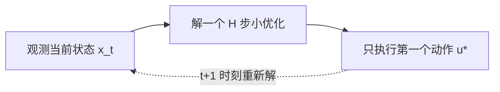
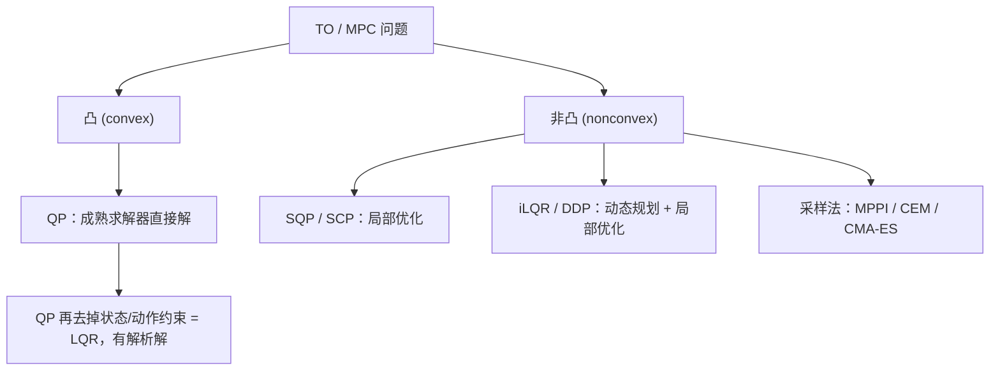
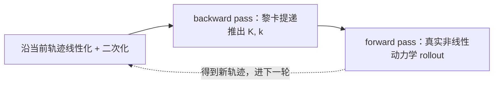

# 机器人学习（十三）：最优控制 (Optimal Control)

> 阅读说明：公式全部用标准 LaTeX 写成，用 Typora / Obsidian / VS Code（装 Markdown 预览插件）打开即可正常渲染。纯文本编辑器里看到 `$$` 包着的就是公式源码。

开篇三张图——风扰中悬停的无人机 (Neural-Fly)、鱼游动时的流体、沙地上漂移的越野车——都在说同一件事：**动力学 (dynamics)** 是这一讲的绝对主角。连续时间的写法：

$$
\dot{x} = \frac{dx}{dt} = f(x, u)
$$

离散时间的写法：

$$
x_{t+1} = f(x_t, u_t)
$$

怎么读：$x$ 是状态 (state)，$u$ 是控制输入 (control input)，$f$ 描述"当前状态 + 当前动作，状态会怎么变"。连续版给出变化率 $\dot{x}$（对时间的导数），离散版直接给出下一时刻的状态。

## 0. 这一讲在课程里的位置

基于模型的强化学习 (model-based RL, MBRL) 这个专题分三部分：

1. 控制理论基础：稳定性与 Lyapunov 方法、鲁棒控制 (robust control)、自适应控制 (adaptive control)、线性系统与连续时间 LQR、非线性系统的线性化 (linearization)——上一讲已经讲完；
2. **已知动力学时，怎么做决策**：轨迹优化 (trajectory optimization, TO)、模型预测控制 (model predictive control, MPC)、离散时间 LQR、序列二次/凸规划 (SQP/SCP)、iLQR/DDP、采样式 MPC——本讲；
3. 学习未知动力学并用于控制：模型学习 (model learning)、用学到的模型做策略优化、深度 MBRL（Dreamer、MBRL+MFRL 等）——下一讲开始。

一句话记住本讲的边界：**今天 $f_{1:T}$ 已知，下一讲 $f_{1:T}$ 未知**。MBRL 本质上就是"模型未知的最优控制"，所以这一讲是在给整个 MBRL 专题打地基。

## 1. 最优控制问题长什么样

先接上上一讲的话头。给定动力学模型，控制理论要设计一个反馈策略 (feedback policy) $u = \pi(x)$，去实现某些目标：镇定 (stabilization) 到参考点、跟踪 (tracking) 期望轨迹、对不确定性自适应、对扰动鲁棒，以及——**最小化某个代价函数**。最后这一条正是强化学习的历史起点。

MBRL 和最优控制解的其实是同一个优化问题：

$$
\min_{x_{1:T},\ u_{1:T}} \ \sum_{t=1}^{T} c_t(x_t, u_t)
\quad \text{s.t.} \quad
x_{t+1} = f_t(x_t, u_t), \quad x_t \in X_t, \quad u_t \in U_t
$$

怎么读：决策变量是**整条轨迹**——所有时刻的状态 $x_{1:T}$ 和动作 $u_{1:T}$；目标是把 $T$ 步的代价加总后最小化；s.t.（subject to，受约束于）后面三条分别是动力学约束、状态约束、控制约束。各符号的含义：

- $c_t$ 是代价函数 (cost function)，相当于 RL 里的负奖励；
- $X_t$ 是状态约束 (state constraint)，典型例子是避障 (collision avoidance)；
- $U_t$ 是控制约束 (control constraint)，也就是执行器限制 (actuation limit)，电机力矩总有上限；
- $T$ 是时域 (horizon)，可以固定有限、可以无限，甚至可以本身是个决策变量——那就变成了时间最优控制 (time-optimal control)，比如穿越机竞速拼的就是最短时间。

同一个问题有两种解的姿势：

- **开环轨迹优化 (open-loop trajectory optimization)**：解出一条具体轨迹 $x_{1:T}, u_{1:T}$，交给底层反馈控制去跟踪。这也叫规划 (planning)；
- **闭环策略优化 (closed-loop policy optimization)**：直接找一个策略 $u = \pi(x)$ 来最小化代价。

## 2. 两个轨迹优化的例子：动力学决定一切

两个例子共享完全相同的任务设定：从 $x_0 = [0,0]$ 走到 $x_T = [10,0]$，绕开路中间的红色圆形障碍（记作集合 $\mathcal{O}$），且控制能量最小 (minimum control energy)：

$$
\min_{x,u} \ \sum_{t=1}^{T} \| u_t \|_2^2
\quad \text{s.t.} \quad
x_{t+1} = f(x_t, u_t), \quad x_0 = [0,0], \quad x_T = [10,0], \quad x_t \notin \mathcal{O}, \quad u_t \in U
$$

其中 $\| u_t \|_2^2$ 是控制向量的二范数平方，物理上就是"这一步用了多大力气"，加总起来是控制能量；$x_t \notin \mathcal{O}$ 就是避障。两个例子唯一的区别是那个 $f$。

### 2.1 双积分器 (double integrator)

状态取 $\mathbf{x} = [p_x,\ p_y,\ v_x,\ v_y]^\top$（位置 + 速度），控制 $\mathbf{u} = [u_1, u_2]^\top$ 是二维加速度，动力学是线性的：

$$
\dot{\mathbf{x}} = A \mathbf{x} + B \mathbf{u}, \qquad
A = \begin{bmatrix} 0 & 0 & 1 & 0 \\ 0 & 0 & 0 & 1 \\ 0 & 0 & 0 & 0 \\ 0 & 0 & 0 & 0 \end{bmatrix}, \qquad
B = \begin{bmatrix} 0 & 0 \\ 0 & 0 \\ 1 & 0 \\ 0 & 1 \end{bmatrix}
$$

怎么读：$A$ 的前两行说"位置的导数是速度"（第 1 行把 $v_x$ 挑出来赋给 $\dot{p}_x$，第 2 行同理）；$A$ 后两行全零、配合 $B$ 的下半块说"速度的导数就是控制"。控制要积分两次才变成位置（加速度到速度、速度到位置），所以叫双积分器。

这个问题是非凸 (nonconvex) 的。非凸从哪来？**只来自避障约束**："圆的外面"不是凸集（凸集的补集一般非凸）。动力学是线性等式约束、代价是二次的，这两部分都凸。用 SCP 求解，迭代几轮后轨迹会贴着圆的上沿平滑地绕过去。

### 2.2 独轮车 (unicycle)

换成非线性动力学。状态六维 $\mathbf{x} = [x,\ y,\ \theta,\ \dot{x},\ \dot{y},\ \dot{\theta}]^\top$（位置、朝向及各自的速度）：

$$
\dot{\mathbf{x}} =
\begin{bmatrix} \dot{x} \\ \dot{y} \\ \dot{\theta} \\ u_1 \cos\theta \\ u_1 \sin\theta \\ u_2 \end{bmatrix}
= f(\mathbf{x}, \mathbf{u})
$$

怎么读：前三行还是"位置类变量的导数等于速度类变量"；$u_1$ 是沿车头方向的加速度，要经过 $\cos\theta$、$\sin\theta$ 投影到世界坐标系的 x、y 两个方向；$u_2$ 是角加速度。非线性就藏在这两个三角函数里。

其它设定一模一样，但问题"更"非凸：除了避障，**动力学本身也是非线性等式约束**，这是第二个非凸性来源。同样用 SCP 解，收敛出的轨迹形状和双积分器完全不同——独轮车不能横着平移，得先把车头转过去。

### 2.3 Dynamics matters!

把两组收敛轨迹放在一起看：代价和约束一字不差，只换了动力学，最优解就截然不同。这就是"动力学很重要"的直观证据。

反过来问一句：**如果规划时忽略动力学会怎样？** 得到的路径（比如 x-y 平面上的一条折线）很可能根本不可行 (infeasible)——独轮车执行不了需要侧向平移的轨迹。第一讲说过传统方案里"感知-规划-控制"分层带来的误差传递问题，这里就是具体案例：规划时不带动力学，控制层就得硬扛。

## 3. 模型预测控制 (MPC)

一次性解完全部 $T$ 步的 TO 又贵又脆：模型有误差、环境有扰动，一条开环轨迹执行下去会越偏越远。MPC 的做法是：**每个时间步都解一个 $H$ 步的小 TO 问题（$H \ll T$），但只执行第一个动作。**

在时刻 $t$（机器人处在 $x_t$）解：

$$
\min_{u} \ \sum_{h=0}^{H-1} c_{t+h}(x_{t+h}, u_{t+h}) + V_t(x_{t+H})
$$

$$
\text{s.t.} \quad
x_{t+h+1} = f_t(x_{t+h}, u_{t+h}), \ \forall h \in [0, H-1]; \qquad
x_{t+h} \in X_{t+h}, \ \forall h \in [1, H]; \qquad
u_{t+h} \in U_{t+h}, \ \forall h \in [0, H-1]
$$

怎么读：$h$ 是"从现在起往前看第几步"的局部下标；前 $H$ 步的代价逐项累加，$H$ 步之外的所有未来被打包进终端项 $V_t(x_{t+H})$。解出来记作 $u^{*}_{t \mid t}, u^{*}_{t+1 \mid t}, \cdots, u^{*}_{t+H-1 \mid t}$，下标 $t+h \mid t$ 读作"站在 $t$ 时刻规划的、给 $t+h$ 时刻用的动作"。**只执行第一个 $u^{*}_{t \mid t}$**，下一个时刻整个重来。

三个要点：

1. **后退时域 (receding horizon)**：预测窗口随时间往前滑，所以 MPC 又叫 receding horizon control。
2. **隐式闭环 (implicitly closed-loop)**：每次解的虽然是开环轨迹，但 $u^{*}_{t \mid t}$ 依赖当前实测的 $x_t$，等效于一个反馈策略。这是 MPC 抗扰动的根源。
3. **终端代价 $V_t$ 很关键**。$V_t(x_{t+H})$ 叫 cost-to-go、终端代价 (terminal cost) 或值函数 (value function)，代表" $H$ 步之后剩下的账"。$V_t$ 估得越准，$H$ 就可以取得越短，在线计算越省。$V_t$ 的来源有三类：手工启发式 (heuristics)、离线数据/学习（比如学一个 value function——这是 RL 和 MPC 的天然接口）、在线估计。

第一讲"像开车只看前方几秒路况、不断微调方向盘"的比喻，在这里兑现成了精确的数学。

## 4. 求解地图：凸与非凸

拿到一个 TO/MPC 问题，第一件事是判断凸不凸：

凸的情形里最重要的是二次规划 (quadratic programming, QP)：二次代价、仿射动力学、线性不等式约束：

$$
\min_{x,u} \ \sum_{t=1}^{T} \frac{1}{2} \begin{bmatrix} x_t \\ u_t \end{bmatrix}^\top C_t \begin{bmatrix} x_t \\ u_t \end{bmatrix} + \begin{bmatrix} x_t \\ u_t \end{bmatrix}^\top l_t
\quad \text{s.t.} \quad
x_{t+1} = F_t \begin{bmatrix} x_t \\ u_t \end{bmatrix} + g_t, \qquad
d_t^{\min} \le D_t \begin{bmatrix} x_t \\ u_t \end{bmatrix} \le d_t^{\max}
$$

怎么读：把状态和动作竖着摞成一个向量；$C_t$ 是二次项的权重矩阵、$l_t$ 是一次项系数；等式约束就是仿射动力学（$F_t = [A_t \ \ B_t]$，$g_t$ 是偏置）；不等式约束用矩阵 $D_t$ 把状态动作的线性组合夹在上下界之间——力矩上限、安全走廊都能写成这种"框"。

现成求解器很多（OSQP、GUROBI 等）。一般来说，复杂度随 $T$ 或维度 $\dim [x_t; u_t]$ **三次方**增长。记住一句话：**QP 是很多非凸 TO/MPC 算法的内核**——后面 SQP 每轮迭代解的就是一个 QP。

QP 再把状态和动作约束去掉，就是 LQR，可以用动态规划求出解析解。

## 5. 线性二次调节器 (Linear Quadratic Regulator, LQR)

线性（仿射）动力学 + 二次代价 + **没有状态和动作约束**。"没有约束"这一点是命门：正因为无约束，才能做动态规划 (dynamic programming, DP) 并推出解析解 (analytic solution)。

先统一记号。令 $z_t = [x_t; u_t]$（状态和动作摞成一列），一般形式是：

$$
C_t = \begin{bmatrix} Q_t & S_t \\ S_t^\top & R_t \end{bmatrix} \succ 0, \qquad
l_t = \begin{bmatrix} l_{x,t} \\ l_{u,t} \end{bmatrix}, \qquad
F_t = \begin{bmatrix} A_t & B_t \end{bmatrix}, \qquad
x_{t+1} = F_t z_t + g_t
$$

怎么读：$Q_t$ 惩罚状态偏差、$R_t$ 惩罚控制大小、$S_t$ 是状态-控制交叉项（通常设 0）；$\succ 0$ 表示正定 (positive definite)，保证代价是"开口向上的碗"、极小点唯一；$l_t$ 是线性代价项；$g_t$ 是动力学偏置。

### 5.1 热身：标准 LQR

先做最干净的版本：无交叉项（$S_t = 0$）、无线性项和偏置（$l_t = 0$，$g_t = 0$）：

$$
\min_{x,u} \ \sum_{t=1}^{T} \frac{1}{2} x_t^\top Q_t x_t + \frac{1}{2} u_t^\top R_t u_t
\quad \text{s.t.} \quad x_{t+1} = A_t x_t + B_t u_t
$$

套路是：**猜一个二次型的最优 cost-to-go（值函数），再用归纳法验证**：

$$
V_t(x_t) = \frac{1}{2} x_t^\top P_t x_t
$$

怎么读：$V_t(x)$ 读作"从时刻 $t$、状态 $x$ 出发，此后一路按最优走，总共还要付多少代价"。敢猜二次型，是因为代价二次、动力学线性，二次型在这两种运算下是封闭的；$P_t$ 是待定矩阵，$P_t$ 越"大"表示处在这个状态越贵。

**第一步**，末端 $t = T$：成立，且 $P_T = Q_T$（最后一步再施加控制只会白白增加代价，所以 $u_T = 0$）。

**第二步**，假设 $t+1$ 时成立，做贝尔曼递推 (Bellman recursion)：

$$
V_t(x_t) = \min_u \left[ \frac{1}{2} x_t^\top Q_t x_t + \frac{1}{2} u^\top R_t u + V_{t+1}(A_t x_t + B_t u) \right]
$$

怎么读：从 $t$ 出发的最优总账 = 今天这一步的代价 + 从"明天的状态"出发的最优总账，而明天的状态由动力学 $A_t x_t + B_t u$ 给出。这一句话就是动态规划的全部内核。

把 $V_{t+1}$ 代入乘开，按"只含 $x$ / 只含 $u$ / 交叉"归成三堆：

$$
V_t(x_t) = \min_u \ \frac{1}{2} x_t^\top \left( Q_t + A_t^\top P_{t+1} A_t \right) x_t
+ \frac{1}{2} u^\top \left( R_t + B_t^\top P_{t+1} B_t \right) u
+ u^\top B_t^\top P_{t+1} A_t x_t
$$

由于 $R_t + B_t^\top P_{t+1} B_t \succ 0$，这对 $u$ 是开口向上的抛物线，求导置零即得全局最小点：

$$
u^{*} = -\left( R_t + B_t^\top P_{t+1} B_t \right)^{-1} B_t^\top P_{t+1} A_t \, x_t
$$

直观理解：一维情形下目标是 $\frac{1}{2} a u^2 + b u x$，顶点在 $u = -(b/a)\,x$；矩阵版里 $a$ 对应"对 $u$ 的曲率" $R + B^\top P B$，$b$ 对应"$u$ 和 $x$ 的耦合" $B^\top P A$。重点是 $u^{*}$ 与 $x$ 成线性关系——**最优控制器天生就是线性反馈**。

把 $u^{*}$ 代回去整理，$V_t$ 果然还是二次型，系数满足**黎卡提递推 (Riccati recursion)**：

$$
P_t = Q_t + A_t^\top \left[ P_{t+1} - P_{t+1} B_t \left( R_t + B_t^\top P_{t+1} B_t \right)^{-1} B_t^\top P_{t+1} \right] A_t
$$

逐块读：$Q_t$ 是今天这步的状态代价；$A_t^\top P_{t+1} A_t$ 把"明天的账"透过动力学折算回今天（状态先被 $A$ 推一步再进 $P_{t+1}$）；中括号里减掉的那一项是"因为手里有控制可用而省下来的钱"——假如 $B = 0$（完全控不了），这一项消失，账只会单调累加。归纳完成。

整理成算法（全程只有矩阵运算）：

1. 置 $P_T = Q_T$；
2. 反向传播 (backward pass)：从 $t = T-1$ 递推到 $t = 1$，按黎卡提公式算出 $P_t$；
3. 算增益 (gain)：$K_t = \left( R_t + B_t^\top P_{t+1} B_t \right)^{-1} B_t^\top P_{t+1} A_t$，读作"状态偏一个单位，控制该回多少"；
4. 执行时：$u_t = -K_t x_t$。

三个 remark：

- 总最优代价就是 $V_1(x_1) = \frac{1}{2} x_1^\top P_1 x_1$；
- LQR 返回的是一个**线性反馈控制器 (linear feedback controller)**；
- 拿到手的不只是一串动作，而是**一整串反馈增益 $K_{1:T}$**——遇到扰动，$u_t = -K_t x_t$ 会自动纠偏，比一条开环动作序列鲁棒得多。后面 iLQR 又快又稳的秘密就埋在这里。

### 5.2 时不变系统与无限时域

若 $A, B, Q, R$ 都不随时间变，递推形式不变。当 $T \to \infty$，$P_t$ 收敛到一个不动点，直接解 **DARE (discrete-time algebraic Riccati equation，离散时间代数黎卡提方程)**：

$$
P = Q + A^\top P A - A^\top P B \left( R + B^\top P B \right)^{-1} B^\top P A
$$

怎么读：它就是黎卡提递推的"不动点方程"——时域拉到无穷后 $P_t$ 不再随 $t$ 变，把递推式里的 $P_t$ 和 $P_{t+1}$ 写成同一个 $P$，递推就变成了方程。解出 $P$ 后得到时不变增益 $K = \left( R + B^\top P B \right)^{-1} B^\top P A$ 和平稳策略 $u_t = -K x_t$。

在标准条件下（如 $(A, B)$ 可镇定 (stabilizable)），这个策略是稳定的：

$$
\rho(A - BK) < 1
$$

怎么读：闭环动力学是 $x_{t+1} = (A - BK)\,x_t$，$\rho(\cdot)$ 是谱半径 (spectral radius，特征值模的最大值)；小于 1 意味着状态每走一步都在收缩，最终收敛到原点——这就是稳定。上一讲的"稳定性"和这一讲的"最优性"在这里接上了。

### 5.3 随机情形：噪声改变代价，不改变策略

给动力学加上零均值、独立同分布 (i.i.d.) 的噪声，目标改成期望代价：

$$
x_{t+1} = A_t x_t + B_t u_t + w_t, \qquad
\mathbb{E}[w_t] = 0, \qquad \mathbb{E}[w_t w_t^\top] = W
$$

结论很漂亮：**最优策略的结构完全不变**，还是 $u_t = -K_t x_t$，连 $K_t$ 都一样。变的只是值函数多了一个与状态无关的常数项：

$$
V_t(x_t) = \frac{1}{2} x_t^\top P_t x_t + v_t, \qquad
v_t = v_{t+1} + \frac{1}{2} \mathrm{Tr}(W P_{t+1}), \qquad v_T = 0
$$

为什么策略不变：把期望摊开时，交叉项 $\mathbb{E}[x^\top P w] = 0$（噪声零均值），只剩 $\mathbb{E}[w^\top P w] = \mathrm{Tr}(W P)$ 这一坨与 $x, u$ 都无关的常数。$\mathrm{Tr}$ 是矩阵的迹（对角元之和），这里可以读成"噪声各方向的强度乘以该方向状态的贵贱，加权求和"。总最优代价变成 $\frac{1}{2} x_1^\top P_1 x_1 + v_1$。直白地说：噪声让你多付钱，但不改变你该怎么开车。

### 5.4 一般 LQR

把交叉项 $S_t$、线性代价 $l_t$、动力学偏置 $g_t$ 全部加回来：

$$
\min_{x,u} \ \sum_{t=1}^{T} \frac{1}{2} z_t^\top C_t z_t + z_t^\top l_t
\quad \text{s.t.} \quad x_{t+1} = F_t z_t + g_t
$$

值函数的猜测相应多出一个线性项和常数项：

$$
V_t(x_t) = \frac{1}{2} x_t^\top P_t x_t + p_t^\top x_t + v_t
$$

怎么读：二次项 $P_t$ 管"碗的曲率"；线性项 $p_t$ 管"碗底不在原点"这件事——因为 $l_t$ 和 $g_t$ 把问题推离了原点；$v_t$ 是常数账。末端验证：$P_T = Q_T$，$p_T = l_{x,T}$，$v_T = 0$。

贝尔曼递推依旧是对 $u$ 的二次极小化。记 $M_t = R_t + B_t^\top P_{t+1} B_t$（对 $u$ 的二次项系数，即"控制方向上的代价曲率"，后面所有 $M_t^{-1}$ 都可以读成"除以曲率"），最优动作变成**仿射反馈**：

$$
u^{*} = -K_t x_t - k_t, \qquad
K_t = M_t^{-1} \left( B_t^\top P_{t+1} A_t + S_t^\top \right), \qquad
k_t = M_t^{-1} \left( l_{u,t} + B_t^\top P_{t+1} g_t + B_t^\top p_{t+1} \right)
$$

怎么读：$K_t$ 是反馈增益 (feedback gain)——状态偏了多少就回多少；$k_t$ 是前馈项 (feedforward)——即使状态为零也要出的固定动作，用来抵消动力学偏置 $g_t$ 和线性代价 $l_t$。

把 $u^{*}$ 代回，得到向后递推：

$$
P_t = Q_t + A_t^\top P_{t+1} A_t - K_t^\top M_t K_t
$$

$$
p_t = l_{x,t} + A_t^\top \left( P_{t+1} g_t + p_{t+1} \right) - K_t^\top M_t k_t
$$

怎么读：$P_t$ 的结构和标准情形同构——今天的 $Q_t$，加上明天的账透过动力学折回（$A^\top P A$），减去控制能省下的部分（$K^\top M K$）；$p_t$ 则是把偏置 $g_t$ 和明天的线性项 $p_{t+1}$ 折回今天，再减去控制消化掉的一块。

**完整算法**：初始化 $P_T = Q_T$、$p_T = l_{x,T}$；对 $t = T-1, \dots, 1$ 依次算 $M_t$、$K_t$、$k_t$、$P_t$、$p_t$；执行 $u_t = -K_t x_t - k_t$。常数项 $v_t$ 不影响策略，只有想算总最优代价 $V_1(x_1)$ 时才需要递推（会多出 $\frac{1}{2} g_t^\top P_{t+1} g_t + p_{t+1}^\top g_t - \frac{1}{2} k_t^\top M_t k_t$ 这一串）。

几点评注：

- 返回的仍是一个时变的线性（仿射）反馈控制器；
- 加零均值 i.i.d. 噪声，解同样不变；
- **DP 的威力**：复杂度对维度 $\dim [x_t; u_t]$ 是三次方，但对时域 $T$ 只是**线性**——对比通用 QP 求解对 $T$ 也是三次方。代价是 DP 这条路没法轻松处理状态/动作约束，这是它相对 QP 丢掉的东西。

## 6. 非凸怎么办（一）：SQP / SCP

序列二次规划 (sequential quadratic programming, SQP) 的思路：在当前轨迹附近把问题"临时当成 QP"，解一步、挪过去、再来。先初始化一条轨迹 $x_{1:T}^{(1)}, u_{1:T}^{(1)}$，然后每轮迭代 $(i)$ 围绕当前轨迹 $x_{1:T}^{(i)}, u_{1:T}^{(i)}$ 做四件事。

**第 1 步：仿射化动力学 (affinize)。**

$$
x_{t+1} \approx A_t^{(i)} x_t + B_t^{(i)} u_t + g_t^{(i)}
$$

其中 $A_t^{(i)}, B_t^{(i)}$ 是 $f_t$ 对 $x_t, u_t$ 的雅可比矩阵 (Jacobian) 在当前轨迹点 $(x_t^{(i)}, u_t^{(i)})$ 处的取值，$g_t^{(i)}$ 是补上的常数项，使等式在展开点处严格成立。注意：这是**沿着轨迹逐点仿射化**，不是围绕某个固定平衡点 (equilibrium point) 的线性化——每个 $t$、每轮 $i$ 的 $A, B$ 都不一样。

**第 2 步：二次近似代价。** 就是在当前点做二阶泰勒展开，记 $\delta z_t = z_t - z_t^{(i)}$（状态和动作相对当前轨迹的偏差）：

$$
c_t(x_t, u_t) \approx c_t^{(i)} + \left( \nabla c_t^{(i)} \right)^\top \delta z_t + \frac{1}{2} \, \delta z_t^\top \left( \nabla^2 c_t^{(i)} \right) \delta z_t
$$

其中 $\nabla c$ 是梯度（一次项系数），$\nabla^2 c$ 是黑塞矩阵 (Hessian)（二次项曲率）。

**第 3 步：仿射化不等式约束。**

$$
d_t^{\min,(i)} \le D_t^{(i)} \begin{bmatrix} x_t \\ u_t \end{bmatrix} \le d_t^{\max,(i)}
$$

避障是典型例子：圆外区域非凸，就在当前轨迹一侧切一个半空间（切平面）去近似它，凸化 (convexification) 完成。

**第 4 步：解一个带信赖域的 QP。** 把前三步拼起来，再额外加一条：

$$
\left\| \begin{bmatrix} x_t \\ u_t \end{bmatrix} - \begin{bmatrix} x_t^{(i)} \\ u_t^{(i)} \end{bmatrix} \right\| \le \epsilon
$$

这就是信赖域 (trust region)：新解不许离展开点太远——因为线性/二次近似只在附近才靠谱。解出来的就是 $x_{1:T}^{(i+1)}, u_{1:T}^{(i+1)}$。收敛判据：前后两轮的解足够接近。

**初始轨迹从哪来？** 这个问题很要紧，因为解强烈依赖初始化：

- SQP-MPC 里，用上一时刻的解平移一步（warm start）；
- 手工设计（启发式）；
- 搜索算法（RRT 一类），比如 Neural-Swarm2 里用 AO-RRT 出初始解，再交给 SCP 精修；
- 学习一个初始化器。

更一般的版本是序列凸规划 (sequential convex programming, SCP)：不局限于二次近似——对目标和不等式约束做凸近似 (convex approximation)，对等式约束做仿射近似，在信赖域内解凸问题，反复迭代。延伸阅读可以看 Stanford EE364b 的 sequential convex programming 讲义。

**SQP/SCP 的定位**：非凸问题的局部优化方法，本质是启发式 (heuristic)——可能找不到最优解、甚至找不到可行解 (feasible solution)，结果高度依赖初始化，但实践中经常非常好用。

## 7. 非凸怎么办（二）：iLQR 与 DDP

iLQR (iterative LQR) 做的近似和 SQP 一模一样——沿当前轨迹线性化动力学、二次化代价——差别在**怎么解这个近似问题**：SQP 把它丢给通用 QP 求解器，iLQR 利用黎卡提方程的结构 (Riccati structure)。

每轮迭代 $(i)$：

1. **反向传播 (backward pass)**：在近似问题上跑一遍 LQR 递推（5.4 节的算法），得到反馈律 $u_t = -K_t^{(i)} x_t - k_t^{(i)}$。实现时常改写成偏差变量 $\delta x_t^{(i)} = x_t - x_t^{(i)}$ 的形式；
2. **前向 rollout (forward pass)**：把这个反馈律放到**真实的非线性动力学**上前向仿真一遍，得到新轨迹 $x_{1:T}^{(i+1)}, u_{1:T}^{(i+1)}$；
3. 收敛判据同 SQP：前后两轮解足够接近。

**为什么又快又稳**：前向仿真用的是带反馈的 $u = -Kx - k$ 而不是一串开环动作，偏差被即时纠正；一次 backward pass 加一次 forward rollout，就完成了一次二阶量级的轨迹更新。代价是 iLQR 不能直接处理约束，要靠罚函数 (penalty method)、增广拉格朗日 (augmented Lagrangian) 这类手段外挂。

### 7.1 和牛顿法的联系

牛顿法 (Newton's method) 极小化一个函数 $h(x)$：在当前点算梯度 $g = \nabla h(x_k)$ 和黑塞矩阵 $H = \nabla^2 h(x_k)$，每步解一个二次子问题：

$$
x_{k+1} = \arg\min_x \ \frac{1}{2} (x - x_k)^\top H (x - x_k) + g^\top (x - x_k)
$$

怎么读：在当前点用一个"二次碗"近似原函数，然后一步跳到碗底。这是 majorize-minimization 的套路。梯度下降 (gradient descent, GD) 是 $H = I / \alpha$ 的特例（$\alpha$ 是学习率）：碗是圆的，跳一步等于沿负梯度走 $\alpha$。

现在把 TO 里的状态全部用动力学层层代入消掉，只留 $u$ 当变量：

$$
\min_u \ c_1(x_1, u_1) + c_2\left( f_1(x_1, u_1),\ u_2 \right) + c_3\left( f_2(f_1(x_1, u_1), u_2),\ u_3 \right) + \cdots
$$

怎么读：$x_2$ 被 $f_1(x_1, u_1)$ 替掉、$x_3$ 被 $f_2(f_1(\cdot), u_2)$ 替掉……状态消失了，问题变成关于 $u_{1:T}$ 的无约束优化——这样才能套牛顿法的框架。

**iLQR 就是对这个无约束问题做（近似的）牛顿法。** 说"近似"，是因为 iLQR 只保留了动力学的一阶展开。想要完整的二阶牛顿，得把动力学也展开到二阶：

$$
x_{t+1} \approx f_t\left( z_t^{(i)} \right) + \nabla f_t \, \delta z_t + \frac{1}{2} \, \nabla^2 f_t \left[ \delta z_t, \delta z_t \right]
$$

这就是 **DDP (differential dynamic programming，微分动态规划)**。式子里 $\nabla^2 f_t$ 是个三维张量（$f$ 的每个分量各有一个黑塞矩阵），$\left[ \delta z_t, \delta z_t \right]$ 表示对两个偏差方向做二阶收缩，按分量理解即可。

为什么必须要 $\nabla^2 f$？拿一个两步的标量系统看：$\min_{u_1} c_1(u_1) + c_2(x_2)$，其中 $x_2 = f_1(x_1, u_1)$。用链式法则算 $\nabla_{u_1}^2 c_2$ 时必然冒出 $\nabla_{u_1}^2 f_1$——只用一阶动力学信息，这一项就被丢掉了。

**iLQR/DDP 小结**：

- 可以看成非凸问题上的（近似）牛顿法；
- 内核是无状态/动作约束的 QP；
- 用动态规划（黎卡提方程）来解，所以复杂度随时域**线性**增长（对比通用 QP 的三次方）；
- 约束处理是短板。

## 8. 非凸怎么办（三）：采样式 TO/MPC

不求导，直接"撒点"。问题写成 $\min_u J(u_{1:T})$，其中 $J$ 是把控制序列在动力学上跑一遍累计出的总代价；$u_t \in U_t$ 靠采样时保证，状态约束通常折进代价当罚项。

**一般框架**：

1. 从某个分布采 $N$ 条控制序列 $u_{1:T}^{(1)}, \cdots, u_{1:T}^{(N)}$；
2. 在非线性动力学上 rollout，评估各自代价 $J^{(1)}, \cdots, J^{(N)}$；
3. 根据代价算权重 $w^{(1)}, \cdots, w^{(N)}$；
4. 用样本和权重更新分布；
5. 收敛则停，输出分布均值。

不同算法只是第 3、4 步的配方不同。

**MPPI (model predictive path integral)**：从高斯分布 $\mathcal{N}(\mu, \Sigma)$ 采样，用指数权重：

$$
w^{(i)} = \frac{\exp\left( -\frac{1}{\lambda} J^{(i)} \right)}{\sum_{j} \exp\left( -\frac{1}{\lambda} J^{(j)} \right)}, \qquad
\mu \leftarrow \sum_{i} w^{(i)} u_{1:T}^{(i)}
$$

怎么读：权重公式就是对"负代价除以 $\lambda$"做 softmax——代价越低、指数越大、权重越高，分母保证所有权重加起来等于 1；新均值 = 按权重加权平均的动作序列，好样本说话声音大。$\lambda > 0$ 叫温度 (temperature)：$\lambda$ 小，权重集中在最好的少数样本上，更新激进；$\lambda$ 大，权重摊平，更新保守。

**CEM (cross-entropy method，交叉熵方法)**：只留代价最低的 $K$ 条精英样本 (elite samples)（$K \ll N$），用精英重新拟合分布：

$$
\mu = \frac{1}{K} \sum_{i=1}^{K} u_{1:T}^{(i)}, \qquad
\Sigma = \frac{1}{K} \sum_{i=1}^{K} \left( u_{1:T}^{(i)} - \mu \right) \left( u_{1:T}^{(i)} - \mu \right)^\top
$$

怎么读：等价于"只让最好的 $K$ 条样本投票、且票权均等"——均值取精英的平均，协方差取精英的散布；散布同时决定了下一轮往外探索多远。

**统一视角（CMA-ES / DMD-MPC）**：权重形式任选（指数、top-K 等），均值和协方差都用学习率做滑动更新：

$$
\mu \leftarrow (1 - \alpha_\mu) \, \mu + \alpha_\mu \sum_i w^{(i)} u_{1:T}^{(i)}, \qquad
\Sigma \leftarrow (1 - \alpha_\Sigma) \, \Sigma + \alpha_\Sigma \sum_i w^{(i)} \left( u_{1:T}^{(i)} - \mu \right) \left( u_{1:T}^{(i)} - \mu \right)^\top
$$

怎么读："(1 − α) 倍旧值 + α 倍新估计"是滑动平均 (moving average)，$\alpha_\mu, \alpha_\Sigma$ 是学习率，防止单轮样本把分布带跑偏。再一般化一步：分布不必是高斯，可以是任意参数化分布 $p_\theta$。

**怎么变成 MPC（receding horizon）？** 到 $t+1$ 时刻，把 $\mu_t$ 和 $\Sigma_t$ 平移一个下标当初始分布——天然的 warm start。

**为什么这套方法越来越流行**：

- 代价和动力学可以任意复杂——不可微 (nondifferentiable)、内嵌 DNN，都无所谓，只要能 rollout；
- 天然适合 GPU 大规模并行 (massive parallelization)；
- 实现极其简单。

一个数字感受一下：8192 条样本、$H = 40$，在一台笔记本 GPU（GTX 1660 Ti）上能跑到约 80 Hz——已经超过多数机器人 50 Hz 的实时控制要求。第一讲提的"实时性"难题，采样式 MPC 是一条现实的出路。代表工作：MPPI 原始论文（Information Theoretic MPC）和 Deep Model Predictive Optimization。

## 9. 一页总结

| 方法 | 适用范围 | 核心机制 | 约束处理 | 对时域 $T$ 的复杂度 |
|------|----------|----------|----------|---------------------|
| QP | 凸问题 | 成熟求解器 (OSQP/GUROBI) | 原生支持 | 三次方 |
| LQR | 线性动力学 + 二次代价 | DP + 黎卡提递推 | 不支持 | 线性 |
| SQP / SCP | 非凸 | 迭代凸近似 + 信赖域 | 支持（近似后） | 每轮解一个 QP |
| iLQR / DDP | 非凸 | 近似/完整牛顿 + 黎卡提 | 需外挂罚函数 | 每轮线性 |
| MPPI / CEM / CMA-ES | 非凸、不可微 | 采样 + 加权更新分布 | 罚项 / 采样域 | 线性且可并行 |

本讲一切建立在 $f_{1:T}$ 已知上。下一讲 $f$ 未知——先学模型，再把今天这套工具原样接上去，就是 MBRL。

## 10. 几个思考题

**MBRL 和最优控制是什么关系？**

两者解同一个约束优化问题：最小化累积代价，受动力学、状态、控制约束。唯一区别是最优控制假设 $f$ 已知，MBRL 的 $f$ 未知、要从数据里学。所以说 MBRL 基本上就是"模型未知的最优控制"。

**双积分器例子的非凸性从哪来？独轮车为什么"更"非凸？**

双积分器：动力学线性、代价二次，都凸；唯一的非凸来自避障——"圆的外面"不是凸集。独轮车在此之上又叠加了非线性动力学（$\cos\theta$、$\sin\theta$）这个非凸等式约束，所以"更"非凸。

**MPC 每次解的明明是开环轨迹，为什么说它是闭环的？**

因为每个时刻都基于当前实测状态 $x_t$ 重新求解，$u^{*}_{t \mid t}$ 是 $x_t$ 的函数——这就是反馈。所以叫隐式闭环 (implicitly closed-loop)。

**MPC 里的终端代价 $V_t$ 有什么用？可以从哪来？**

$V_t$ 概括了 $H$ 步之后的全部剩余代价。$V_t$ 越准，$H$ 可以取得越短，在线计算量越小。来源：手工启发式、离线数据/学习（学一个 value function）、在线估计。

**LQR 为什么能有解析解？它输出的到底是什么？**

因为线性动力学 + 二次代价 + 无约束：值函数保持二次型，贝尔曼递推里的极小化是能手解的二次优化，得到黎卡提递推。输出的不只是动作序列，而是一整串反馈增益 $K_{1:T}$（一般情形还有前馈 $k_{1:T}$），即一个时变线性（仿射）反馈控制器。

**动力学噪声零均值 i.i.d. 时，LQR 的最优策略会变吗？**

不变。只有值函数多出一个与状态无关的常数项（每步累加 $\frac{1}{2} \mathrm{Tr}(W P_{t+1})$），期望代价变高，但策略结构和增益都不变。

**DP 这条路（LQR/iLQR）相对通用 QP 求解，赚在哪、亏在哪？**

赚在复杂度：对时域 $T$ 线性增长（通用 QP 是三次方），对维度两者都是三次方。亏在约束：DP 没法直接处理状态/动作约束，要靠罚函数、增广拉格朗日外挂；QP 天生吃约束。

**SQP 和 iLQR 都在轨迹附近"线性化动力学 + 二次化代价"，差别到底在哪？**

差别在怎么解近似子问题。SQP 把它当一般 QP 丢给求解器（可以带仿射化的约束和信赖域）；iLQR 利用黎卡提结构，一次 backward pass 得到反馈律、一次真实动力学 forward rollout 得到新轨迹，所以收敛快而稳，但不直接支持约束。

**iLQR 和 DDP，谁是"真"牛顿法？**

DDP。两者都可看作对"消去状态后的无约束问题"做牛顿式更新，但 iLQR 只用了动力学的一阶展开，是近似牛顿；DDP 把动力学展开到二阶（链式法则里会出现 $\nabla^2 f$），才是完整的二阶方法。

**MPPI 的温度 $\lambda$ 调大调小分别什么效果？CEM 对应什么？**

$\lambda \to 0$：权重集中到代价最低的极少数样本，接近贪心；$\lambda$ 大：权重摊平，更新保守。CEM 的 top-$K$ 精英选择可以看作另一种极端的加权方式——精英内均权、精英外零权。

**为什么采样式 MPC 特别适合现代机器人栈？**

三条：对代价/动力学的形式几乎没要求（不可微、DNN 都行，只要能 rollout）；可以在 GPU 上大规模并行，8192 样本、$H = 40$ 在笔记本上就能约 80 Hz，满足 50 Hz 级的实时性；实现非常简单。

**如果规划时忽略动力学，会发生什么？**

得到的路径很可能动力学不可行——比如给独轮车规划一条需要横向平移的最短路。两个 TO 例子里代价与约束完全相同、仅动力学不同，最优轨迹就截然不同，说明动力学必须写进优化问题里，不能事后再补。
