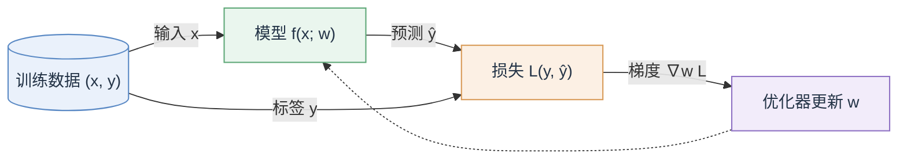
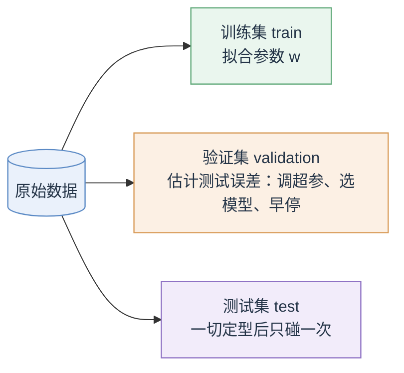

# 机器人学习（三）：机器学习与深度学习速览

这一讲暂时离开机器人本体，把后面所有方法都要踩的地基——监督学习 (supervised learning) 与深度学习 (deep learning)——完整过一遍。模仿学习 (imitation learning) 本质上就是监督学习；强化学习 (reinforcement learning) 里的价值函数 (value function) 和策略 (policy) 也都是用这一套训练出来的。

## 1. 开场：几条心法

这个领域视角众多、名词泛滥，很多有影响力的想法来自其他领域。Yi Ma 化用庞加莱 (Poincaré) 开过一个玩笑：数学是给不同的东西起同一个名字的艺术，机器学习则是给同一个东西起不同名字的艺术。所以遇到新方法，别纠结它叫什么，多问一句它到底靠什么在这个领域上 work (what exactly makes it work so well)。

另一条心法：今天不行，不代表永远不行，理论和实践之间常有巨大的鸿沟 (gap between theory and practice)。2008 年 Ilya Sutskever 在饭桌上劝所有人研究深度神经网络 (deep neural network, DNN)，当时"所有人都知道 DNN 不行"；过参数化 (overparameterization) 在经典统计学习理论（VC 维, VC dimension）里是个坏主意，参数比样本还多必然过拟合，现实却是模型越大效果越好，直到后来才有了 SGD 隐式正则化 (implicit regularization) 之类的理论解释。

课程没有标准教材。常用资料：Deep Learning Book（Goodfellow 等）、Patterns, Predictions, and Actions（Hardt & Recht）、PyTorch 官方教程。

## 2. 监督学习在做什么

一句话定义：**用一组带标签的样本，学一个从输入到输出的函数** $f: X \to Y$。$X$ 是输入空间（观测, observations），$Y$ 是输出空间（目标, targets），训练集 (training set) 记作

$$
D_{\text{train}} = \{(x_1, y_1), \cdots, (x_N, y_N)\}
$$

真正要的不是在训练集上拟合得多好，而是泛化 (generalization)：学到的 $f$ 在没见过的测试数据 (test data) 上也要表现好。

为什么难？看一张人脸照片，我们看到的是脸，计算机看到的只是一个数字矩阵，每个像素 (pixel) 一个灰度值。模式不在单个数字里，而藏在数字之间的复杂关系里。学习的意义正在于此：从"复杂"数据中把模式 (pattern) 提取出来。

按输出空间划分有两类基本问题。回归 (regression) 预测连续值，$Y = \mathbb{R}$ 或 $\mathbb{R}^n$，比如由面积预测房租；分类 (classification) 从固定的有限集合里预测一个类别 (class)，比如猫狗识别、垃圾邮件 (spam) 过滤。此外还有输出结构更复杂的任务，比如目标检测 (object detection)。

## 3. 一套通用骨架：以线性回归为例

不管用什么模型——线性回归还是 GPT——监督学习都由同一组组件构成：模型/架构 (model/architecture)、训练数据 (training data)、损失函数 (loss)、学习目标 (learning objective)、优化 (optimization)，最后以泛化论成败，警惕过拟合 (overfitting) 与欠拟合 (underfitting)。整个训练过程是一个小循环：

用线性回归 (linear regression) 把每个组件落到实处。

模型：拟合一条直线 $f(x \mid w) = w^\top x$。偏置项 (bias) 不用单独处理，给输入添一个恒为 1 的哑特征 (dummy feature)，令 $x = [1; x]$，偏置就并进 $w$ 里了。

训练目标：$y_i \approx f(x_i \mid w)$。

损失函数：平方损失 (squared loss) $L(y, y') = (y - y')^2$。

学习目标：经验损失最小化，

$$
\hat{w} = \arg\min_{w} \; L_N(w) = \sum_{i \in D_{\text{train}}} L\big(y_i,\; f(x_i \mid w)\big)
$$

优化：线性回归加平方损失有闭式解 (closed-form solution) $w = (X^\top X)^{-1} X^\top Y$；更一般的情况用梯度下降 (gradient descent) 迭代求解。

泛化：测试点上的损失也要小。这里有两个常见的坑。一是插值 (interpolation) 相对容易、外推 (extrapolation) 很难，测试点落在训练数据覆盖范围之外时要格外小心；二是分布偏移 (domain shift)，当 $D_{\text{train}}$ 和 $D_{\text{test}}$ 来自不同分布时，泛化没有任何保证。

同一套骨架套在 GPT 上照样成立：模型是 Transformer，数据是互联网文本，损失是下一词预测 (next token prediction) 的交叉熵，优化用 SGD。框架一模一样，变的只是每个组件的具体选择。

## 4. 优化 (Optimization)

### 4.1 GD 还是 SGD

梯度下降 (gradient descent, GD)：$w \leftarrow w - \eta \nabla_w L_N(w)$，每一步都要在全部训练数据上算梯度，数据一大就贵得离谱 (prohibitively expensive)。

小批量随机梯度下降 (mini-batch stochastic gradient descent, SGD) 每步只用一小批数据：

$$
w \leftarrow w - \eta \nabla_w \sum_{i \in \text{Batch}} L\big(y_i,\, f(x_i \mid w)\big)
$$

它的好处不止便宜：一次只需访问一个批量 (batch)，是在线优化算法 (online optimization)；能充分利用快速向量运算 (vector operations)，在 GPU 上尤其明显；天然可并行 (parallelizable)，不同核心算不同 mini-batch 的梯度；而且不是深度学习专属，在大数据集上做最小二乘回归 (least-squares regression) 同样该用它。

### 4.2 学习率 (learning rate) $\eta$

$\eta$ 太大，算法会震荡 (oscillate) 甚至发散 (diverge)；太小，收敛 (converge) 慢到不可接受。理想状态是在不发散的前提下尽量大。实践中的经验 (rules of thumb)：先把损失除以样本数做归一化 (normalize)，让 $\eta$ 的合理量级不随数据集大小漂移；从较大的步长 (step size) 开始；验证误差 (validation error) 不再下降时就减小步长，例如 $\eta_{t+1} \leftarrow \eta_t / 2$；验证误差彻底没有进展时停止训练，即早停 (early stopping)。

### 4.3 SGD 之外

深度学习的损失面是非凸的 (non-convex)，存在大量局部极小 (local minima)。好消息是我们并不执着于全局最优 (global optimum)，找到一个足够好的局部最优就行。围绕"更稳、更快"发展出一族优化器：动量法 (Momentum)、AdaGrad、RMSProp、Adam……目标都是提升鲁棒性 (robustness) 和效率，彼此各有取舍 (trade-offs)。以动量为例，把历史梯度累积成速度 (velocity)：

$$
v_{t+1} = \rho\, v_t - \eta\, g(w_t), \qquad w_{t+1} = w_t + v_{t+1}
$$

震荡方向的分量相互抵消，一致方向的分量不断加速，收敛路径明显更平滑。

### 4.4 正则化 (Regularization)

在学习目标里加一项 $\lambda \cdot R(w)$，相当于给参数注入归纳偏置 (inductive bias)，比如偏好稀疏 (sparsity) 或平滑 (smoothness)：

$$
\arg\min_{w} \sum_{i \in D_{\text{train}}} L\big(y_i, f(x_i \mid w)\big) + \lambda \cdot R(w)
$$

两个经典选择：岭回归 (ridge regression) 取 $R(w) = \lVert w \rVert^2$，偏好"能量"最小的小权重；Lasso 取 $R(w) = \lVert w \rVert_1$，偏好稀疏解，很多分量恰好为 0。

这对机器人特别有用。学动力学 (dynamics) 或做模仿学习时加入平滑性正则，输出的控制量才不会抖。经典例子是平滑模仿学习 (smooth imitation learning)：自动运镜摄像机若用普通监督学习直接模仿人类摄像师，镜头会剧烈抖动，加了平滑约束后轨迹才接近人类水平（Hoang et al., ICML'16）。

## 5. 泛化：过拟合、欠拟合与模型选择

### 5.1 两种失败模式

| | 训练误差 | 测试误差 | 病因 | 常用药方 |
|---|---|---|---|---|
| 欠拟合 (underfitting) | 高 | 高，和训练误差差不多 | 高偏差 (bias)：模型容量太低 | 加大模型复杂度 |
| 过拟合 (overfitting) | 低 | 远高于训练误差 | 高方差 (variance)：模型对训练集过度敏感 | 更多数据、正则化、早停 |

### 5.2 偏差-方差分解 (bias-variance decomposition)

把训练出的参数看作训练集的函数：$w_D$。设 $D$ 由 $N$ 个从 $P(x, y)$ 独立同分布 (i.i.d.) 采出的样本组成（即没有 domain shift），我们关心的是期望测试误差 (expected test error)：

$$
\mathbb{E}_D\, \mathbb{E}_{(x,y) \sim P}\big[L\big(y,\, f(x \mid w_D)\big)\big]
$$

统计学习理论 (statistical learning theory) 的任务就是把这个量刻画成 $N$、$f$、$P$ 的函数。在平方损失下它可以精确拆开，记平均预测 $F(x) = \mathbb{E}_D[f(x \mid w_D)]$，则

$$
\mathbb{E}_D \mathbb{E}_{(x,y) \sim P}\big[L\big]
= \mathbb{E}_{(x,y) \sim P}\Big[\underbrace{\mathbb{E}_D\big[(f(x \mid w_D) - F(x))^2\big]}_{\text{方差 (variance)}} \;+\; \underbrace{(F(x) - y)^2}_{\text{偏差 (bias)}}\Big]
$$

从这个分解读两种失败模式：过拟合对应高方差，方差随模型复杂度上升、随训练数据增多下降；欠拟合对应高偏差，模型复杂度太低时发生，极端例子是 $f(x \mid w_D) \equiv$ 常数，方差为零，偏差巨大。

### 5.3 但大模型不守规矩：双下降 (double descent)

经典观点认为模型复杂度要卡在偏差与方差的平衡点上（bias-variance tradeoff）。可当模型大到跨过插值阈值 (interpolation threshold)，也就是训练误差被压到 0 之后，测试误差会再次下降，进入"越大越好"的现代范式 (modern regime)。这就是深度双下降 (deep double descent) 现象，也正是开头那个"过参数化理论上不行、实践上真香"故事的图像版。

### 5.4 验证集 (validation set) 与模型选择 (model selection)

模型和超参数 (hyperparameters)，比如学习率、模型大小、$\lambda$，到底怎么挑？手里只有训练数据，真实测试误差量不到。机器学习的一条关键原则是"测试条件与训练条件必须匹配" (test and train conditions must match)。标准做法是把数据切开：

在训练集上拟合参数，在验证集上估计测试误差，据此选模型、调超参数、决定早停；数据少时用 k 折交叉验证 (k-fold cross-validation)，把数据切成 k 等份轮流当验证集，误差取平均。测试集绝不能参与调参，否则它变相进入了训练，估出来的泛化误差必然偏乐观。

## 6. 概率视角 (Probabilistic Approach)

前面的思路是"找 $w$ 使 $y_i \approx f(x_i \mid w)$"。换个角度，直接建模给定输入时标签的条件分布 $P(y \mid x; w)$。

似然 (likelihood)：训练集标签在参数 $w$ 下出现的概率，

$$
P(D_{\text{train}} \mid w) = \prod_i P(y_i \mid x_i;\, w)
$$

最大似然估计 (maximum likelihood estimation, MLE)：找使对数似然 (log likelihood) 最大的 $w$，

$$
\arg\max_{w} \sum_i \log P(y_i \mid x_i;\, w)
$$

注意 $\log P(D_{\text{train}} \mid w) = -L(w)$，最大化对数似然就等价于最小化某个损失。损失函数从来不是拍脑袋定的，背后往往站着一个概率模型。

贝叶斯视角 (Bayesian)：给似然再乘上先验 (prior)，得到后验 (posterior)，

$$
P(w \mid D_{\text{train}}) \propto P(D_{\text{train}} \mid w)\, P(w)
$$

对数先验扮演的正是正则项的角色，例如高斯先验对应岭回归。

### 6.1 例子：逻辑回归 (logistic regression)

二分类 (binary classification)：预测 $\mathrm{sign}\big(f(x \mid w)\big) \in \{+1, -1\}$。想法是让原始分数 (raw score) $f(x \mid w)$ 经过 sigmoid（logistic 函数）变成概率，即 $\sigma\big(f(x \mid w)\big) \approx P(y = +1)$：

$$
\sigma(a) = \frac{1}{1 + e^{-a}}, \qquad \sigma'(a) = \big(1 - \sigma(a)\big)\,\sigma(a)
$$

这个漂亮的导数性质让梯度计算异常干净。对 $w$ 做 MLE，对数似然为

$$
\log P(D_{\text{train}} \mid w) = \sum_i 1_{\{y_i = +1\}} \log \sigma\big(f(x_i \mid w)\big) + 1_{\{y_i = -1\}} \log\big(1 - \sigma(f(x_i \mid w))\big)
$$

取负号就是逻辑损失 (logistic loss)，又名对数损失 (log loss)、二元交叉熵 (binary cross-entropy)。它的梯度是

$$
-\big(1_{\{y_i = +1\}} - \sigma(f(x_i \mid w))\big) \cdot \nabla f(x_i \mid w)
$$

可以读成（真实概率 − 模型预测的概率）乘以特征方向：预测得越准，梯度越小，直觉完全对得上。

### 6.2 多分类：softmax 与交叉熵 (cross-entropy)

$K$ 类时把 sigmoid 换成 softmax，把 $K$ 维原始分数变成和为 1 的概率向量：

$$
\mathrm{softmax}(a)_k = \frac{\exp(a_k)}{\sum_{j=1}^{K} \exp(a_j)}
$$

例：$K = 3$，$Y = \{\text{dog}, \text{cat}, \text{lion}\}$，模型输出 $[-1.2,\ 3.1,\ 0.5]$，过 softmax 得 $[0.013,\ 0.919,\ 0.068]$，即 92% 是猫。对应的损失是交叉熵损失 (cross-entropy loss)：

$$
-\sum_i \sum_{k=1}^{K} 1_{\{y_i = k\}} \log\, \mathrm{softmax}\big(f(x_i \mid w)\big)_k
$$

逻辑损失就是 $K = 2$ 时的特例。

## 7. 监督学习在机器人里的位置

训练集依旧是 $D_{\text{train}} = \{(x_i, y_i)\}$，但 $y$ 可以是很多东西：可以是动力学 (dynamics)，即下一时刻状态或残差力，服务于基于模型的控制和强化学习 (model-based control and RL)；也可以是动作 (action)，即专家的示范动作，这就是模仿学习 (imitation learning)。

真正的难点不在拟合本身，而在 $y$ 怎么产生、学到的 $f$ 怎么用。两个例子。无人机动力学写成 $\dot{x} = f_n(x, u) + f\big(x, c(t)\big)$，其中 $f_n$ 是标称模型 (nominal model)，未知的残差项 (residual)，比如时变风况 $c(t)$ 带来的气动力，从飞行数据里学出来，就能在没见过的风况下稳住飞行。斯坦福的双臂机器人（ALOHA）则靠人类示范数据，学会了自主炒虾。

## 8. 深度学习：为什么需要

先看一个失败案例：把 $100 \times 100 \times 3$ 的图片拉平 (reshape) 成 30000 维向量，直接上线性模型加 softmax 做图像分类，效果很差。为什么？

线性模型 $f(x \mid w) = w^\top x$（或 $w^\top \phi(x)$）把每个特征独立看待，只为每个特征回归一个贡献权重。可是图像里单个像素毫无意义，重要的是像素之间的关系：认出一个人，靠的是五官这些"部件"以及部件之间的空间关系 (parts and relations between parts)。

理论上可以手工设计一个把这些高层特征都编码进去的嵌入 (embedding) $\phi(x)$。但它这么难写，为什么不直接学出来？深度学习做的就是这件事：把特征提取本身变成可学习的。

### 8.1 从神经元到网络

人工神经元 (artificial neuron)：加权和 (weighted sum) 加非线性激活 (activation function)，即 $\sigma(w^\top x)$。恰当地选权重，单个神经元就能干活，比如上半区像素给正权重、下半区给负权重，它就成了一个水平边缘检测器 (horizontal edge detector)。

一层 (layer)：一组并行的加权和加逐元素非线性，矩阵形式 $x' = \sigma(W^\top x)$。

网络 (network)：层的复合，

$$
y = \sigma\Big(W_L^\top \cdots \sigma\big(W_2^\top\, \sigma(W_1^\top x)\big)\Big)
$$

这就是全连接深度神经网络 (fully connected deep neural network, DNN)。

### 8.2 非线性的角色

如果拿掉所有 $\sigma$，一串矩阵乘法可以合并成一个矩阵，整个网络塌缩回一个线性函数，一百层等于一层。

几何视角：线性部分 $w^\top x$ 定义一个超平面 (hyperplane)，算的是输入到超平面的带符号距离，非线性对这个距离做"变换"。层层堆叠，等于不断弯曲、折叠输入空间，直到原本线性不可分 (not linearly separable) 的两类数据，在变换后的空间里变得线性可分。

### 8.3 通用近似定理 (universal approximation theorem)

非正式表述：给定函数 $y = f(x)$ 和任意精度 $\epsilon > 0$，存在一个（任意宽 arbitrarily wide 或任意深 arbitrarily deep 的）网络 $f_w$，使得

$$
\sup_{x \in X} \lVert f(x) - f_w(x) \rVert < \epsilon
$$

注意两点。有些版本要求真函数连续 (continuous)；更重要的是，定理只说网络能表示 (represent) 任何函数，不代表能学到 (learn) 它。一个网络"能装下多少函数"称为它的表达能力 (expressive power)，能否被优化算法找到、找到之后能否泛化，是另外两个独立的问题。

## 9. 怎么训练 DNN

### 9.1 反向传播 (backpropagation)

SGD 照用不误，mini-batch 也照用。唯一的问题是 $w$ 有百万到百亿个参数，$\nabla_w$ 怎么算？逐个参数独立求导 (naïvely) 绝对不行。

答案是反向传播。DNN 本质上是函数的复合 (composition of functions)，所以可以用链式法则 (chain rule)。记第 $l$ 层 $s^{(l)} = W^{(l)\top} x^{(l-1)}$，$x^{(l)} = \sigma(s^{(l)})$，对最后一层有

$$
\frac{\partial \mathcal{L}}{\partial W^{(L)}} = \frac{\partial \mathcal{L}}{\partial x^{(L)}} \cdot \frac{\partial x^{(L)}}{\partial s^{(L)}} \cdot \frac{\partial s^{(L)}}{\partial W^{(L)}}
$$

三个因子分别取决于损失的形式、非线性的导数、以及前一层的输出 $x^{(L-1)\top}$。关键在于复用 (reuse)：算 $\partial \mathcal{L} / \partial W^{(L-1)}$ 时，链条的后半段在算上一层时已经算过，直接拿来接着乘。于是一次前向传播 (forward pass) 加一次反向传播 (backward pass)，就得到所有参数的梯度，总代价与一次前向同一量级。

（实线：前向传播；虚线：反向传播。）

反向传播不挑结构，任何计算图 (computational graph) 上都能做，比如 $y = \sin(w_1 x + \log(w_2 x)) + \cos(x)$ 这样的任意复合。现代框架（PyTorch、TensorFlow 等）把这一步做成了自动微分 (automatic differentiation)：只管写前向计算，梯度自动生成。

### 9.2 为什么 GPU 是标配

DNN 高度可并行 (highly parallelizable)。单元并行 (unit parallelization)：一层内所有神经元的加权和合起来就是一次矩阵-向量乘，同时完成。数据并行 (data parallelization)：把一个 batch 的样本拼成矩阵，多个样本同时前向。CPU 只有几个核心，GPU 有成百上千个核心 (hundreds of cores)，正好吃下这两种并行，这也是"SGD + GPU"成为深度学习标配的原因。

### 9.3 梯度消失 (vanishing gradients)

饱和型 (saturating) 非线性（如 sigmoid）在绝大部分区域导数都接近 0，而反向传播是一长串偏导的连乘：

$$
\frac{\partial \mathcal{L}}{\partial W^{(\ell)}} = \cdots \frac{\partial x^{(L)}}{\partial s^{(L)}} \cdots \frac{\partial x^{(\ell+1)}}{\partial s^{(\ell+1)}} \cdots \frac{\partial x^{(\ell)}}{\partial s^{(\ell)}}\, \frac{\partial s^{(\ell)}}{\partial W^{(\ell)}}
$$

很多小于 1 的数一乘，梯度指数级衰减，网络越深，浅层越收不到学习信号。

首要对策是换非饱和 (non-saturating) 激活函数：ReLU $= \max(0, x)$ 及其变体（leaky ReLU、softplus、ELU），正半轴导数不衰减，是如今的默认选择。

### 9.4 怎么再深一点 (how to go deeper)

除了非饱和激活，还有一族稳定深层训练、缓解梯度消失/爆炸 (vanishing/exploding gradients) 的技术：权重初始化 (weight initialization)、批归一化 (batch normalization)、学习率退火 (learning rate annealing)、残差连接 (residual connections) 等等。

为什么残差连接有用？纯链式结构里，信息和梯度必须一层层往下传，路径太长就传不动；残差连接给输出开了一条捷径 (shorter paths to output)，跳过若干层直接相加，让深层网络里的信号畅通。同一思想的延伸是稠密连接 (dense connections, DenseNet)。

这一讲到 DNN 的训练为止。下一讲继续：深度学习模型（CNN、RNN/LSTM、Transformer)、无监督学习 (unsupervised learning) 与生成模型 (generative model)、DNN 的不确定性量化 (uncertainty quantification) 与验证 (verification)。

## 10. 几个思考题

**监督学习的基本组件有哪些？用线性回归逐一对应。**

模型/架构、训练数据、损失、学习目标、优化，再以泛化论成败。对应线性回归：模型 $f(x \mid w) = w^\top x$；数据是样本对 $(x_i, y_i)$；损失是平方损失；目标是经验损失最小化 $\arg\min_w \sum_i L$；优化用闭式解或 (S)GD；最后看测试误差是否也小。

**为什么大数据集必须用 SGD？除了便宜它还有什么好处？**

GD 每步要遍历全部数据，代价过高。SGD 每步只看一个 mini-batch，是在线算法；还能吃满 GPU 的向量运算、天然可并行；而且不限于深度学习，大规模最小二乘同样适用。

**学习率太大或太小分别什么症状？实践中怎么调？**

太大震荡甚至发散，太小收敛过慢。经验做法：损失按样本数归一化；从大步长起步；验证误差停滞就减半；彻底无进展就早停。

**过拟合和欠拟合分别对应偏差-方差分解的哪一项？各怎么缓解？**

过拟合对应高方差：加数据、正则化、早停。欠拟合对应高偏差：加大模型容量。同时记住这个 tradeoff 在超大模型上可能失效——双下降现象里，跨过插值阈值后模型越大测试误差反而越低。

**为什么不能直接在测试集上调超参数？**

那样测试集就变相参与了训练，违反"测试与训练条件必须匹配"的原则，估出来的泛化误差偏乐观。正确做法是切出验证集（或做 k 折交叉验证）来模拟测试条件。

**MLE 和最小化损失是什么关系？逻辑回归的损失是怎么来的？**

对数似然与损失只差一个负号，最大化似然等价于最小化损失。逻辑回归假设 $P(y = +1 \mid x) = \sigma(f(x \mid w))$，其负对数似然就是逻辑损失（二元交叉熵）；推广到 $K$ 类用 softmax，得到交叉熵损失，逻辑损失是 $K = 2$ 的特例。

**把一个 100 层网络的所有激活函数删掉，会发生什么？**

矩阵连乘合并成单个矩阵，整个网络塌缩成线性函数，表达能力与一层线性模型无异。这正是非线性存在的意义。

**通用近似定理保证了什么、没保证什么？**

保证足够宽或足够深的网络能以任意精度逼近（连续）函数，即表达能力足够。但它没保证 SGD 能找到那组参数，也没保证找到之后能泛化——"能表示"和"能学到"是两回事。

**反向传播为什么高效？**

网络是函数的复合，链式法则展开后，深层已经算过的中间导数在浅层梯度里被复用；一次前向加一次反向就得到全部参数的梯度，总代价与一次前向同量级。

**什么是梯度消失？给出至少三种缓解手段。**

饱和激活的小导数在反向传播的连乘中指数级衰减，导致浅层收不到学习信号。缓解：非饱和激活（ReLU 族）、恰当的权重初始化、批归一化、残差连接，配合学习率退火。