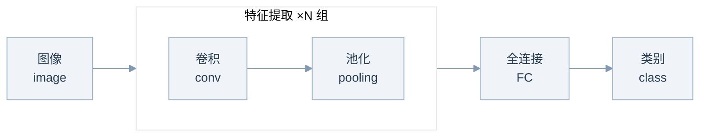
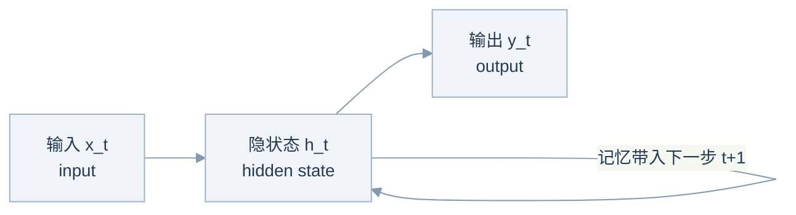
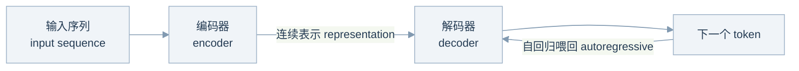
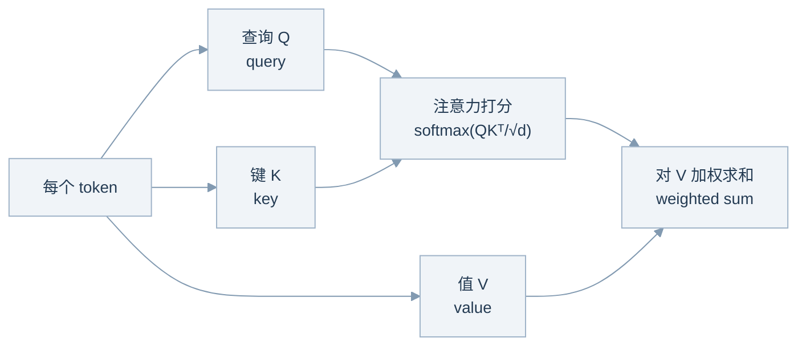
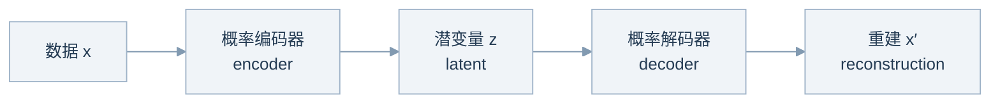
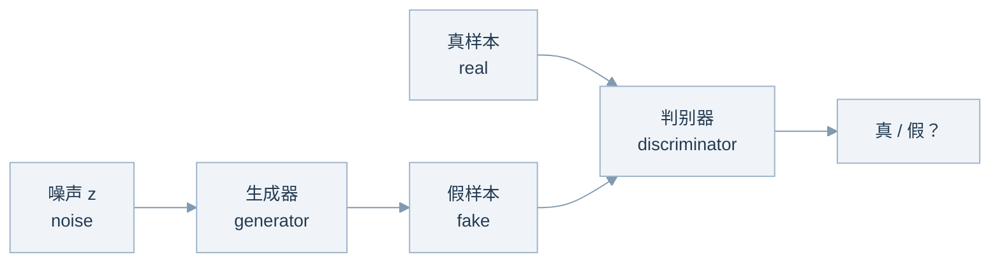
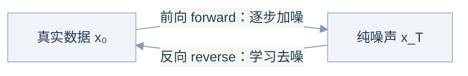

# 机器人学习（四）：三大网络架构、生成模型与不确定性量化

*对应 CMU 16-831 (Spring 2024) Lecture 4: Machine Learning & Deep Learning Refresher（下）*

上一讲复习了监督学习 (supervised learning) 与深度学习 (deep learning) 的基础，这一讲把工具箱补完，共三块：三种主流网络架构（CNN、RNN/LSTM、Transformer）各自把什么假设"焊"进了结构里；没有标签时怎么学——无监督学习 (unsupervised learning) 与生成模型 (generative models)；以及机器人格外关心的两件事——模型知不知道"自己不知道"（不确定性量化, uncertainty quantification），会不会被轻易骗到（网络验证, verification）。

## 1. 三种网络架构：归纳偏置的三档取舍

看架构的统一视角是**归纳偏置 (inductive bias)**：设计者预先塞进网络结构里的假设。偏置多，小数据也学得动，但上限被假设锁死；偏置少，全靠数据喂，上限高、成本也高。CNN、RNN、Transformer 恰好构成一条从"偏置多"到"几乎零偏置"的谱线。

### 1.1 CNN：把空间局部性写进结构

全连接网络 (fully connected network，即 MLP) 里每个神经元都连着整张图，参数量随分辨率爆炸。**卷积神经网络 (Convolutional Neural Network, CNN)** 改用**卷积核 (conv kernel / filter)** 在图上滑动来捕捉空间依赖 (spatial dependencies)，输出**特征图 (feature map)**。三个基本超参数：核大小 (kernel size)、**步长 (stride)**、**填充 (padding)**——例如一张 5×5×1 的图做零填充 (zero padding) 后，用 3×3×1 的核、步长 2，卷出一张 3×3×1 的特征图；RGB 三通道输入则用 3×3×3 的核逐通道卷积、求和、再加偏置 (bias)。名字来自数学里的**卷积算子 (convolution operator)**：f∗g——f 是滤波器、g 是图像、f∗g 是新图像。

CNN 依赖两个归纳偏置：

- **局部性 (locality)**：相邻区域更可能构成有意义的模式，所以每个神经元只看一个局部窗口（感受野, receptive field），同时保持空间顺序 (spatial ordering)；
- **平移不变性 (translation invariance)**：同一个模式出现在图像哪个位置都算数，所以同一组滤波器**权重共享 (weight sharing)**，扫过整张图。

**池化 (pooling)** 负责下采样 (downsampling)：最大池化 (max pooling) 取窗口内最大值，平均池化 (average pooling) 取均值。经典的 LeNet (1998) 就是"卷积-池化"堆几组，再接全连接层收尾：

顺带记一下**等变与不变 (equivariance vs. invariance)**：等变指 f(g(x)) = g(f(x))——先平移再卷积等于先卷积再平移，卷积对平移是等变的；不变指 f(g(x)) = f(x)——猫平移之后，CNN 的分类输出仍是"猫"。想给模型这类性质，两条路：把它设计进网络结构 (network structure)，或者用**数据增强 (data augmentation)** 教出来（同一只狗旋转、裁剪、翻转出一堆训练样本）。

### 1.2 RNN / LSTM：把时间顺序写进结构

时间序列 (time series) 无处不在：语音、股价、文本。任务形态包括分类 (classification)、预测 (prediction)、序列到序列 (sequence-to-sequence, seq2seq，例如机器翻译)。机器人的观测-动作流本身就是时间序列，所以这类模型与我们直接相关。

**循环神经网络 (Recurrent Neural Network, RNN)** 按时间步顺序处理数据，用**隐状态 (hidden state)** h_t 汇总"过去所有可能对未来有用的信息"：

$$h_t = \sigma\big(W_h^\top [h_{t-1}, x_t]\big), \qquad y_t = \sigma\big(W_y^\top h_t\big)$$

问题：学长程依赖 (long-range dependencies) 需要把梯度沿时间反传很多步，于是**梯度消失 / 爆炸 (vanishing / exploding gradients)**；而且必须按时间步串行展开，内存与计算开销 (memory / computational footprint) 都很大。

**长短期记忆网络 (Long Short-Term Memory, LSTM)** 的补救思路：给网络加一条**可训练的记忆 (trainable memory)**——细胞状态 (cell state) c_t，允许显式地"读写"。读写由三个门 (gate) 控制，每个门都是 sigmoid 输出的 0~1 软开关，形如 σ(W⊤[h_{t−1}, x_t])：**遗忘门 (forget gate)** f_t 决定旧记忆留多少，**输入门 (input gate)** i_t 决定新信息写多少，**输出门 (output gate)** o_t 决定露出多少给隐状态：

$$c_t = f_t \odot c_{t-1} + i_t \odot \tanh\big(W_c^\top[h_{t-1}, x_t]\big), \qquad h_t = o_t \odot \tanh(c_t)$$

c_{t−1} 到 c_t 之间近似一条"直通车"，梯度不容易在长序列上消失。

### 1.3 Attention 与 Transformer：把偏置全部拿掉

换个角度看卷积：它其实是一种**局部注意力 (local attention)**——每个位置只"注意"邻近窗口。但很多任务需要**非局部注意力 (non-local attention)**：句首的一个词可能决定句尾怎么翻。**注意力机制 (attention mechanism)** 让模型拥有几乎无限长的记忆 (long-term memory)。

**Transformer**（Vaswani et al., 2017，《Attention Is All You Need》，引用量已破十万）的高层结构：**编码器 (encoder)** 把输入序列映射成一个连续表示 (continuous representation)；**解码器 (decoder)** 拿着这个表示，**自回归 (autoregressive)** 地一次生成一个 token，并把已生成的内容喂回给自己：

进编码器之前有两步：**词嵌入 (input embedding)** 把每个词变成向量；**位置编码 (position embedding)** 用一组 sin/cos 函数把位置信息显式加进去——Transformer 没有 RNN 那样的循环结构 (recurrence)，不加位置信息它分不清词序。

**编码器层 (encoder layer)**：多头自注意力 (multi-headed self-attention) 接一个前馈网络 (feed-forward network)，配残差连接 (residual connections) 和层归一化 (layer normalization)。**自注意力 (self-attention)** 的机制是让输入里的每个词与其他所有词建立关联：输入分别过三个线性层 (linear layer)，得到**查询 (query, Q)、键 (key, K)、值 (value, V)**；Q 与 K 点积得到两两之间的打分矩阵 (score matrix)，分数衡量两个词之间的"注意力"强度；按维度缩放（防止点积过大、softmax 饱和）、过 softmax，再对 V 加权求和：

$$\mathrm{Attention}(Q,K,V) = \mathrm{softmax}\!\left(\frac{QK^\top}{\sqrt{d_k}}\right)V$$

**解码器 (decoder)** 与编码器层几乎一样，多两点：从起始符 (start token) 出发自回归生成；多一层**交叉注意力 (cross attention)**，去注意编码器给出的输入表示。最后输出词表 (vocabulary) 上的概率分布，取最可能的词。

**为什么 Transformer 赢了？**两个词：**简单 (simple)** 和**可扩展 (scalable)**。整个模型只有矩阵加乘、ReLU、softmax，几乎没有归纳偏置 (no inductive bias)，而且天然可并行。对照另外三家：

| 架构 | 短板 |
|---|---|
| CNN | 卷积窗口有限，只能局部注意 (locality) |
| RNN / LSTM | 必须按时间步串行，训练很慢，且有梯度消失 (vanishing gradient) |
| MLP（全连接） | 连接太稠密、参数过多，且吃不了变长输入 (variable-size inputs) |

这正是 Rich Sutton《苦涩的教训》(The Bitter Lesson, 2019) 的论点：**能大规模利用算力的通用方法最终大胜，而最能规模化 (scale) 的两种方法是搜索 (search) 和学习 (learning)**。归纳偏置是人类知识的小聪明，算力加数据才是复利。

应用早已出圈：NLP 里的 GPT、PaLM、LLaMA 自不必说；**ViT (Vision Transformer)** 把图像切成 16×16 的小块 (patch) 当"词"直接喂给 Transformer（"An Image is Worth 16×16 Words"）；**Decision Transformer** 把强化学习轨迹的 (回报 return, 状态 state, 动作 action) 当序列建模，用因果 Transformer (causal transformer) 预测动作——这条线与机器人直接相关，后面还会见到。

## 2. 无监督学习：没有标签怎么学

**无监督学习 (unsupervised learning)**：只从无标签数据 (unlabeled data) 里学"模式 (patterns)"。三种常见设定：聚类 (clustering)、降维 (dimension reduction)、生成模型 (generative models)。

一个重要的近亲是**自监督学习 (self-supervised learning)**：不靠人工标注，让数据自己构造监督信号 (supervisory signals)。GPT 的下一词预测 (next token prediction) 就是自监督——句子的后半段天然是前半段的标签；MAE (masked autoencoder) 遮住图像的大部分块再让网络重建，也是同一思路。互联网规模的预训练 (pre-training) 全靠这一招，因为人工根本标不动那么多数据。

### 2.1 聚类：用"归属"总结数据

聚类是对数据的一种"摘要 (summary)"。最经典的是基于中心的 (centroid-based) **K-Means**：同时选簇划分 C_1…C_K 和簇中心 (cluster centers) c_1…c_K，最小化每个点到自己中心的距离平方和——注意目标函数里完全没有标签 y：

$$\operatorname*{argmin}_{S = C_1 \cup \dots \cup C_K,\ \{c_1,\dots,c_K\}} \sum_{k}\sum_{x \in C_k} \|x - c_k\|^2$$

求解用 **EM 算法 (Expectation-Maximization)**——一个重要的学习算法家族，K-Means 是它最简单的实例：

- **E 步 (E-step)**：固定中心，把每个点 x 分给距离最近的中心 c_k，即估计簇归属 (cluster membership)；
- **M 步 (M-step)**：固定归属，把每个中心更新为簇内均值 c_k = mean(C_k)，即最小化簇内方差 (intra-cluster variance)。

两步交替、目标单调下降直到收敛。注意只收敛到局部最优 (local optimum)、对初始化敏感——这与第一讲说的"优化求解器可能陷入局部最优"一脉相承。

### 2.2 降维：用"投影"总结数据

**降维 (dimension reduction)** 用低维投影 (projection) 概括高维数据：

- **PCA (principal component analysis, 主成分分析)**，计算上等价于 **SVD (singular value decomposition, 奇异值分解)**：把原始特征线性投影到低维空间，尽量保留方差 (variance)；
- **t-SNE (t-distributed Stochastic Neighbor Embedding)**：非线性 (nonlinear)，是高维数据可视化 (visualization) 的常用工具，比如把 MNIST 的十类数字摊在平面上看成团；
- 想再"深"一点：用编码器-解码器 (encoder-decoder) 做重建 (reconstruction)，学到的中间编码 (code) 就是深度表示学习 (deep representation learning) 的产物。

## 3. 生成模型：学会分布，然后采样

**生成模型 (generative model)** 干两件事：**学习 (learning)**——学一个分布 p_θ 去"匹配"数据分布 p_data；**采样 (sampling)**——从 p_θ 里抽出新数据 x_new ∼ p_θ。这事有多难？一张 1400×700 的 RGB 图有 256^(1400×700×3) ≈ 10^800000 种可能，模型要在这么大的空间里把概率质量放对位置。

Feynman 说 "What I cannot create, I do not understand"（我不能创造的，我就不理解）。生成建模把它反过来用："What I understand, I can **create**."

**为什么机器人课要讲生成模型？因为模仿学习 (imitation learning) 本质上就是生成建模**：专家示范 (expert demonstrations) 就是 p_data，学一个 p_θ，然后采样并泛化 (generalize)；而且通常是**条件生成 (conditional generation)**——给定当前观测，生成动作或轨迹。用扩散模型做规划（Planning with Diffusion）、斯坦福双臂机器人自主炒虾的演示，都在这个框架里。另一个用法是**生成仿真 (generate simulations)**：RoboGen 用生成模型自动造出仿真任务和场景，试图"无限"生产机器人训练数据——正面回应第一讲的最大瓶颈：数据从哪来。

三大范式，以及它们的"**不可能三角** ('impossible' triangle)"——样本质量 (quality)、采样速度 (speed)、模式覆盖 (mode coverage / diversity) 三者难以兼得：

| 范式 | 质量 quality | 速度 speed | 覆盖 coverage |
|---|---|---|---|
| GAN (generative adversarial network) | ✓ | ✓ | ✗ 模式坍塌 |
| VAE (variational autoencoder) | 偏模糊 | ✓ | ✓ |
| 扩散模型 (diffusion model) | ✓ | ✗ 多步迭代 | ✓ |

### 3.1 VAE：变分推断加重参数化

目标是最大化对数似然 (log likelihood)：找 θ 最大化 Σ log p_θ(x)，其中

$$p_\theta(x) = \int p_\theta(x \mid z)\, p(z)\, dz$$

这个积分**不可解 (intractable)**——要遍历所有可能的潜变量 (latent variable) z。VAE 的思路：再学一个**编码器** q_φ(z|x) 去近似真后验 (true posterior) p_θ(z|x)，最小化两者的 KL 散度 (KL divergence)。推一通代数之后得到**证据下界 (ELBO, evidence lower bound)**：

$$\log p_\theta(x) \;\ge\; \mathbb{E}_{z \sim q_\phi(z|x)}\big[\log p_\theta(x \mid z)\big] \;-\; D_{\mathrm{KL}}\big(q_\phi(z|x)\,\|\,p(z)\big)$$

直白地读：**最大化重建真实数据的似然，同时用 KL 项把编码分布往先验上拉（正则化, regularization）**。VAE 的损失就是负的 ELBO。

还剩一个新问题：z ∼ q_φ(z|x) 这个采样操作没法反向传播 (backpropagate)。解法是**重参数化技巧 (reparameterization trick)**：让编码器输出高斯的均值 μ 和标准差 σ，令

$$z = \mu + \sigma \odot \epsilon, \qquad \epsilon \sim \mathcal{N}(0, I)$$

随机性全部挪到 ε 上，梯度就能顺着 μ、σ 流回编码器。整体管线：

### 3.2 GAN：一场零和博弈

**GAN (Generative Adversarial Network, 生成对抗网络)** 的灵感来自博弈论 (game theory)：**生成器 (generator)** G 从噪声 z 造假样本、学数据分布；**判别器 (discriminator)** D 学着分辨真假。两者玩零和博弈 (zero-sum game)：

$$\min_G \max_D V(D,G) = \mathbb{E}_{x\sim p_{\text{data}}}[\log D(x)] + \mathbb{E}_{z\sim p_z}\big[\log\big(1 - D(G(z))\big)\big]$$

GAN 训练出了名的难：纳什均衡 (Nash equilibrium) 很难达到、梯度消失、**模式坍塌 (mode collapse)**——生成器翻来覆去只会生成少数几种样本。改进沿三条线走：

1. **更好的散度 (divergence)**：原始 GAN 隐式对应 JS 散度 (Jensen–Shannon divergence)，在函数空间里不平滑；WGAN (Wasserstein GAN) 换成 Wasserstein 距离；
2. **更好的优化 (optimization)**：谱归一化 (spectral normalization, 对判别器做 Lipschitz 约束)、competitive gradient descent；
3. **更好的模型与损失设计**：DCGAN、CycleGAN——后者做无配对的图到图翻译 (unpaired image-to-image translation)：莫奈画风↔照片、斑马↔马、夏天↔冬天。

### 3.3 扩散模型：把生成拆成一千小步

VAE 和 GAN 都是"一步到位 (one-shot)"的生成。**扩散模型 (diffusion model)** 问：如果换成**马尔可夫链 (Markov chain)**，一小步一小步来呢？灵感来自随机微分方程 (SDE) 和非平衡热力学 (non-equilibrium thermodynamics)。一个结构性区别：扩散模型里 dim(z) = dim(x)，潜变量和数据同维；而 GAN/VAE 里 dim(z) ≪ dim(x)。

**前向扩散过程 (forward diffusion process)**：取一条真数据 x₀，逐步加独立同分布的高斯噪声 (iid Gaussians)，直到变成纯噪声 x_T：

$$q(x_t \mid x_{t-1}) = \mathcal{N}\big(x_t;\ \sqrt{1-\beta_t}\,x_{t-1},\ \beta_t I\big)$$

由马尔可夫性 (Markovian) 加重参数化能推出一个好性质：

$$x_t = \sqrt{\bar\alpha_t}\,x_0 + \sqrt{1-\bar\alpha_t}\,\epsilon, \qquad \alpha_t = 1-\beta_t,\quad \bar\alpha_t = \prod_{s=1}^{t}\alpha_s$$

也就是说**任何一步 t 都能从 x₀ 一跳直达**：训练时随机抽一个 t 直接采样，不必真的一步步模拟。

**反向扩散过程 (reverse diffusion process)**：学一个高斯 p_θ(x_{t−1}|x_t)，从纯噪声 x_T 出发一步步去噪，还原出 x₀。推导套路与 VAE 相同——变分下界 (variational lower bound) 加重参数化——化简到最后，损失出奇地简单：**让网络预测当初加进去的噪声**：

$$L_t^{\text{simple}} = \mathbb{E}_{t,\,x_0,\,\epsilon}\Big[\ \big\|\epsilon - \epsilon_\theta(x_t,\, t)\big\|^2\ \Big]$$

再深一层的联系是**随机梯度朗之万动力学 (stochastic gradient Langevin dynamics)**——一个物理概念：只靠对数密度的梯度 ∇ₓ log p(x)（称为**分数, score**）就能从 p(x) 采样；当步数趋于无穷、步长趋于零时，样本收敛到真实分布。分数生成模型 (score-based generative models, Song & Ermon, 2019) 直接学一个分数网络 s_θ(x)，而扩散模型里的 ε_θ 可以看作（缩放过的）分数函数——两条路殊途同归。DALL·E 3 这类文生图 (text-to-image) 就是扩散模型的代表作。

## 4. 不确定性量化与网络验证：机器人为什么格外在意

第一讲说过：物理世界不原谅错误。所以机器人版的深度学习必须多回答两个问题——**模型知不知道自己不知道？**（不确定性量化, uncertainty quantification, UQ）**模型会不会被轻易骗到？**（网络验证, DNN verification）

机器人里的两个真实用法：

- **抓取 (grasping)** [Shi et al., 2021]：对不确定性高的物体，模型给出的抓取候选明显发散；对有把握的物体则收敛成一致的抓取位姿——不确定性本身就是可利用的信号；
- **基于模型的强化学习 (model-based RL, MBRL)** [Chua et al., 2018, PETS]：用集成 (ensemble) 学动力学模型 (dynamics model)，做轨迹传播 (trajectory propagation) 时带着不确定性一起往前推，再交给模型预测控制（第一讲记过的 MPC）去规划——自然而然地避开模型没把握的区域。

三类主流 UQ 方法：

1. **概率模型与贝叶斯方法 (Bayesian methods)**：贝叶斯神经网络 (Bayesian neural networks)、高斯过程 (Gaussian processes)、dropout（不只训练时用，推理时也开着，多次前向的方差就是不确定性的近似）；
2. **集成方法 (ensemble methods)**：训 K 个独立网络（不同初始化或数据增强），预测之间的分歧就是不确定性估计；
3. **保形预测 (conformal prediction)**：对**任意黑盒预测器 (arbitrary black-box predictors)** 都适用——在校准集 (calibration set) 上计算分数 (score) 并取其 1−α 分位数 (quantile)，然后对新样本输出一个**预测集 (prediction set)** τ(X)，自带覆盖率 (coverage) 保证：

$$P\big(Y_{n+1} \in \tau(X_{n+1})\big) \ge 1 - \alpha$$

**DNN 验证 (verification)** 的动机是深度网络出奇地**脆弱 (fragile)**。对抗样本 (adversarial example) 的经典演示：一张熊猫图加上 0.007 倍、人眼不可见的定向噪声，网络就以 99.3% 的置信度 (confidence) 改口叫"长臂猿 (gibbon)"。验证的目标可以形式化为：**证明输入集内的所有 x，其输出都落在安全集内**，即 x ∈ X ⇒ f(x) ∈ Y。例如"分类抗扰动 (perturbation)"：X 取 x₀ 附近的小扰动球 {x : ‖x − x₀‖ₚ ≤ ε}，Y 要求正确类别的得分始终最高。方法家族：可达性分析 (reachability)、优化 (optimization)、搜索 (search)。延伸阅读：Algorithms for Verifying Deep Neural Networks (Liu et al., 2019)。

## 5. 几个思考题

**CNN 的两个归纳偏置是什么？分别落实成了什么结构设计？**

局部性 (locality)：邻近区域的模式更强，落实为卷积核只看局部窗口、并保持空间顺序；平移不变性 (translation invariance)：同一模式在哪都算数，落实为滤波器权重共享、扫过全图。想要更多等变/不变性质，要么设计进网络结构，要么靠数据增强 (data augmentation) 教出来。

**RNN 为什么难训练？LSTM 靠什么缓解？**

学长程依赖要把梯度沿时间反传很多步，导致梯度消失/爆炸，且串行处理的内存与计算开销大、训练慢。LSTM 引入细胞状态 (cell state) 作为可训练的记忆，用遗忘/输入/输出三个门控制读写；c_{t−1} 到 c_t 是一条近似恒等的通路，梯度更容易流过去。

**自注意力里 Q、K、V 各扮演什么角色？打分之后为什么要缩放？**

每个 token 用查询 Q 去查别人、用键 K 供别人查、用值 V 提供实际内容；QKᵀ 得到两两"注意力"打分矩阵，softmax 后对 V 加权求和。除以 √d_k 是防止维度大时点积数值过大、softmax 进入饱和区导致梯度消失。

**Transformer 相比 CNN / RNN / MLP 赢在哪？这和《苦涩的教训》是什么关系？**

简单（只有矩阵加乘、ReLU、softmax）、几乎没有归纳偏置、高度可扩展 (scalable)、天然并行、支持变长输入。对照：CNN 受限于局部窗口，RNN/LSTM 串行慢且梯度消失，MLP 参数爆炸且不支持变长输入。这印证了 Bitter Lesson：能规模化吃算力和数据的通用方法（搜索与学习），终将胜过手工设计的领域知识。

**监督、无监督、自监督怎么区分？GPT 和 MAE 属于哪类？**

监督学习 (supervised) 用人工标签；无监督学习 (unsupervised) 只从无标签数据找模式（聚类、降维、生成模型）；自监督学习 (self-supervised) 用数据自身构造监督信号。GPT 的下一词预测和 MAE 的遮块重建都是自监督。

**K-Means 的 E 步和 M 步分别在优化什么？能收敛到全局最优吗？**

E 步固定中心，把每个点分给最近中心（优化簇归属）；M 步固定归属，把中心移到簇内均值（最小化簇内方差）。两步都不会增大目标函数，所以收敛，但只到局部最优，对初始化敏感。

**生成模型的"不可能三角"指什么？三大范式各占哪两角？**

样本质量 (quality)、采样速度 (speed)、模式覆盖 (coverage/diversity) 三者难以兼得。GAN：质量+速度，缺覆盖（模式坍塌）；VAE：速度+覆盖，样本偏糊；扩散模型：质量+覆盖，采样慢（多步迭代）。

**VAE 为什么需要 ELBO？为什么需要重参数化技巧？**

似然 p_θ(x) = ∫ p_θ(x|z)p(z)dz 的积分不可解，于是学 q_φ(z|x) 近似后验，把目标换成可优化的证据下界（重建项 + KL 正则项）。而采样 z ∼ q_φ(z|x) 不可导，用 z = μ + σ⊙ε 把随机性挪到 ε 上，梯度才能流回编码器。

**扩散模型和 VAE / GAN 最大的结构区别是什么？训练损失最后化简成了什么？**

一步生成换成马尔可夫链多步去噪，且潜变量与数据同维（dim(z) = dim(x)）。前向过程的好性质 x_t = √ᾱ_t·x₀ + √(1−ᾱ_t)·ε 允许任意步直接采样；训练损失化简为噪声预测的均方误差 ‖ε − ε_θ(x_t, t)‖²。

**模仿学习和生成模型是什么关系？**

模仿学习就是把专家示范当 p_data、学 p_θ 再采样的（条件）生成建模：输入观测、生成动作。所以 VAE、GAN、扩散模型都能当策略类 (policy class) 用；生成模型还能反过来生产仿真和数据（RoboGen），缓解第一讲说的数据瓶颈。

**机器人系统里，不确定性量化有哪些落地方式？**

抓取时对高不确定的物体输出发散的候选（或干脆放弃、请求帮助）；MBRL 里用模型集成传播不确定性，让 MPC 避开模型没把握的状态区域。方法上三板斧：贝叶斯（BNN / 高斯过程 / dropout）、集成、保形预测（黑盒适用、自带覆盖率保证）。
