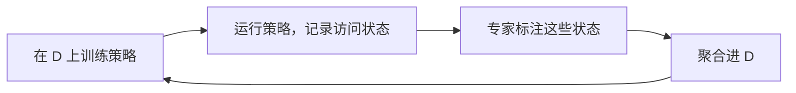

# 机器人学习（五）：模仿学习与 DAgger

对应课件 Lecture 5: Imitation Learning (Part 1)。主线是：先立好序列决策的记号，再引入模仿学习，然后回答本讲最重要的问题——它长得像监督学习，但为什么不是；最后看两类解法，重点是 DAgger。

## 1. 记号：MDP、POMDP 和 RL 的目标

后面整个课程都用这套符号，先记牢：

- $S$：状态空间 (state space)，$s_t \in S$
- $A$：动作空间 (action space)，$a_t \in A$
- $O$：观测空间 (observation space)，$o_t \in O$
- $p$：一步转移概率，也叫动力学 (dynamics)，$s_{t+1} \sim p(\cdot \mid s_t, a_t)$
- $h$：观测模型 (observation model)，$o_t \sim h(\cdot \mid s_t)$
- $r: S \times A \to \mathbb{R}$：奖励函数 (reward function)

这些定义式怎么读：$\in$ 是"属于"；波浪号 $\sim$ 读"服从"，$x \sim p$ 表示 $x$ 是从分布 $p$ 里随机抽出来的一个样本；竖线 $\mid$ 读"在……的条件下"；圆点 $\cdot$ 只是占位符。所以 $s_{t+1} \sim p(\cdot \mid s_t, a_t)$ 整句是"给定当前状态和动作，下一个状态从条件分布 $p$ 中随机产生"——之所以是分布而不是确定值，是因为物理世界有噪声，同样的动作可能落到不同的状态。$r: S \times A \to \mathbb{R}$ 里的冒号和箭头描述函数的输入输出：吃进一个（状态, 动作）对，吐出一个实数（$\mathbb{R}$ 表示全体实数），衡量这一步做得好不好。

马尔可夫决策过程 (Markov Decision Process, MDP) 就是四元组 $(S, A, p, r)$，目标是学一个策略 (policy) $\pi_\theta(a_t \mid s_t)$，读作"在状态 $s_t$ 下选动作 $a_t$ 的概率"；下标 $\theta$ 表示策略由一组可学习的参数（比如神经网络的权重）决定，所谓学习就是调这组参数。部分可观测的版本 (Partially Observed MDP, POMDP) 是六元组 $(S, A, O, p, h, r)$，区别只有一处：策略看不到真实状态，只能基于观测来决策，即 $\pi_\theta(a_t \mid o_t)$。机器人基本都活在 POMDP 里，相机图像是 $o_t$，世界的真实物理状态 $s_t$ 是拿不到的。

为什么非要马尔可夫性 (Markov property)？因为它允许我们"知道当前状态后，扔掉全部历史"：$s_{t+1}$ 只依赖 $(s_t, a_t)$，与 $s_{t-1}$ 无关。

强化学习和控制的目标可以写成一行：

$$\theta^\star = \arg\max_\theta \; E_{\tau \sim p_\theta(\tau)}\left[\sum_t r(s_t, a_t)\right]$$

这行从里往外读。最里面的 $\sum_t r(s_t, a_t)$ 是把一条轨迹上每一步的奖励加起来，得到总奖励；$E[\cdot]$ 是期望（平均值），因为策略和环境都有随机性，同一个策略跑很多次会得到不同轨迹，所以要看平均表现，下标 $\tau \sim p_\theta(\tau)$ 说明这些轨迹是按当前策略产生的；最外层 $\arg\max_\theta$ 的意思是"在所有可能的参数中，返回让括号里的值最大的那个 $\theta$"（$\max$ 返回最大值本身，$\arg\max$ 返回取到最大值的位置）。合成一句话：找一组参数，使得按它行动的平均总奖励最大，这个最优解记作 $\theta^\star$（星号表示"最优"）。

上式里的 $\tau = (s_1, a_1, \dots, s_T, a_T)$ 表示一整条轨迹 (trajectory)，它出现的概率可以精确写出来：

$$p_\theta(\tau) = p(s_1)\prod_{t} \pi_\theta(a_t \mid s_t)\, p(s_{t+1} \mid s_t, a_t)$$

$\prod$ 是连乘号（$\sum$ 的乘法版本）。回想一条轨迹是怎么发生的：环境先随机给出初始状态（概率 $p(s_1)$），然后不断循环"策略选动作（概率 $\pi_\theta$）、环境转移到下一个状态（概率 $p$）"。这一整串事件恰好如此发生的概率，就是把每一步的概率全部乘起来——和"连续抛硬币得到某个特定序列的概率等于各次概率之积"是一个道理。

时间跨度 $T$ 可以有限 (finite horizon) 也可以无限 (infinite horizon, $T = \infty$)。无限时直接求和会发散，所以给奖励打折扣，写成 $\sum_t \gamma^t r(s_t, a_t)$，折扣因子 (discount factor) 满足 $0 < \gamma \le 1$。指数 $\gamma^t$ 意味着越远的奖励折得越狠：取 $\gamma = 0.9$ 的话，第 0 步的奖励不打折，第 10 步的只按 $0.9^{10} \approx 0.35$ 计。这样一来保证无穷和收敛，二来表达"眼前的奖励比遥远的更值钱"。

## 2. 什么是模仿学习

想法非常朴素：收集专家数据 (expert data)，也就是成对的"观测/状态-动作"，再训练一个函数把观测映射到动作。这个做法有个更直白的名字：行为克隆 (behavior cloning, BC)。

流程和监督学习一模一样。专家示范出轨迹 $s_0, a_0, s_1, a_1, \dots, s_T, a_T$，把每个 $(s_i, a_i)$ 当作一条训练样本，用监督学习拟合 $\hat a = \pi(s_i)$——帽子记号 $\hat a$ 表示模型的预测值，区别于数据里专家的真实动作 $a_i$，训练就是让预测尽量贴近真实标签。拿自动驾驶举例：输入是相机图像这种高维观测 (high-dimensional observation)，输出是方向盘转角 (steering angle)，范围 $[-1, 1]$，本质上就是一个回归问题。

这条路线历史很久。1989 年 CMU 的 ALVINN (Autonomous Land Vehicle In A Neural Network) 用一个很小的网络——30×32 的图像输入、5 个隐藏单元、30 个输出——就让车自己开起来了，算是深度模仿学习的鼻祖，CMU 后来也孵化了一大批自动驾驶公司。今天的代表工作有 Mobile ALOHA（自主做虾）和 Diffusion Policy（双臂倒酱汁），说明数据到位时，BC 能做出相当惊艳的操作 (manipulation) 任务。

## 3. 为什么它不是标准监督学习

本讲的核心一节。BC 确实能 work，但直接把它当监督学习用，会在一个不太直观的地方翻车。

### 3.1 i.i.d. 假设不成立

先回忆监督学习的理论故事。Vapnik-Chervonenkis (1971) 定理说：只要训练样本 $(x_i, y_i)$ 是从同一分布独立同分布 (i.i.d.) 采样的，那么对函数类 $\mathcal{F}$ 中的任意 $f$，都有

$$\text{测试误差} \;\le\; \text{训练误差} + O\!\left(\sqrt{\frac{d_{VC}(\mathcal{F})}{n}}\right)$$

三个量的含义：训练误差是模型在见过的数据上的错误率；$n$ 是训练样本数量；$d_{VC}(\mathcal{F})$ 叫 VC 维 (VC dimension)，可以粗略理解为模型的复杂度、能"折腾"的程度。$O(\cdot)$ 表示只看量级、忽略常数。整个不等式在说：测试误差最多比训练误差多出一个尾巴项，这个尾巴分子是模型复杂度、分母是数据量——数据越多尾巴越小，模型越复杂尾巴越大。所以只要样本够多，低训练误差就能换来好的测试表现，这是监督学习敢于泛化的底气。但注意，前提写在定理条件里：样本必须 i.i.d.。

模仿学习恰恰破坏了它：$t$ 时刻输出的动作，决定了 $t+1$ 时刻看到的状态。数据不是从某个固定分布里独立抽出来的，而是策略自己一步一步"走"出来的。

### 3.2 分布漂移是动态的、致命的

监督学习里本来就有域漂移 (domain shift) 问题：训练分布和测试分布不一致，性能会掉。但序列决策把它放大成了另一种性质的东西。

专家数据里几乎只有"好"状态。专家水平高，基本不会把自己弄进"坏"状态，所以坏状态在训练集里近乎不存在。学到的策略只要犯一个小错，就滑出了训练分布 (out of the training distribution)，进入一个它从没见过的区域；在陌生区域更容易犯错，错误于是一级级放大，形成级联失败 (cascading failures)，也叫复合误差 (compounding errors)。

课上的说法是：统计意义上，模仿学习是悬崖行走 (cliff walking)。普通监督学习的域漂移是静态的，这里的漂移是动态的 (dynamic) 且致命的 (fatal)：分布随着策略自己的行为不断移动，而一次出界就可能再也回不来。

### 3.3 误差界是 $O(\epsilon T^2)$

把上面的直觉定量化。先定义代价 (cost)：

$$c(s, a) = \begin{cases} 0 & \text{if } a = \pi^\star(s) \\ 1 & \text{otherwise} \end{cases}$$

大括号表示分情况取值，这其实就是个计错器：在状态 $s$ 下，策略选的动作和专家会选的一致就记 0 分，不一致就记 1 分（$\pi^\star$ 的星号表示专家/最优策略）。沿整条轨迹把 $c$ 加起来，得到的就是总共犯错的次数。

再做一个假设：对训练集里的所有状态 $s \in \mathcal{D}_{\text{train}}$，都有 $\pi_\theta(a \ne \pi^\star(s) \mid s) \le \epsilon$。读作"只要待在训练时见过的状态里，策略单步选错动作的概率不超过一个小数 $\epsilon$"——也就是在熟悉的地方它基本靠谱，这正是监督学习训练完能保证的东西。

在悬崖行走式的最坏情况下（犯一次错，之后步步皆错），期望总代价满足

$$E\left[\sum_t c(s_t, a_t)\right] \le \epsilon T + \epsilon T + \cdots = O(\epsilon T^2)$$

左边读作"整条轨迹上期望总共犯错的次数"。推导的直觉是按"第一次犯错发生在哪一步"分情况讨论：第一次犯错发生在第 1 步的概率约为 $\epsilon$，最坏情况下之后 $T$ 步全部报废，损失约 $T$；第一次犯错发生在第 2 步，损失约 $T-1$……全部加起来是 $\epsilon T + \epsilon(T-1) + \cdots + \epsilon \approx \epsilon T^2/2$。也可以像课件那样记：一共 $T$ 项、每项至多 $O(\epsilon T)$，所以总量级是 $O(\epsilon T^2)$。结论：测试误差随时间跨度平方增长；而普通监督学习里每一步的错误互不传染，总误差只是 $\epsilon T$，线性增长。更完整的分析见 Ross et al., "A Reduction of Imitation Learning and Structured Prediction to No-Regret Online Learning"。

两点补充。第一，这个界偏悲观：现实中犯了错常常可以恢复 (recover)，并非每错必坠崖。第二，由此有个反直觉的悖论 (paradox)：如果示范数据里多一些错误以及错误之后的修正，模仿学习反而可能学得更好——错误本身有害，但"怎么从错误里恢复"这个信息更有价值。

顺带一提，这个毛病不是机器人独有的，一切序列预测 (sequential prediction) 都有。比如逐帧预测视频，把预测出的帧再喂回去继续往后预测，误差同样会累积，几十步之后画面就糊了。自回归生成天然带着这个问题。

## 4. 怎么解决

课程给了四条路线，本讲展开前两条：一是聪明地收集和增广数据；二是改算法，也就是 DAgger；三是下一讲的思路，用足够强的模型把单步错误率 $\epsilon$ 压到极小；四是第 23 讲的多任务学习 (multi-task learning)。

### 4.1 在数据上做文章

ALVINN 的论文在 1989 年就把话说明白了：不能只给网络看"开得准"的示范，还必须教它犯错之后如何恢复（回到路中央）。落实下来是两个思路。

思路一，采集数据时故意加错误和修正。错误本身对训练有害，但修正带来的收益往往大于错误的伤害。

思路二，数据增广 (data augmentation)，人工合成一些展示纠错的数据。两个例子：

- 用鲁棒管道 MPC (robust tube MPC) 当专家（Tagliabue et al.）：MPC 能给出轨迹管道内任意扰动状态下的正确动作，相当于免费得到一圈纠错样本，在无人机上验证过，示范效率很高；
- 扰动驾驶员的方向盘信号（Codevilla et al., end-to-end conditional imitation learning）：人开车时往控制信号里注入噪声 (noise)，驾驶员会自然地把车修正回来，"扰动 + 人的修正"正是我们想要的训练数据。

### 4.2 改算法：DAgger

DAgger (Dataset Aggregation)，CMU 2011 年的工作。核心想法一句话：既然问题出在"训练分布 ≠ 策略实际走到的分布"，那就用交互 (interaction) 去策略实际到达的状态上收集专家标注。

算法一共四步，不断循环：

1. 在人类数据 $\mathcal{D} = \{o_1, a_1, \dots, o_N, a_N\}$ 上训练 $\pi_\theta(a_t \mid o_t)$；
2. 运行 $\pi_\theta$，收集它实际访问到的观测 $\mathcal{D}_\pi = \{o_1, \dots, o_M\}$；
3. 请专家为 $\mathcal{D}_\pi$ 中的观测逐个标注动作 $a_t$；
4. 聚合 (aggregate)：$\mathcal{D} \leftarrow \mathcal{D} \cup \mathcal{D}_\pi$，回到第 1 步。

几个记号：花体 $\mathcal{D}$ 表示数据集 (dataset)；$\mathcal{D}_\pi$ 的下标 $\pi$ 提醒这批数据是策略自己跑出来的，而且一开始只有观测、没有动作标签，标签由第 3 步的专家补上；第 4 步里 $\cup$ 是集合取并集，$\leftarrow$ 表示更新赋值，整句读作"把新数据并入老数据集，再重新训练"。

注意第 2、3 步的分工：状态来自学到的策略，动作标签来自专家。这样迭代下去，训练分布会逐轮逼近策略的测试分布，漂移从根子上被消掉。

理论上，DAgger 本质是一个在线学习 (online learning) 算法，带遗憾保证 (regret guarantees)，能把误差从 BC 的 $O(\epsilon T^2)$ 拉回 $O(\epsilon T)$。课上的 Mario Kart 演示也印证了这一点：BC 在彩虹桥开局不久就冲出赛道，DAgger 能稳稳跑完全程。

它的问题同样明显：需要不停地请专家在线标注 (keep querying the expert)，又贵又慢，难以规模化。这也是下一讲换思路的动机——干脆用非常强的模型，让 BC 本身就少犯错。

两种方法对比：

| | 行为克隆 BC | DAgger |
|---|---|---|
| 训练状态来自 | 专家自己的轨迹 | 学到的策略实际访问的状态 |
| 分布匹配 | 训练 ≠ 测试，会漂移 | 逐轮逼近测试分布 |
| 误差量级 | $O(\epsilon T^2)$ | $O(\epsilon T)$ |
| 专家参与 | 一次性离线示范 | 每轮都要在线标注 |

## 5. 思考题

**模仿学习为什么不是标准监督学习？坏掉的是哪条假设？**

坏在 i.i.d.。VC 理论里"低训练误差 ⇒ 好测试表现"要求训练与测试样本来自同一分布且独立采样；而模仿学习里当前动作决定下一个状态，数据是策略自己走出来的。策略与专家稍有偏差，它访问的状态分布就偏离训练分布，且偏差随时间累积。

**BC 的 $O(\epsilon T^2)$ 是怎么推出来的？$\epsilon$ 和 $T$ 分别指什么？**

$\epsilon$ 是策略在训练分布内单步犯错的概率上界，$T$ 是时间跨度。最坏情况（悬崖行走）下，第一次犯错发生在第 $t$ 步的概率约 $\epsilon$、代价是之后约 $T-t$ 步全部报废；把所有情形加总，$\epsilon T + \epsilon(T-1) + \cdots + \epsilon \approx \epsilon T^2/2$，量级 $O(\epsilon T^2)$，测试误差随时间跨度平方增长。

**"数据里多些错误反而更好"这个悖论怎么理解？**

纯专家数据只覆盖好状态，策略没见过坏状态，更不会从坏状态恢复。带错误与修正的数据恰好教会它"跌出去之后怎么回来"，而修正的收益通常大于错误的伤害。tube MPC 增广和扰动方向盘都是这个思想的工程化。

**DAgger 的四步分别是什么？它为什么能治分布漂移？代价是什么？**

训练、运行策略收集状态、请专家标注、聚合数据，循环往复。因为新数据的状态取自当前策略的真实访问分布，训练分布逐轮逼近测试分布，误差回到 $O(\epsilon T)$。代价是专家必须持续在线参与，昂贵、缓慢、难扩展。

**MDP 和 POMDP 一句话区分？机器人为什么多半处在 POMDP 里？**

MDP 的策略直接以状态为输入，$\pi_\theta(a_t \mid s_t)$；POMDP 的策略只能以观测为输入，$\pi_\theta(a_t \mid o_t)$，其中 $o_t \sim h(\cdot \mid s_t)$，信息不完整。机器人只能靠相机、IMU 这类传感器感知世界，拿到的是观测而不是真实状态。