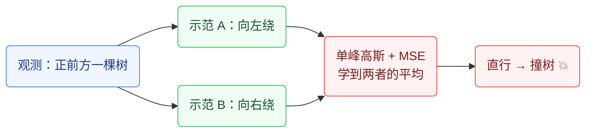
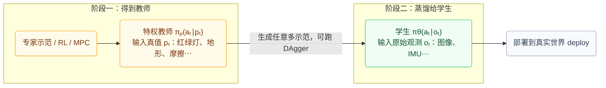
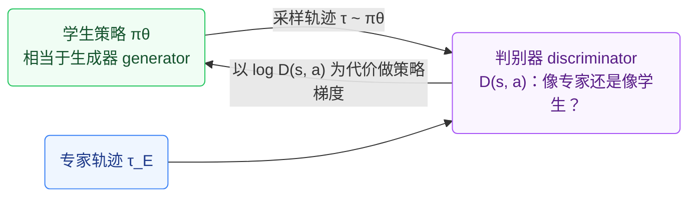
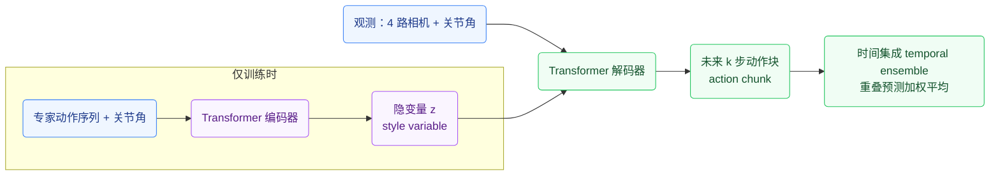
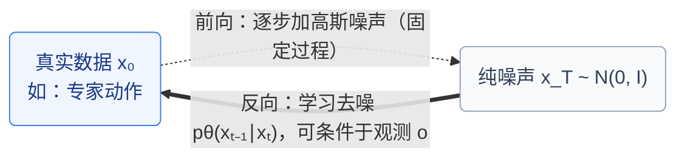

# 机器人学习（六）：模仿学习（下）—— 更强的模型、特权教师与生成式策略

## 1. 承上启下

上一讲把模仿学习 (imitation learning, IL) 的基本盘讲完了：行为克隆 (behavior cloning, BC) 把"观测→动作"当普通监督学习 (supervised learning) 做，会因为分布偏移 (distribution shift) 产生复合误差 (compounding errors)；缓解办法一是更好的数据（数据增强 data augmentation），二是更好的算法（DAgger, Dataset Aggregation）。

这一讲往前走三步，先记一张地图：

| 本讲主题 | 针对的痛点 | 关键做法 |
|---|---|---|
| 利用历史 (use history) | 单帧策略"见图即动"，不符合人类示范习惯 | 共享编码器 + 序列模型 (Transformer / LSTM) |
| 建模多峰行为 (multi-modal behavior) | 对"多个正确答案"取平均，得到唯一错误的动作 | GMM / CVAE / 扩散模型 / GAN |
| 特权教师 (privileged teacher) | 高维观测直接学太难，专家监督又太贵 | 先训练能"作弊"的白盒教师，再蒸馏给学生 |
| 生成式模型 + IL (generative models) | 完整刻画复杂、多峰的专家分布 | GAIL / ACT / Diffusion Policy / Diffuser |

其中生成式模型 + IL 是当下非常活跃的研究方向 (very active research area)。本讲公式明显变多，所以先过一遍符号，正文里每个公式下面还配了"逐项拆解"。

## 2. 读公式前：符号速查表

| 符号 | 读法与含义 |
|---|---|
| sₜ, oₜ, aₜ | t 时刻的状态 (state)、观测 (observation)、动作 (action)。状态 = 世界的完整真实信息；观测 = 传感器实际看到的（可能残缺的）信息 |
| p(a ∣ o) | 条件概率 (conditional probability)。竖线读作"给定"：在已知 o 的前提下，a 出现的概率 |
| πθ(aₜ ∣ oₜ) | 策略 (policy)：给定观测、选各个动作的条件概率。下标 θ 表示这个分布由参数为 θ 的神经网络算出来，训练 = 调 θ |
| x ~ p | 读作"x 采样自 (sampled from) 分布 p"：按 p 规定的概率随机抽一个 x |
| 𝔼_{x~p}[f(x)] | 期望 (expectation)：想象抽无穷多个 x，f(x) 的平均值 |
| N(μ, Σ) | 高斯（正态）分布：μ 决定中心在哪，Σ 决定散得多开。N(0, I) 是标准高斯：中心在原点、各维独立、方差为 1 |
| log | 对数。把概率的连乘变成连加，数值稳定、容易求导，机器学习里到处是它 |
| ∇θ f | f 对 θ 的梯度 (gradient)：f 上升最快的方向。梯度下降 = 沿着让损失变小的方向挪 θ |
| ∏ / Σ | 连乘 / 连加 |
| ‖v‖² | 向量 v 各分量平方后求和，即"长度的平方"，用来度量误差多大 |
| D_KL(q ‖ p) | KL 散度 (KL divergence)：分布 q 和 p 差多远。恒 ≥ 0，两者完全相同时取 0；注意它不对称 |
| min_G max_D | 博弈式优化：D 想把目标推大、G 想把目标推小，两边轮流更新，直到谁也占不到便宜 |
| s.t. | subject to，读作"受约束于"：后面列的是解必须满足的条件 |

## 3. 利用历史 (Use History)

标准 BC 学的是单帧策略 (memoryless policy) πθ(aₜ∣oₜ)：**看到同样的画面两次，就做同样的动作两次，完全不管之前发生过什么**。这对人类示范者 (human demonstrator) 很不自然——人开车会记得两秒前后视镜里有辆车，即使这一刻它被挡住了（部分可观测 partially observable，对应 POMDP）。

自然的想法：学 πθ(aₜ∣o₁, ⋯, oₜ)。公式上只是把竖线右边从"这一帧"换成"从开局到现在的所有帧"——意思是网络做决定时允许翻看全部历史。

一个值得琢磨的小问题：如果输入的不是观测而是完整状态，πθ(aₜ∣s₁, ⋯, sₜ) 还有意义吗？

- 从马尔可夫性 (Markov property) 的角度：没必要。状态已经包含决策所需的全部信息，最优策略只依赖 sₜ；
- 从模仿学习的角度：有意义！IL 的目标是拟合专家 (expert) 的行为分布，而专家（人类）本身就是看着历史做决策的，并不马尔可夫。想学得像，就得把历史也作为输入。

怎么表示这个变长的历史？

- 全连接网络 (fully connected)：不行。帧数可变 (variable number of frames)，且参数量爆炸 (too many weights)；
- 时间序列模型 (time series models)：对每一帧用共享权重 (shared weights) 的视觉编码器提特征，再交给序列模型 (sequence model)——Transformer、LSTM 都行。

## 4. 建模多峰行为 (Model Multi-modal Behavior)

### 4.1 多峰从哪来

多峰 (multi-modal) 指同一个观测下，示范数据里出现好几种截然不同却都正确的动作。各类示范者身上都很常见：

- 人类示范者 (human demonstrator)：同一个弯，这次早打方向，下次晚打方向；
- 最优控制 (optimal control)：最优解不唯一，绕障碍向左向右代价相同；
- Oracle 搜索算法 (oracle search algorithm)：不同随机种子返回不同但同样合法的路径。

经典例子：正前方一棵树，示范里一半向左绕、一半向右绕。用单峰高斯 (unimodal Gaussian) 配均方误差 (MSE) 去拟合，学到的是条件均值 (conditional mean)——直行撞树。课件里那幅滑雪轨迹"绕树两侧"的漫画说的就是这事。

### 4.2 怎么建模多峰

思路只有一个：让策略输出一个**能表达多峰的分布**，而不是单点或单峰高斯。工具从简单到强大排一排：

**① 预先定义分布族 (predefine)：高斯混合模型 (Gaussian mixture model, GMM)**

$$p(a \mid o) = \sum_{i=1}^{K} w_i(o)\,\mathcal{N}\big(a;\ \mu_i(o),\ \Sigma_i(o)\big)$$

逐项拆解：
- 把 K 个高斯"小山包"按权重叠加，就能拼出一座多峰的山（课件里那张多峰密度曲线图就是 3 个虚线高斯叠成实线）；
- 第 i 个山包的位置 μᵢ、胖瘦 Σᵢ、权重 wᵢ 都由网络看着观测 o 输出；权重非负、加起来等于 1；
- 局限：峰的个数 K 要手工指定，真实模式比 K 多时又会退回"取平均"的老问题。

**② 隐变量模型 (latent variable models)：（条件）变分自编码器 ((conditional) VAE)**

网络本身每次只输出一个单峰分布，但先随机采一个隐变量 ξ ~ N(0, I) 再解码：不同的 ξ 落到不同的峰上，平均下来（边缘分布）就是多峰的。课件那张"三个网络"图：同一路况，喂进不同的 ξ，分别输出"直行""左转""右转"三个不同的单峰。

**③ 扩散模型 (diffusion model)**：表达能力最强，第 6 节细说。

**④ 其他生成式模型 (generative models)**：GAN 等。

## 5. 特权教师 (IL with Privileged Teachers)

### 5.1 想法

直接学 πθ(aₜ∣oₜ)（或带历史的版本）可能很难：oₜ 是高维的 (high-dimensional)——图像、点云。于是拆成两段：

1. 先得到一个**特权教师 (privileged teacher)** πₚ(aₜ∣pₜ)。pₜ 装着学生拿不到的真值信息 (ground truth information)：红绿灯状态、他车位置速度、地形、摩擦系数……教师因为"开了天眼"，学起来容易得多；
2. 再用教师批量生成示范 (demonstrations)，去监督**学生 (student)** πθ(aₜ∣oₜ)。学生只能用真实部署时可得的传感器观测——本质上是一次策略蒸馏 (policy distillation)。

### 5.2 为什么比直接 IL 好

四条理由，第一条最重要：

1. 教师是白盒 (white-box)，**要多少监督有多少监督**。上一讲 DAgger 的死穴是"要专家在线标注、太贵"，现在教师是个程序，学生走到哪儿它就标到哪儿——DAgger 随便跑；
2. 优化可能更容易 (optimization might be easier)：从低维真值到动作的映射，比从像素到动作好学；
3. 天然带一些不变性 (invariance)：白天开还是夜里开、旁边的车是红是蓝，真值状态相同，教师动作就相同，学生自然学到对这些无关因素不敏感；
4. 容易做数据增强 (data augmentation)：在真值表示（比如俯视路网图 road map）上做旋转和平移 (rotation & shift) 轻而易举，比在真实图像上增强靠谱得多。

### 5.3 例一：自动驾驶 —— Learning by Cheating

论文名直译就是"靠作弊学习"：

- Stage 1：特权代理 (privileged agent) 向专家学，它看得到红绿灯、他车位置/速度 (pos/vel) 等真值；
- Stage 2：传感-运动学生 (sensorimotor agent) 只看车载摄像头图像，向特权代理学。

### 5.4 例二：四足越野 —— 仿真里的教师-学生

这套流程放进仿真 (simulation) 里更是如鱼得水：仿真器里真值要什么有什么。代表作是 ETH 的 ANYmal 越野行走（Learning Quadrupedal Locomotion over Challenging Terrain）：

- 特权信息 (privileged information) xₜ：接触状态 (contact states)、接触力 (contact forces)、地形剖面 (terrain profile)、摩擦系数 (friction coefficient)、外部扰动 (disturbances)——几乎是仿真里能拿到的一切；
- 学生只用本体感知历史 (proprioceptive history)：IMU、关节角 (joint angles)，每 0.02 s 存一次（50 Hz，呼应第一讲"实时性"那条），用时间卷积网络 (TCN, temporal convolutional network) 编码；
- 与驾驶例子的关键不同：教师不是从示范学的，而是**直接用强化学习（PPO, Proximal Policy Optimization）在仿真里练出来的**。

"仿真里 RL 练教师 → 蒸馏给只用机载传感器的学生 → 上真机"，这条流水线是如今腿足机器人 Sim2Real 的标准配方。

### 5.5 变体：学生不一定在动作空间里模仿

教师-学生之间传递的接口不一定是动作 (action space)：

- **RMA (Rapid Motor Adaptation)**：Phase 1 训练环境因子编码器 (env factor encoder)，把质量、摩擦、地形等 eₜ 压成隐向量 zₜ，基础策略 (base policy) 以 zₜ 为条件；Phase 2 训练适应模块 (adaptation module)，只用最近的状态-动作历史去**回归 ẑₜ**——学生在隐空间 (latent space) 里模仿；
- **ABS (Agile But Safe)**（讲者实验室的工作）：学生（感知网络）不输出动作，而是**预测射线 (ray prediction)**——到障碍物的距离，供 reach-avoid 值网络 (value network) 做安全高速运动。

共同点：蒸馏的接口可以是动作、隐变量或某种中间表征 (intermediate representation)，哪个好学、好迁移就用哪个。

### 5.6 例三：无人机特技 —— Deep Drone Acrobatics

特权教师是一个 MPC 控制器 (model predictive control)，它知道精确状态。课件里给的就是 MPC 每个周期要解的优化问题：

$$\pi^* = \min_{u}\Big\{\, x[N]^\top Q\, x[N] \;+\; \sum_{k=1}^{N-1}\big(\, x[k]^\top Q\, x[k] + u[k]^\top R\, u[k] \,\big) \Big\} \quad \text{s.t.}\ \ r(x,u)=0,\ \ h(x,u)\le 0$$

逐项拆解：
- u 是要求解的**未来一串控制量**（比如未来 N 步的电机指令），x[k] 是按动力学模型往前推演出来的第 k 步状态（通常指相对参考轨迹的偏差）；
- xᵀQx 这种"两边夹一个矩阵"的写法叫二次型 (quadratic form)，本质是**加权的误差平方**：Q 在哪个分量上大，偏离参考就在哪个分量上罚得狠。uᵀRu 同理，罚控制量太猛，图省能量、求平滑；
- 第一项 x[N]ᵀQx[N] 是对预测时域终点 (horizon N) 的额外惩罚；
- s.t. 后面是硬约束：r(x, u) = 0 是动力学等式约束（状态必须按物理规律演化），h(x, u) ≤ 0 是安全类不等式约束（推力上限、姿态范围等）；
- 一句话：**在满足物理和安全的前提下，找一串控制量，让未来 N 步的综合误差 + 控制代价最小**；每个周期重解一遍，只执行第一步——第一讲记过的 MPC，这回当上了老师。

学生融合三路机载输入：视觉特征轨迹 (feature tracks, 15 Hz, 经 PointNet)、IMU (200 Hz)、参考轨迹 (reference trajectory, 50 Hz)，各自过时间卷积 (temporal convolutions) 后拼接，MLP 输出机体角速度与总推力 (body rates & thrust)——纯机载感知就能做翻滚特技。

## 6. 生成式模型 + 模仿学习 (Deep IL via Generative Models)

### 6.1 一分钟复习：生成式模型

- 学习 (learning)：学一个分布 pθ 去"匹配"数据分布 p_data；
- 采样 (sampling)：从 pθ 里生成新样本 x_new ~ pθ。

两个 p 的区别要分清：**p_data 是数据真实来自的分布**——没人知道它的公式，我们手里只有从它抽出的样本（专家示范）；**pθ 是我们用神经网络参数化的分布**——训练就是调 θ 让 pθ 尽量贴近 p_data，之后从 pθ 采样就叫"生成"。

放到 IL 里：p_data 来自专家，粒度可粗可细——单步动作 (action level)、观测-动作对、动作序列、整条轨迹 (trajectory level)；而且几乎总是**条件生成 (conditional generation)**，条件就是当前观测。几乎所有类型的生成式模型都能和 IL 组合。

### 6.2 GAN + IL：GAIL

先复习 GAN (generative adversarial network) 的对抗目标：

$$\min_G \max_D V(D, G) = \mathbb{E}_{x \sim p_{\text{data}}}[\log D(x)] + \mathbb{E}_{z \sim p_z}[\log(1 - D(G(z)))]$$

逐项拆解：
- D(x) 是判别器 (discriminator) 的输出：一个 0～1 之间的数，表示"我认为 x 是真数据的概率"；G(z) 是生成器 (generator) 拿噪声 z 造出的假样本；
- 第一项：x 抽自真数据。判别器想把 D(x) 推向 1，log D(x) 就趋向 0（它能取到的最大值）——"真的要认出是真的"；
- 第二项：判别器想把 D(G(z)) 推向 0，于是 log(1 − D(G(z))) 趋向 0——"假的要认出是假的"。两项都推大，就是 max_D 在干的事；
- 生成器只出现在第二项：min_G 想让 D(G(z)) 趋向 1（骗过判别器），把第二项拉向 −∞；
- 均衡点：G 造的样本和真数据无法区分，D 只能瞎猜（输出 0.5）。

**GAIL (Generative Adversarial Imitation Learning)** 把样本定义成状态-动作对 x = (s, a)：真样本 = 专家轨迹里的 (s, a)，假样本 = 学生策略在环境里滚出来的 (s, a)。注意这里的"生成器"不是一个单独网络，而是**学生策略 + 环境**一起产生轨迹。重复三步：

1. 用当前学生策略采样轨迹 (sample trajectories from student)；
2. 更新判别器 D(s, a)：做二分类，分辨这对 (s, a) 来自教师还是学生；
3. 更新学生策略：把每步代价 (cost) 定为 c(s, a) = log D(s, a)（"被判别器认出是学生"的程度），用 TRPO——一种限制每次更新步长的策略梯度 (policy gradient) 方法——去最小化累计代价，另加熵正则 (entropy regularization) −λH(πθ) 保持随机性、防止过早收敛。

策略梯度这一步的通用形状是 𝔼[∇θ log πθ(a∣s) · Q(s, a)]，直觉：**哪个动作带来的后果好（这里指"之后不容易被识破"），就把它的概率调大**。

注意第 3 步是强化学习而不是反向传播——"在环境里采样轨迹"这个环节不可导。所以 GAIL 是 IL 与 RL 的杂交：不需要人工奖励函数（判别器充当了内生奖励），但需要和环境交互。

课上留的思考题：**GAIL 能建模多峰行为吗？**（答案见文末。）

### 6.3 VAE + IL：以 ACT 为例

先复习 VAE (variational autoencoder) 的损失：

$$L_{\text{VAE}}(\theta, \phi) = -\,\mathbb{E}_{z \sim q_\phi(z \mid x)}\big[\log p_\theta(x \mid z)\big] \;+\; D_{\mathrm{KL}}\big(q_\phi(z \mid x)\,\big\|\,p_\theta(z)\big)$$

逐项拆解：
- 结构：编码器 (encoder) qφ(z∣x) 把输入 x 压成隐变量 (latent variable) z 的分布；解码器 (decoder) pθ(x∣z) 从 z 还原 x。φ 是编码器参数、θ 是解码器参数，训练就是同时调它俩把 L 压到最小 (argmin)；
- 第一项是**重建项 (reconstruction)**：log pθ(x∣z) 越大表示还原得越像；前面挂了负号，所以"还原不像就罚"；
- 第二项是**正则项**：逼着编码出来的 z 分布贴近先验（标准高斯）。作用是把隐空间整理得规整连续，之后才可以"随手从 N(0, I) 采一个 z 去生成新样本"；
- 采样这个动作本身没法求导，于是用**重参数化 (reparameterization)** 绕开：

$$z = \mu + \sigma \odot \varepsilon,\qquad \varepsilon \sim \mathcal{N}(0, I)$$

把随机性全部推给外部的 ε（⊙ 是逐元素相乘），z 就成了 μ、σ 的确定函数，梯度能顺着 μ、σ 流回编码器。

**ACT (Action Chunking with Transformers)** 是 CVAE (conditional VAE) 在真机上的代表作，来自低成本双臂系统 ALOHA，做精细双手操作 (fine-grained bimanual manipulation)，比如装电池、开胶带：

- 编码器（仅训练时用）：专家动作序列 + 关节角 → 隐变量 z，论文叫风格变量 (style variable)，捕捉"这次示范的风格"；测试时 z 直接取先验均值；
- 解码器：z + 更丰富的观测（4 路相机图像 + 关节角）→ 预测一段未来动作序列；
- 两个点睛设计：
  - **动作分块 (action chunking)**：一次预测未来 k 步而不是 1 步。决策次数少了 k 倍，复合误差 (compounding errors) 随之大减；
  - **时间集成 (temporal ensemble)**：不同时刻会对同一个未来步给出重叠预测，按类似 [0.5, 0.3, 0.2, 0.1] 的指数权重加权平均，动作更平滑。

### 6.4 扩散模型 + IL

**前向扩散过程 (forward diffusion process)**：拿一条真数据 x₀，一步步加独立同分布 (iid) 的高斯噪声，直到变成纯噪声 x_T。这一步是人为设定的，没有可学参数：

$$q(x_t \mid x_{t-1}) = \mathcal{N}\big(x_t;\ \sqrt{1-\beta_t}\,x_{t-1},\ \beta_t I\big),\qquad q(x_{1:T} \mid x_0) = \prod_{t=1}^{T} q(x_t \mid x_{t-1})$$

逐项拆解：
- 左式读作：给定上一步的 x_{t−1}，这一步的 xₜ 服从一个高斯——中心是 x_{t−1} 缩小一点点（乘 √(1−βₜ)，一个略小于 1 的数），再撒上方差为 βₜ 的噪声；
- βₜ 是第 t 步的加噪强度，很小（比如从 0.0001 慢慢涨到 0.02），排成一张噪声时间表 (noise schedule)；一边压缩信号、一边加噪，T 步后原始信息被彻底抹平；
- 右式的连乘：整条加噪链的概率 = 每一步的概率相乘，因为这是马尔可夫链——每步只看上一步。

**反向扩散过程 (reverse diffusion process)**：真正的反向分布 q(x_{t−1}∣xₜ) 没人知道（课件标红的那句），于是**拿一个高斯去近似它**，均值和方差由网络预测：

$$p_\theta(x_{t-1} \mid x_t) = \mathcal{N}\big(x_{t-1};\ \mu_\theta(x_t, t),\ \Sigma_\theta(x_t, t)\big)$$

网络的输入是"当前的带噪样本 xₜ + 现在是第几步 t"，输出去噪一步后的分布。从 x_T ~ N(0, I) 出发套 T 次，就"逆流而上"回到数据 x₀。

**训练损失（DDPM）**出奇地简单：

$$\nabla_\theta \left\| \varepsilon - \varepsilon_\theta\big(\sqrt{\bar\alpha_t}\, x_0 + \sqrt{1-\bar\alpha_t}\,\varepsilon,\ t\big) \right\|^2$$

逐项拆解：
- 前向加噪其实能"一步到位"：$x_t = \sqrt{\bar\alpha_t}\,x_0 + \sqrt{1-\bar\alpha_t}\,\varepsilon$，其中 $\bar\alpha_t$ 是把每步保留比例 (1−βₛ) 连乘起来的**累计保留率**，ε ~ N(0, I) 是我们亲手撒进去的噪声。括号里那一坨就是它；
- 于是每轮训练只做三次随机：随机挑一条数据 x₀、随机挑一个步数 t、随机撒一把噪声 ε；把加噪后的 xₜ 和 t 喂给网络 εθ，让它**猜刚才撒的噪声是什么**，猜错的平方误差就是损失；
- 会认噪声就会去噪声：采样时每一步把预测出的噪声从 xₜ 里减掉一点点，就是反向过程的一步。

它与**随机梯度朗之万动力学 (stochastic gradient Langevin dynamics)** 有深刻联系。这个来自物理的方法，只用 log p(x) 的梯度就能从 p(x) 采样：

$$x_t = x_{t-1} + \frac{\delta}{2}\,\nabla_x \log p(x_{t-1}) + \sqrt{\delta}\,\varepsilon_t,\qquad \varepsilon_t \sim \mathcal{N}(0, I)$$

逐项拆解：
- 三项分别是：上一步的位置 + 往"概率更高的方向"走一小步（δ 是步长）+ 一点随机抖动；
- ∇ₓ log p 这一项就叫**得分 (score)**：它指向概率密度的"上坡方向"。类比蒙眼找山顶：坡度告诉你往哪走，随机抖动帮你跳出小坑；
- 结论：**不需要知道 p 本身，只要知道它的 score 就能从 p 采样**；当步数 → ∞、步长 δ → 0 时，xₜ 的分布严格收敛到真实的 p(x)；
- 和扩散的关系：去噪网络 εθ 学到的东西正比于各噪声水平下的 score，所以反向去噪本质就是在做（逐级退火版的）朗之万采样。这也解释了扩散模型为什么能表达任意形状（当然包括多峰）的分布。

三个代表工作，建模粒度一个比一个大：

- **例 1（动作级）**：Imitating Human Behaviour with Diffusion Models（Microsoft）。街机抓娃娃 (arcade claw game) 实验：MSE 回归、单高斯、离散化 (discretised)、K-Means 等都盖不住完整的动作分布 p(a∣o)，只有扩散模型覆盖了多峰且复杂的分布。做法是观测到动作的扩散 (observation-to-action diffusion)：从 a_T ~ N(0, 1) 出发，条件于观测编码反复去噪得到动作；
- **例 2（动作序列级）**：Diffusion Policy（Columbia & TRI & MIT）。视觉-运动策略 (visuomotor policy)，条件于观测对**动作序列**做扩散去噪，能干"往披萨上甩酱再抹匀"这类高难度连续控制，是当下操作 (manipulation) 方向的主力基线；
- **例 3（轨迹级）**：Diffuser（Planning with Diffusion for Flexible Behavior Synthesis）。直接对整条状态-动作轨迹做扩散：

$$\tau = \begin{bmatrix} s_0 & s_1 & \cdots & s_T \\ a_0 & a_1 & \cdots & a_T \end{bmatrix}$$

  读法：把整条轨迹排成一块二维数组——上排是各时刻状态、下排是各时刻动作，一列对应一个时刻。扩散模型把这一整块当作"一张图"来生成。于是规划 (planning) 变成了条件生成：去噪时把第一列的状态钉死在当前状态上，还可以用回报 J 的梯度做引导 (guided diffusion)，每轮只执行计划的第一个动作——味道很像"生成式 MPC"。

### 6.5 小结：组合矩阵

IL 可以和 GAN / VAE / Diffusion 任意组合，学到的分布也可以在不同层级 (level)：

| 层级 | 学的分布 | 代表 |
|---|---|---|
| 动作级（条件于观测） | p(aₜ ∣ oₜ) | Diffusion BC（例 1） |
| 状态-动作对 | p(sₜ, aₜ) | GAIL |
| 动作序列 | p(aₜ, ⋯, aₜ₊ₖ ∣ oₜ) | ACT、Diffusion Policy |
| 完整轨迹 | p(τ) | Diffuser |

## 7. 本讲提到的代表工作

- Learning by Cheating — Chen, Zhou, Koltun, Krähenbühl, CoRL 2019（驾驶，特权教师）
- Learning Quadrupedal Locomotion over Challenging Terrain — Lee et al., Science Robotics 2020（四足，RL 教师 + TCN 学生）
- RMA: Rapid Motor Adaptation for Legged Robots — Kumar, Fu, Pathak, Malik, RSS 2021（隐空间蒸馏）
- Agile But Safe (ABS) — He, Zhang et al., 2024（学生预测射线；讲者实验室）
- Deep Drone Acrobatics — Kaufmann et al., RSS 2020（MPC 当教师）
- Generative Adversarial Imitation Learning (GAIL) — Ho & Ermon, NeurIPS 2016
- Learning Fine-Grained Bimanual Manipulation with Low-Cost Hardware (ACT / ALOHA) — Zhao, Kumar, Levine, Finn, RSS 2023
- Imitating Human Behaviour with Diffusion Models — Pearce et al., ICLR 2023
- Diffusion Policy: Visuomotor Policy Learning via Action Diffusion — Chi et al., RSS 2023
- Planning with Diffusion for Flexible Behavior Synthesis (Diffuser) — Janner, Du, Tenenbaum, Levine, ICML 2022

## 8. 几个思考题

**为什么单帧策略 πθ(aₜ∣oₜ) 常常不够？πθ(aₜ∣s₁, ⋯, sₜ) 又该怎么评价？**

单帧策略意味着"看到同样的画面就做同样的动作"，而人类示范是带记忆的（比如记得被遮挡的车），行为并不马尔可夫，硬用单帧去拟合注定拟合不像。至于条件在状态历史上：从马尔可夫性看没必要（sₜ 已含全部信息），但从模仿的角度合理——目标是复现专家的非马尔可夫行为分布，历史有助于拟合。

**正前方一棵树，示范一半向左一半向右。为什么 MSE + 单高斯会出事？给出至少三种解法。**

MSE 的最优解是条件均值，两峰的平均是"直行"，恰好是唯一错误的动作。解法：GMM 预定义多峰分布；CVAE 借隐变量间接表达多峰；扩散模型直接学任意形状的分布；GAN 类对抗方法。

**特权教师范式为什么有效？（四条）**

教师是白盒，监督无限量供应，可以放心跑 DAgger；从低维真值学映射，优化更容易；真值表示天然对光照、颜色等无关因素不变；在真值状态上做数据增强非常容易。

**驾驶、四足、无人机三个例子里，特权教师分别从哪来？**

驾驶（Learning by Cheating）：从人类专家示范模仿而来；四足（ANYmal）：在仿真里用 RL（PPO）训练而来；无人机（Deep Drone Acrobatics）：干脆就是一个知道真值状态的 MPC 控制器。教师的来源可以是示范、RL 或经典控制，核心只是"它比学生多知道点什么"。

**学生一定要在动作空间里模仿教师吗？**

不一定。RMA 的学生在隐空间回归教师编码的环境因子 ẑₜ；ABS 的学生预测到障碍物的射线距离。接口选动作、隐变量还是中间表征，取决于哪个更好学、更好迁移。

**GAIL 的三步循环是什么？它和 BC 的本质区别在哪？**

采样学生轨迹 → 训练判别器分辨师生 → 以 log D 为代价用策略梯度更新学生。BC 是纯离线监督学习，逐状态拟合动作；GAIL 是分布匹配 (distribution matching)，需要和环境交互采样、用 RL 更新，不需要人工奖励——判别器就是奖励。

**GAIL 能建模多峰行为吗？**

分两层看。目标函数层面：GAIL 做的是分布匹配，不像 MSE 那样强行取均值，原则上允许多峰。实现层面：若策略头本身是单峰高斯，同一状态下仍表达不了两个峰；而且 GAN 有模式塌缩 (mode collapse) 的老毛病，实践中容易只学会专家的其中一种模式。所以答案是"目标上可以，参数化和训练动态上未必"。

**VAE 损失的两项各管什么？重参数化解决了什么问题？**

第一项管"还原得像不像"（重建），第二项管"隐空间规不规整"（KL 把 z 的分布拉向标准高斯，保证之后能随手采样生成）。重参数化把"采样"改写成 z = μ + σ⊙ε：随机性外包给 ε，z 变成可导的确定函数，梯度才能传回编码器。

**ACT 的编码器、解码器各干什么？action chunking 和 temporal ensemble 分别解决什么？**

编码器（仅训练时）把专家动作序列 + 观测压成隐变量 z；解码器拿 z + 多相机观测预测一段动作序列。Action chunking 一次预测 k 步，把决策次数降为 1/k，显著缓解复合误差；temporal ensemble 把不同时刻对同一步的重叠预测加权平均，保证动作平滑。

**DDPM 的训练损失在让网络学会什么？为什么学会它就能生成？**

损失里括号那一坨是"一步到位"加噪出的样本 xₜ；整个损失就是让网络从 xₜ 里**猜出当初撒进去的噪声 ε**。会认噪声就会去噪声：采样时从纯噪声出发，每步减掉一点预测噪声，T 步走回数据分布。理论上这等价于学习各噪声水平下的得分 ∇ log p，反向采样即退火版朗之万动力学。

**扩散模型为什么天然适合机器人示范数据？Diffusion Policy 和 Diffuser 有何区别？**

示范数据的动作分布往往多峰且形状复杂；扩散模型通过学得分 (score) 逐步去噪，能以观测为条件表达几乎任意形状的分布，正对上这个需求。Diffusion Policy 在动作序列级建模；Diffuser 在整条轨迹级建模，顺手把规划也变成了条件生成。