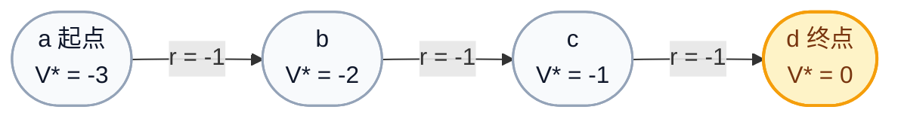
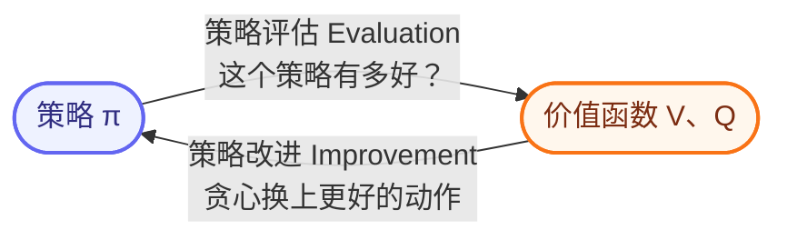

# 机器人学习（七）：强化学习入门——MDP、价值函数与动态规划

## 1. 为什么需要强化学习 (Why RL?)

上一个专题的模仿学习 (imitation learning) 有两个绕不开的局限。

一是需要专家 (expert)。人类示范 (human demonstration) 采集起来又贵又慢，很多任务甚至找不到能做示范的人。

二是上限被锁死在专家水平 (cannot go beyond the expert level)。模仿学习本质上是在拟合示范数据的分布，学得再好也只是复刻；想通往"超级智能" (superintelligence)，光靠模仿走不通。

理想的 AI 应该能自主学习 (learn autonomously)：自己试错，自己发现比人更好的做法。这就是强化学习 (Reinforcement Learning, RL) 的出发点——不再问"专家会怎么做"，改问"怎么做能拿到最多的奖励 (reward)"。交互仍是熟悉的闭环，只是环境的反馈里多了一个奖励信号：


RL 的战绩单可以分两个世界看。

数字世界：AlphaGo（2016 年 4:1 战胜李世石）；AlphaZero 通吃国际象棋、围棋、将棋 (chess, go, shogi)；AlphaStar 在星际争霸 II 达到宗师级 (Grandmaster level in StarCraft II)。

物理世界（与本课程更相关）：双足机器人 (biped) Cassie 完成跳跃和 400 米跑；四足机器人靠第一视角视觉 (egocentric vision) 通过复杂地形 (legged locomotion in challenging terrains)；"又快又安全"的无碰撞高速奔跑 (agile but safe: collision-free high-speed locomotion)；双臂灵巧手的抛接 (dynamic handover with bimanual hands)；以及登上 Nature 的冠军级无人机竞速 (champion-level drone racing)。

## 2. 数学框架：MDP 与 POMDP

先统一语言。一个序列决策问题由六个要素刻画：

- 状态空间 (state space) $S$：$s_t \in S$ 是 $t$ 时刻的状态；
- 动作空间 (action space) $A$：$a_t \in A$ 是 $t$ 时刻的动作；
- 观测空间 (observation space) $O$：$o_t \in O$ 是 $t$ 时刻的观测；
- 转移概率 (transition probability)，又叫动力学 (dynamics)：$s_{t+1} \sim p(\cdot \mid s_t, a_t)$；
- 观测模型 (observation model)：$o_t \sim h(\cdot \mid s_t)$；
- 奖励函数 (reward function)：$r: S \times A \to \mathbb{R}$。

组合方式不同，得到两类问题：

| | 马尔可夫决策过程 (MDP) | 部分可观测 MDP (POMDP) |
|---|---|---|
| 元组 | $(S, A, p, r)$ | $(S, A, O, p, h, r)$ |
| 策略的输入 | 状态：$\pi_\theta(a_t \mid s_t)$ | 观测：$\pi_\theta(a_t \mid o_t)$ |
| 隐含假设 | 状态完全可观测 (fully observable) | 只能透过观测间接感知状态 |

之所以叫"马尔可夫"，是因为马尔可夫性质 (Markov property)：下一个状态只取决于当前状态和动作，与更早的历史无关。它带来的最大便利是——一旦知道状态，历史可以整个扔掉 (throw away history once the state is known)，策略不需要记忆。

机器人问题天然更接近 POMDP：相机图像有遮挡、有噪声、看不到速度，观测 $o_t$ 只是状态 $s_t$ 的一个有损投影。不过为了先把地基打牢，本讲在完全可观测的 MDP 里展开。

### 读公式前的准备：符号速查 (Notation)

从下一节起会大量出现数学符号，先集中认一遍，后面忘了随时翻回来：

| 符号 | 怎么读 | 白话含义 |
|---|---|---|
| $\mathbb{E}[X]$ | X 的期望 (expectation) | 随机变量的平均值：所有可能结果按概率加权平均 |
| $\mathbb{E}[X \mid Y=y]$ | 条件期望 | 竖线读"在……条件下"：已知 $Y=y$ 的前提下，X 的平均值 |
| $\mathbb{E}_\pi[\cdot]$ | 按 π 取期望 | 下标注明随机性来源：动作由策略 $\pi$ 抽样时的平均值 |
| $\sum_a f(a)$ | 对 a 求和 | 把 a 的每种取值代入 f，再全部加起来 |
| $\prod_t$ | 对 t 连乘 | 乘法版的 $\sum$：逐项相乘 |
| $\max_a f(a)$ | f 的最大值 | 每个 a 都试一遍，返回最大的那个函数值（一个数） |
| $\arg\max_a f(a)$ | 使 f 最大的 a | 同样每个都试，但返回让 f 最大的那个 a 本身（一个选项） |
| $x \sim p(\cdot)$ | x 服从分布 p | x 是从概率分布 p 里随机抽出来的样本 |
| $p(s' \mid s, a)$ | 条件概率 | 在状态 s 做动作 a 之后，落到状态 s' 的概率 |
| $\gamma$ | gamma，折扣因子 | 0 到 1 之间的数：未来的奖励打几折 |
| $\forall s$ | 对所有 s | 对每一个状态都成立 |
| $\lVert x \rVert_\infty$ | 无穷范数 (infinity norm) | 向量各分量绝对值中最大的一个，度量"最大偏差" |

max 与 argmax 的区别值得单独一句：菜单上最贵的菜是 88 元——max 是 88 元（数值），argmax 是那道菜（选项）。RL 里"最优价值"用 max、"最优策略"用 argmax，正对应"分数"与"动作"。

## 3. RL 的目标：最大化回报 (Return)

RL 优化的不是单步奖励，而是回报 (return)——未来奖励的折扣和：

$$G_t = r_{t+1} + \gamma r_{t+2} + \gamma^2 r_{t+3} + \cdots = \sum_{k=0}^{\infty} \gamma^k\, r_{t+k+1}$$

> **公式解读**：$G_t$ 读作"从 $t$ 时刻起算的回报"。$r_{t+1}$ 是马上到手的奖励，原价计入；$r_{t+2}$ 晚一步到手，乘 $\gamma$ 打一次折；$r_{t+3}$ 再晚一步，乘 $\gamma^2$……离现在越远，折扣越狠。右边的 $\sum$ 只是把这串加法写紧凑：$k$ 从 0 数到无穷，第 $k$ 项就是 $\gamma^k r_{t+k+1}$。
>
> 代个数感受一下：设 $\gamma = 0.9$，未来三步奖励都是 1，则 $G_t = 1 + 0.9 + 0.81 = 2.71$，而不是 3——晚到的奖励"缩水"了。

其中 $\gamma$ 是折扣因子 (discount factor)，$0 < \gamma \le 1$。为什么要折扣？数学上保证无穷级数收敛 (convergence)；直觉上"今天的奖励比明天的值钱"；技术上它还是后面收敛性证明中压缩系数的来源，一举三得。

时域 (horizon) 有两种设定：有限时域 (finite horizon) 即分幕式 (episodic setting)，此时 $G_t = r_{t+1} + r_{t+2} + \cdots + r_T$；无限时域 (infinite horizon)，$T = \infty$。本讲聚焦折扣无限时域 (discounted infinite horizon) 的情形。

顺带记一下序列的记号约定：$s_0, a_0, r_1, s_1, a_1, r_2, \cdots$，即 $r_{t+1}$ 是在 $s_t$ 执行 $a_t$ 后得到的奖励。不同教材下标可能差一位 (different books might use different indices)，读论文时留意。

于是 RL 的目标是一句话：找一个策略 (policy)，最大化期望累积奖励 (maximize the expected cumulative reward)：

$$\theta^\star = \arg\max_\theta\; \mathbb{E}_{\tau \sim p_\theta(\tau)}\Big[\sum_t r(s_t, a_t)\Big], \qquad p_\theta(\tau) = p(s_0)\prod_t \pi_\theta(a_t \mid s_t)\, p(s_{t+1} \mid s_t, a_t)$$

> **公式解读**：分两半读。左半：$\arg\max_\theta$ 表示"找出让方括号内的量最大的策略参数 $\theta$"；$\mathbb{E}_{\tau \sim p_\theta(\tau)}[\cdot]$ 表示"轨迹 $\tau$ 按分布 $p_\theta$ 随机产生时，总奖励的平均值"——策略和环境都有随机性，一条轨迹的好坏不作数，比的是平均表现。右半是轨迹概率的算法：一条轨迹发生的概率 = 初始状态的概率 $p(s_0)$ × 每一步"策略选中该动作的概率 $\pi_\theta(a_t \mid s_t)$" × "环境转到该状态的概率 $p(s_{t+1} \mid s_t, a_t)$"，一路连乘下去。

$\tau$ 是一条轨迹 (trajectory)，它的分布由初始状态分布、策略、动力学三者连乘而成。

## 4. 价值函数 (Value Functions)：给状态和动作标价

有了回报，就能给状态"标价"。

状态价值函数 (state-value function)：从状态 $s$ 出发、之后一直跟随策略 $\pi$，期望拿到的回报

$$V^\pi(s) = \mathbb{E}_\pi\big[G_0 \mid s_0 = s\big]$$

> **公式解读**：竖线右边的 $s_0 = s$ 是条件，读作"假定起点是 $s$"；$\mathbb{E}$ 的下标 $\pi$ 声明"之后每一步动作都由 $\pi$ 抽样"。整句：从 $s$ 出发、全程听 $\pi$ 的，平均能拿到多少回报。V 给每个状态打分，分高的是"好位置"。

动作价值函数 (action-value function)：在 $s$ 先执行动作 $a$（这一步可以不听 $\pi$ 的），之后再跟随 $\pi$

$$Q^\pi(s, a) = \mathbb{E}_\pi\big[G_0 \mid s_0 = s,\, a_0 = a\big]$$

> **公式解读**：与 V 相比，条件里多了一个 $a_0 = a$——第一步动作被强行指定为 $a$（哪怕 $\pi$ 本来不会这么选），从第二步起才交还给 $\pi$。所以 Q 回答的问题更细一层：在 $s$ 先做 $a$、之后跟 $\pi$，平均能拿多少。

**为什么 V 和 Q 都需要？** 两者满足 $V^\pi(s) = \sum_a \pi(a \mid s)\, Q^\pi(s,a)$——V 是 Q 在策略下的加权平均。Q 多出的那个自由度（第一步动作可以自选）正是改进策略的抓手：$Q^\pi(s,a) > V^\pi(s)$ 意味着"在 $s$ 先做 $a$ 再跟 $\pi$"胜过"从头听 $\pi$ 的"，说明 $\pi$ 在这个状态还有提升空间。这就是后面策略改进 (policy improvement) 的全部直觉。

### 最优价值函数 (Optimal Value Functions)

$$V^*(s) = \max_\pi V^\pi(s), \qquad Q^*(s,a) = \max_\pi Q^\pi(s,a)$$

> **公式解读**：这里的 $\max_\pi$ 是对"所有可能的策略"取最大：想象把天下策略挨个拿来评估，每个状态记下能达到的最高分，就是 $V^*$。它是天花板——"这个状态在最好情况下值多少"。

两者的关系是 $V^*(s) = \max_a Q^*(s,a)$；最优策略 (optimal policy) 为

$$\pi^*(s) = \arg\max_a Q^*(s,a)$$

> **公式解读**：注意这里是 argmax 不是 max——返回的是动作。在状态 $s$ 把每个动作的 $Q^*$ 分数摆开，挑分数最高的那个执行，这就是最优策略；而上面的 $V^*(s) = \max_a Q^*(s,a)$ 说的是"状态的最优价值 = 手上最好那张牌的价值"。

这里有个重要的不对称：知道 $Q^*$，最优策略直接查表读出，不需要动力学 (do not need the dynamics)；只知道 $V^*$，则必须借助动力学做单步前瞻 (one-step lookahead)——枚举每个动作会把自己带到哪个 $s'$——才能选出动作。这解释了为什么很多无模型 (model-free) 算法（如 Q-learning）宁可学更大的 Q 表也不学 V。

### 例子：一维网格世界 (1-d Grid World)

四个状态 a（起点）、b、c、d（终点），动作 {left, right, stay}，每走一步奖励 −1，无折扣（$\gamma = 1$）、确定性转移 (deterministic transitions)：



从 a 到终点最少 3 步，所以 $V^*(a) = -3$，其余同理。再看 Q：$Q^*(a, \text{stay}) = -1 + V^*(a) = -4$（原地白耗一步），$Q^*(a, \text{right}) = -1 + V^*(b) = -3$，取 argmax 得 $\pi^*(a) = \text{right}$。价值一旦算对，最优策略就是"顺着数字往高处走"。

## 5. 策略评估 (Policy Evaluation)：一个策略值多少分

给定某个策略 $\pi$（不一定最优），计算它的价值函数，这一步叫策略评估。

出发点是回报的递归结构 (recursive relationship)：

$$G_t = r_{t+1} + \gamma\big(r_{t+2} + \gamma r_{t+3} + \cdots\big) = r_{t+1} + \gamma\, G_{t+1}$$

> **公式解读**：把 $G_t$ 的定义拆开：第一项 $r_{t+1}$ 单独拎出，剩下的 $\gamma r_{t+2} + \gamma^2 r_{t+3} + \cdots$ 提取公因子 $\gamma$ 后，括号里恰好就是"从 $t+1$ 时刻起算的回报" $G_{t+1}$。一句话：**现在的回报 = 马上到手的一步奖励 + 打折后的"明天的回报"**。这个递归是本讲后面一切推导的种子。

一步奖励，加上打折后的"下一步的回报"。对期望展开：

$$V^\pi(s) = \mathbb{E}_\pi\big[r_1 + \gamma G_1 \mid s_0 = s\big] = \sum_a \pi(a \mid s) \sum_{s',\,r} p(s', r \mid s, a)\,\big[r + \gamma\, V^\pi(s')\big]$$

> **公式解读**：期望为什么展开成两层求和？因为"平均"就是"按概率加权再求和"。从 $s$ 出发走一步，共掷两次骰子：先是策略选动作（概率 $\pi(a \mid s)$），再是环境定去向（概率 $p(s', r \mid s, a)$）。把每一种"动作 + 去向"组合的所得 $r + \gamma V^\pi(s')$ 乘上该组合发生的概率，全部加起来，就是期望。两个 $\sum$ 不过是把这两层骰子逐一枚举。

做个简化（假设奖励只是状态的函数，$r = r(s)$），就得到贝尔曼方程 (Bellman equation)：

$$V^\pi(s) = \underbrace{r(s)}_{\text{在 } s \text{ 收到奖励}} + \gamma \sum_a \underbrace{\pi(a \mid s)}_{\text{采样动作 } a} \sum_{s'} \underbrace{p(s' \mid s, a)}_{\text{进入状态 } s'} \underbrace{V^\pi(s')}_{\text{期望未来回报}}$$

> **公式解读**：从左到右是一步交互的流水账：在 $s$ 先落袋奖励 $r(s)$；策略以概率 $\pi(a \mid s)$ 抽一个动作，环境以概率 $p(s' \mid s, a)$ 把我送进 $s'$；$s'$ 之后的漫长未来不必展开，直接用一个数 $V^\pi(s')$ 概括，打上折扣 $\gamma$。妙处在于：左边是 $s$ 的价值，右边全是各个 $s'$ 的价值——**价值函数在用自己定义自己**。正因为有这个自指的等式，才能"反复代入"迭代求解。

Q 的版本完全对称，只是顺序变成"先转移、再采样下一个动作"：

$$Q^\pi(s,a) = r(s) + \gamma \sum_{s'} p(s' \mid s, a) \sum_{a'} \pi(a' \mid s')\, Q^\pi(s', a')$$

> **公式解读**：Q 版本里第一步动作 $a$ 已经给定，所以没有对 $a$ 的求和；但到达 $s'$ 之后的下一个动作 $a'$ 要由 $\pi$ 抽，于是求和挪到了 $a'$ 上。对照记忆：V 的方程"先选动作、再转移"，Q 的方程"先转移、再选动作"。

### 表格型情形：一个线性方程组

在表格型 (tabular) 情形（如网格世界，状态有限可枚举），贝尔曼方程就是一个线性方程组 (a set of linear equations)，$V^\pi$ 是它的唯一解。写成矩阵形式 (matrix form)：

$$V^\pi = r + \gamma\, T^\pi V^\pi$$

设共 $|S|$ 个状态：$T^\pi$ 是 $|S| \times |S|$ 的转移矩阵，第 $(j,k)$ 元是 $p(s_k \mid s_j,\, a = \pi(s_j))$；$V^\pi$ 与 $r$ 均为 $|S|$ 维向量。

> **公式解读**：这是把 $|S|$ 条贝尔曼方程"叠"成一个向量等式：$V^\pi$ 是各状态价值排成的一列向量，$r$ 是各状态奖励排成的向量；$T^\pi$ 的第 $j$ 行记着"从 $s_j$ 出发（按 $\pi$ 行动）落到各个状态的概率"，于是矩阵乘法 $T^\pi V^\pi$ 的第 $j$ 个分量恰好是"下一状态价值的期望"。一个方程，批量表达所有状态。

解法有两种：

1. 闭式解 (closed-form solution)：$V^\pi = (I - \gamma T^\pi)^{-1} r$。求逆的代价是 $O(|S|^3)$，状态一多就吃不消；
2. 迭代策略评估 (iterative policy evaluation)：$V_{k+1} = r + \gamma T^\pi V_k$，从任意 $V_0$ 出发迭代到收敛。

> **公式解读**：闭式解其实就是"移项解方程"：由 $V^\pi = r + \gamma T^\pi V^\pi$ 移项得 $(I - \gamma T^\pi)\,V^\pi = r$，两边左乘逆矩阵即得。类比一元方程 $x = b + ax \Rightarrow x = \frac{b}{1-a}$，矩阵世界里只是把"除法"换成"求逆"。迭代法则是"反复把旧答案代入右边"：用 $V_k$ 算出 $V_{k+1}$，转到数字不再变化，停下来的地方就是解。

两个自然的问题：迭代凭什么收敛？$I - \gamma T^\pi$ 凭什么可逆？答案是同一个词——压缩 (contraction)。

### 压缩映射 (Contraction)

赋范向量空间 (normed vector space) 上的算子 $F$ 是 $\gamma$-压缩 ($\gamma$-contraction, $0 < \gamma < 1$)，如果

$$\|F(x) - F(y)\| \le \gamma\, \|x - y\|, \quad \forall x, y$$

> **公式解读**：$\|x - y\|$ 度量两点间的距离。不等式说：任取两点，经 $F$ 映射一次，距离缩到原来的 $\gamma$ 倍以内（$\gamma < 1$）——$F$ 每作用一次，所有点都被互相拉近一个固定比例。反复作用，点与点无限逼近，最终挤到同一处；那一点满足 $F(x) = x$（映过去还是自己），故称不动点。

若 $F$ 是 $\gamma$-压缩，则由 Banach 不动点定理 (Banach fixed-point theorem)：迭代 $x_{k+1} = F(x_k)$ 收敛到唯一不动点 (unique fixed point)，且收敛速率是线性的 (linear convergence rate)，误差按 $\gamma^k$ 指数衰减 (exponentially converge)。

策略评估的贝尔曼算子 (Bellman operator) $F^\pi(V) = r + \gamma T^\pi V$ 正是无穷范数 (infinity norm, $\|\cdot\|_\infty$) 下的 $\gamma$-压缩：

$$\|F^\pi(u) - F^\pi(v)\|_\infty = \gamma\,\|T^\pi(u - v)\|_\infty \le \gamma\,\|u - v\|_\infty$$

> **公式解读**：第一个等号：$F^\pi(u) - F^\pi(v) = (r + \gamma T^\pi u) - (r + \gamma T^\pi v)$，公共的 $r$ 相消，剩下 $\gamma T^\pi (u - v)$。第二步的不等号是关键：$T^\pi$ 每一行都是概率分布（非负、加起来等于 1），乘上向量相当于对各分量做加权平均，而**平均值绝不会超过最大值**，所以最大偏差（无穷范数）不会被放大。

最后一步用到 $T^\pi$ 是行随机矩阵 (row-stochastic matrix)：每一行都是一个概率分布，对向量做概率加权平均不会放大最大偏差。直觉是：每迭代一轮，任意两个价值估计之间的最大差距至少缩到原来的 $\gamma$ 倍，所有起点都被"拧"向同一个不动点——那个不动点恰好就是 $V^\pi$。顺带地，压缩还意味着 $\gamma T^\pi$ 的谱半径 (spectral radius) 小于 1，$I - \gamma T^\pi$ 因此可逆，闭式解才写得出来。

### 例子：二维网格世界 (2-d Grid World)

4×4 网格，左上、右下是终点 (terminal states)，每次转移奖励 $R_t = -1$，评估随机策略 (random policy，四个方向等概率)。从全 0 开始迭代（$k = 0$）；一轮后所有非终点格子变成 −1（$k = 1$）；$k = 2$ 时靠近终点的格子约 −1.7、其余 −2.0；数字随迭代继续下探，$k \to \infty$ 时收敛到：

```
   0   -14  -20  -22
 -14   -18  -20  -20
 -20   -20  -18  -14
 -22   -20  -14    0
```

每格数字读作"按随机策略走，平均还要多少步才能到终点"（再乘上 −1）。

### 小结

策略评估利用的是贝尔曼方程的递归结构，这套解法统称动态规划 (dynamic programming, DP)；收敛有保证，因为贝尔曼算子是压缩 (contraction)；但有一个大前提——需要已知动力学 (require knowing the dynamics)。这个假设在后面的无模型方法里会被打破。

## 6. 策略改进 (Policy Improvement)：从评分到提分

评估只回答"π 有多好"，我们真正要的是更好的 π。整件事是一个循环：



改进用最直觉的办法——贪心 (greedy)：

$$\pi'(s) = \arg\max_a Q^\pi(s, a)$$

> **公式解读**：对每个状态 $s$，把所有动作的 $Q^\pi(s, \cdot)$ 分数横着一比，新策略 $\pi'$ 直接指定分数最高的那个动作。注意打分用的是**老策略的 Q**——衡量的是"第一步换成该动作、之后照旧跟 $\pi$"的成绩。

即在每个状态选"先做这个动作、之后仍跟老策略 π"回报最高的那个动作。这样真的会更好吗？会，而且有定理背书。

**策略改进定理 (policy improvement theorem)**：若 $Q^\pi\big(s, \pi'(s)\big) \ge V^\pi(s),\ \forall s$，则 $V^{\pi'}(s) \ge V^\pi(s),\ \forall s$。

> **定理解读**：前提读作"在每个状态，先按 $\pi'$ 走一步（之后跟老策略）都不比全程听老策略差"；结论是"全程改按 $\pi'$ 走，每个状态的价值也都不会变差"。一句话：**单步占优 ⇒ 全程占优**。

证明思路是"逐步换血"：

$$V^\pi(s) \le Q^\pi\big(s, \pi'(s)\big) = \mathbb{E}_{\pi'}\big[r_{t+1} + \gamma V^\pi(s_{t+1})\big] \le \mathbb{E}_{\pi'}\big[r_{t+1} + \gamma r_{t+2} + \gamma^2 V^\pi(s_{t+2})\big] \le \cdots = V^{\pi'}(s)$$

第一步只把当下动作换成 $\pi'$，不等号成立；再把下一步也换成 $\pi'$，不等号继续成立……无限展开后，右边就是完全按 $\pi'$ 行动的价值。

贪心什么时候"失效"？当 $\pi(s) = \arg\max_a Q^\pi(s,a)$ 已经处处成立——对自己贪心也捞不到好处——策略不再变化。此时价值函数满足的正是贝尔曼最优方程 (Bellman optimality equations)：

$$V^*(s) = \max_a \sum_{s'} p(s' \mid s, a)\,\big[r + \gamma\, V^*(s')\big]$$

$$Q^*(s,a) = \sum_{s'} p(s' \mid s, a)\,\big[r + \gamma \max_{a'} Q^*(s', a')\big]$$

> **公式解读**：与策略评估版对照着读：原先"对动作按 $\pi(a \mid s)$ 加权平均"的位置，如今换成 $\max_a$ 直接挑最好的——最优策略不掷骰子，只认最优动作。$V^*$ 那行读作"$s$ 的最优价值 = 挑一个动作，让'即时奖励 + 折扣后下一状态的最优价值'的期望最大"；$Q^*$ 那行读作"先做 $a$ 落到 $s'$，之后在 $s'$ 挑最好的 $a'$ 继续走"。

背后是最优性原理 (principle of optimality)：最优轨迹的任何后半段自身也必须最优。注意与策略评估的贝尔曼方程相比多了个 max——方程从线性变成了非线性 (nonlinear)，没有闭式解，只能迭代逼近。

## 7. 两个经典算法：策略迭代与价值迭代

### 策略迭代 (Policy Iteration)

评估与改进交替进行，直到策略稳定：

$$\pi_0 \;\xrightarrow{\;\text{评估}\;}\; Q^{\pi_0} \;\xrightarrow{\;\text{改进}\;}\; \pi_1 \;\xrightarrow{\;\text{评估}\;}\; Q^{\pi_1} \;\xrightarrow{\;\text{改进}\;}\; \cdots \;\longrightarrow\; \pi^*$$

```
1. 初始化 (initialization)：任取 V(s) 与 π(s)
2. 策略评估 (policy evaluation)：
     反复对每个 s 更新  V(s) ← Σ_s' p(s'|s, π(s)) [ r + γ V(s') ]
     直到最大改变量 Δ < θ（精度阈值）
3. 策略改进 (policy improvement)：
     π(s) ← argmax_a Σ_s' p(s'|s, a) [ r + γ V(s') ]
     若所有状态的动作都没变 (policy-stable)：输出 π ≈ π*；否则回到第 2 步
```

也可以基于 Q 函数来做：评估更费事（表格从 $|S|$ 个格子变成 $|S| \times |A|$ 个），但改进只需一步 argmax，完全不碰动力学。

### 价值迭代 (Value Iteration)

策略迭代的痛点：每改进一次，都得把内层的评估循环跑到收敛，很浪费。能省吗？能——直接把贝尔曼最优方程当更新规则 (directly update the value function)：

```
反复对每个 s 更新  V(s) ← max_a Σ_s' p(s'|s, a) [ r + γ V(s') ]
直到 Δ < θ
最后一次性提取确定性策略 (deterministic policy)：
     π(s) = argmax_a Σ_s' p(s'|s, a) [ r + γ V(s') ]
```

价值迭代可以看成"评估只扫一遍就急着 max"的策略迭代。贝尔曼最优算子 (Bellman optimality operator) 同样是 $\gamma$-压缩，所以同样保证收敛到唯一不动点 $V^*$。

| | 策略迭代 (policy iteration) | 价值迭代 (value iteration) |
|---|---|---|
| 内层评估 | 迭代到收敛（完整评估） | 只扫一遍，与 max 融合 |
| 是否显式维护策略 | 是，每轮更新 | 否，收敛后一次性提取 |
| 单轮开销 | 大 | 小 |
| 外层轮数 | 少 | 多 |
| 收敛保证 | 改进定理 + 压缩 | 压缩 |

### 广义策略迭代 (Generalized Policy Iteration, GPI)

评估和改进其实不必按固定节奏交替，任意穿插 (any interleaving of policy evaluation and policy improvement) 都能收敛，这个统一框架叫广义策略迭代 (GPI)：评估把 V 拉向 $V^\pi$，改进把 π 拉向 $\mathrm{greedy}(V)$，两股力量互相追赶，最终一起停在 $(\pi^*, V^*)$。

记住一句话：**所有 RL 方法都是某种形式的 GPI (all RL methods are a form of GPI)**。后面学的各种算法，无非是在"怎么评估"和"怎么改进"这两个槽位上填不同的实现。

## 8. 从表格到真实机器人：还差三堵墙

本讲的全部推导都站在两个假设上：表格型 (tabular，状态和动作有限、可枚举) + 已知动力学 (known dynamics)。真实机器人一条都不满足，对应三个待解难题：

1. 动力学未知 (unknown dynamics)：$p(s' \mid s, a)$ 写不出来，只能通过与环境交互采样 (sampling) 来近似——这正是无模型强化学习 (model-free RL) 的主题；
2. 连续动作空间 (continuous action space)：$\max_a$ 不再是查表比大小，本身就成了一个优化问题；
3. 连续状态空间 (continuous state space)：V、Q 存不进表格，需要函数逼近 (function approximation)，比如神经网络。

后续课程的主线就是：在放宽这两个假设的前提下，近似求解贝尔曼最优方程 (approximately solve the Bellman optimality equations)。

## 9. 思考题

**为什么有了模仿学习还需要强化学习？**

两个原因：模仿学习需要专家示范，采集昂贵甚至不可得；上限被专家水平锁死，无法超越示范者。RL 通过自主试错学习，既不需要示范，原则上也没有专家天花板——AlphaGo 战胜李世石就是超越人类专家的实证。

**MDP 和 POMDP 的区别是什么？机器人问题更接近哪个？**

MDP 是元组 $(S, A, p, r)$，策略以状态为输入 $\pi(a_t \mid s_t)$；POMDP 是 $(S, A, O, p, h, r)$，多了观测空间 $O$ 和观测模型 $h$，策略只能以观测为输入 $\pi(a_t \mid o_t)$。机器人靠相机、IMU 等传感器感知世界，观测有噪声、有遮挡、丢信息，天然是 POMDP。

**为什么知道 $Q^*$ 就能直接得到最优策略、不需要动力学，只知道 $V^*$ 却不行？**

$\pi^*(s) = \arg\max_a Q^*(s,a)$ 是纯查表操作。而 $V^*$ 只给状态打分，选动作前必须先回答"每个动作会把我带到哪"，即做单步前瞻 $\sum_{s'} p(s' \mid s,a)\,[r + \gamma V^*(s')]$，这一步离不开动力学 $p$。

**$Q^\pi(s,a) > V^\pi(s)$ 说明什么？**

由 $V^\pi(s) = \sum_a \pi(a \mid s)\, Q^\pi(s,a)$，V 是 Q 的加权平均。某个动作的 Q 高于这个平均，说明"在 s 先做 a、之后再跟 π"优于一直跟 π——π 在 s 处不是最优，把 $\pi(s)$ 换成 a 就是一次有保证的改进（策略改进定理）。

**迭代策略评估为什么保证收敛？收敛多快？**

贝尔曼算子 $F^\pi(V) = r + \gamma T^\pi V$ 在无穷范数下是 $\gamma$-压缩（$T^\pi$ 每行是概率分布，加权平均不会放大最大偏差）。由 Banach 不动点定理，从任意初值迭代都收敛到唯一不动点 $V^\pi$，误差按 $\gamma^k$ 指数衰减（线性收敛率）。压缩同时保证 $I - \gamma T^\pi$ 可逆，闭式解存在。

**策略迭代和价值迭代的区别与联系？**

区别：策略迭代每轮把评估做到收敛再贪心改进，外层轮数少但单轮贵；价值迭代把评估压缩成一遍带 max 的扫描，直接迭代贝尔曼最优方程，最后才提取策略。联系：都属于动态规划，都靠压缩映射保证收敛，都是 GPI 的特例。

**把本讲的动态规划直接搬到真实机器人上，会先后撞上哪三堵墙？**

动力学未知，必须靠采样近似；动作空间连续，max 变成优化问题；状态空间连续，价值函数需要函数逼近（如神经网络）。