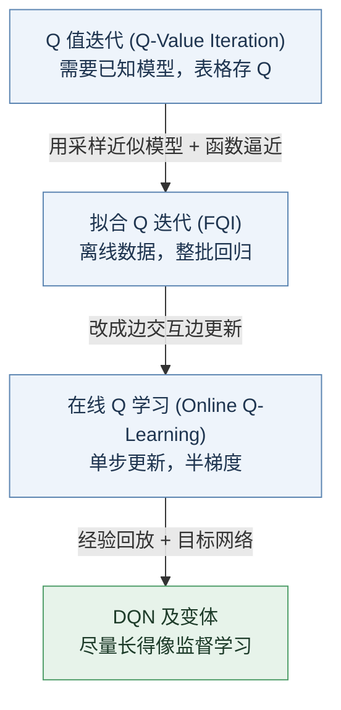

# 机器人学习（八）：Q 学习及其变体 (Q-Learning and Variants)

一句话概括本讲：**把"求解贝尔曼最优方程"这件事，一步步改造成神经网络 + SGD 能跑起来的监督学习**。改造分四站，每一站解决上一站的一个卡点：

**符号速查**（后文公式反复用到，读不懂就回来查这张表）：

| 符号 | 含义 |
|---|---|
| $s,\ a,\ r,\ s'$ | 状态、动作、即时奖励、下一个状态；带撇号 $'$ 的量都指"下一步的" |
| $\pi(a\mid s)$ | 策略 (policy)：在状态 $s$ 下怎么选动作 $a$；竖线 $\mid$ 读作"给定" |
| $p(s',r\mid s,a)$ | 环境动态 (dynamics)：在 $s$ 做 $a$ 后，转到 $s'$ 且拿到奖励 $r$ 的概率 |
| $\gamma$ | 折扣因子 (discount factor)，0～1 之间：未来的奖励打折计入，越远折得越狠 |
| $Q(s,a)$ | 动作值 (action value)：在 $s$ 做 $a$、之后一路做到最优，期望拿到的总回报（本讲默认指最优版本 $Q^*$ 或对它的估计） |
| $V(s)$ | 状态值 (state value)：站在 $s$、之后一路做到最优的期望总回报 |
| $\phi,\ \theta$ | 神经网络参数；$Q_\phi$ 即"参数为 $\phi$ 的 Q 网络"，$\phi^-$ 是它的一份旧拷贝 |
| $\eta$ | 学习率 (learning rate)：每一步参数挪多大 |
| $\nabla_\phi f$ | $f$ 对 $\phi$ 的梯度 (gradient)：指出微调参数的哪个方向能让 $f$ 变大 |
| $\mathbb{E}[\cdot]$ | 期望 (expectation)：对随机量取平均 |
| $\max_a f$ 与 $\arg\max_a f$ | 前者问"$f$ 的最大值是多少"，返回一个**数**；后者问"哪个 $a$ 让 $f$ 最大"，返回一个**动作** |

## 1. 回顾：从值迭代到 Q 值迭代

### 1.1 两个动态规划算法

**策略迭代 (policy iteration)**：交替做策略评估 (policy evaluation)——迭代解出当前策略的值函数——和策略改进 (policy improvement)——逐状态换成贪婪动作。这套流程也可以基于 Q 函数来做：评估变复杂了，但改进变容易了。

**值迭代 (value iteration)**：策略迭代里的评估本身是个内循环，能不能省掉？可以，直接把贝尔曼最优方程 (Bellman optimality equation) 当更新规则用：

$$V^*(s)=\max_a Q^*(s,a)=\max_a \sum_{s',r} p(s',r\mid s,a)\,\big[\,r+\gamma\, V^*(s')\,\big]$$

> **怎么读**：从最里层往外剥。方括号 $[\,r+\gamma V^*(s')\,]$ 是"这一步的奖励，加上打了折的下一状态价值"；环境有随机性，同一个动作可能落到不同的 $s'$，所以用概率 $p(s',r\mid s,a)$ 加权求和取期望——这一整块正是 $Q^*(s,a)$，即"在 $s$ 做 $a$ 的期望总回报"；最外层再对动作取 $\max$：最优状态价值 = 各动作里最好那个的期望回报。注意整个式子是**递归**的：现在的价值由未来的价值定义，这正是动态规划可行的原因。

### 1.2 Q 值迭代 (Q-Value Iteration)

同样的思路写在 Q 函数上：

$$Q_{k+1}(s,a)=\sum_{s',r} p(s',r\mid s,a)\Big[r+\gamma \max_{a'} Q_k(s',a')\Big],\quad\forall\, s,a$$

> **怎么读**：下标 $k$ 是迭代轮数。等号右边全部用**旧表** $Q_k$ 计算："在 $s$ 做 $a$，期望拿到 $r$ 并落到 $s'$；假设之后贪婪行事，即在 $s'$ 按旧表挑最好的动作（$\max_{a'}$ 那一项）"，算出来的数填进**新表** $Q_{k+1}$ 的 $(s,a)$ 格子。每个格子都刷一遍算一轮，反复刷。

记 $Q_{k+1}=\mathcal{T}Q_k$，$\mathcal{T}$ 叫贝尔曼算子 (Bellman operator)。方程虽然是非线性的，但 $\mathcal{T}$ 是压缩映射 (contraction)——直观说：每刷一轮，当前表与真值 $Q^*$ 的最大差距至少缩小到原来的 $\gamma$ 倍，误差指数级衰减——所以从任意 $Q_0$ 出发都收敛到唯一不动点 (fixed point) $Q^*$。收敛后取 $\pi(s)=\arg\max_a Q(s,a)$ 就是最优策略，这一步不需要模型，是用 Q 不用 V 的一大好处。

### 1.3 三个现实障碍

理论上完美，落到现实有三道坎：

1. **动态未知**：$p(s',r\mid s,a)$ 不知道 → 出路是靠与环境交互采样 (sampling) 来近似期望；
2. **维度灾难 (curse of dimensionality)**（Richard Bellman 的用词）：表格要存 $|S|\times|A|$ 个数。一个 Atari 游戏的状态数量级是 $(255^3)^{200\times 200}$，既存不下也扫不完 → 出路是函数逼近 (function approximation)；
3. **连续动作的 max**：动作空间连续时 $\max_{a'}$ 没法枚举 → 留到 5.4 节解决。

好消息：$Q(s,a)$ 作为一个函数通常有"模式" (pattern)——比如 mountain car 的最优值函数画出来是一张结构清晰的热力图——而**学模式恰好是深度学习 (deep learning) 最擅长的事**。

## 2. 拟合 Q 迭代 (Fitted Q-Iteration, FQI)

### 2.1 算法：两个主意

FQI 把 1.3 的前两条出路同时用上：

- **主意一**：用采到的转移 (transition) 样本 $\{(s_i,a_i,s_i',r_i)\}$ 近似动态规划更新里的期望；
- **主意二**：用参数化函数 $Q_\phi$（比如神经网络，参数为 $\phi$）代替表格。

流程：

1. 用"某个策略" (some policy) $\pi$ 收集数据集