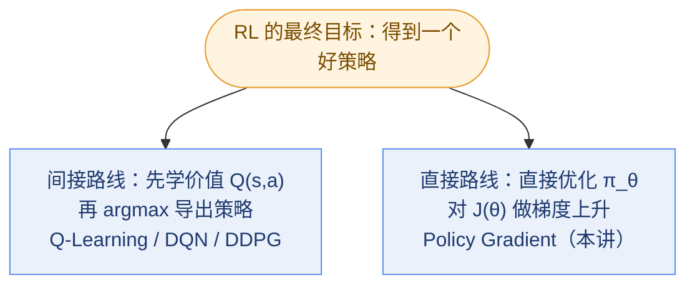
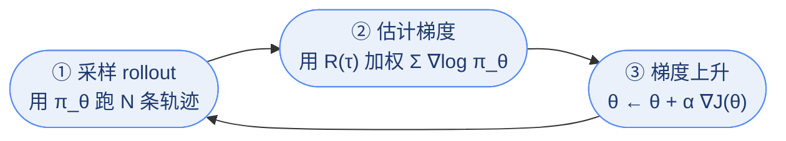
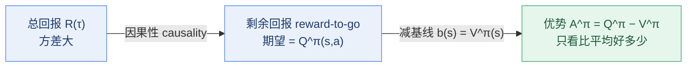

# 机器人学习（九）：策略梯度方法 (Policy Gradient Methods)

上承 Q-Learning，下启演员-评论家 (actor-critic)。这一讲回答一个问题：**既然我们最终要的只是策略 (policy)，能不能跳过价值函数，直接对策略参数求梯度？** 答案就是策略梯度定理 (policy gradient theorem) 和它最朴素的实现——REINFORCE。

## 1. 复习：Q-Learning 与连续动作的困境

### 1.1 DQN 的一轮循环

DQN (Deep Q-Network) 每一轮做五件事：

1. 用 ε-贪心策略 (epsilon-greedy policy) 选动作，观测到转移四元组 $(s, a, s', r)$；
2. 存入经验回放缓冲区 (replay buffer)；
3. 从 buffer 采一个批次 (batch)，用目标网络 (target network) 计算目标值 (target)：$y_i = r(s_i, a_i) + \gamma \max_{a'} Q_{\phi^-}(s'_i, a'_i)$；
4. 对 TD 误差做梯度下降 (gradient descent)：$\phi \leftarrow \phi - \eta \sum_i \big(Q_\phi(s_i, a_i) - y_i\big)\nabla_\phi Q_\phi(s_i, a_i)$；
5. 周期性同步目标网络：$\phi^- \leftarrow \phi$。

常见改进：Double DQN、优先经验回放 (prioritized experience replay)、Dueling 架构 (dueling architecture)，以及把 Q-learning 推向连续动作 (continuous actions) 的各种尝试。

### 1.2 Q-Learning 的画像

核心更新是 $Q_\phi(s,a) \leftarrow r(s,a) + \gamma \max_{a'} Q_\phi(s', a')$，整体是"跑策略生成样本 (generate samples) → 拟合价值以估计回报 (fit a model to estimate return) → 改进策略 (improve the policy)"的循环。几条关键性质：

- 完全离线的版本叫拟合 Q 迭代 (fitted Q iteration, FQI)；在线 + 神经网络近似 = DQN 及其变体；
- Q-learning 是**离线策略 (off-policy)** 且**无模型 (model-free)** 的；
- Q-learning **不显式学习策略**——策略是靠 $\arg\max_a Q(s,a)$ 隐式导出的；
- 连续动作空间 (continuous action space) 下，$\max$ 和 $\arg\max$ 本身就是难解的优化问题；
- 值得记住的算法组件：replay buffer、target network、double Q-learning、dueling、prioritized buffer。

### 1.3 DDPG：给连续动作打的补丁

连续动作下 $\max_{a'} Q(s', a')$ 没法枚举。DDPG (Deep Deterministic Policy Gradient, Lillicrap et al., ICLR'16) 的思路是**学一个近似优化器 (approximate optimizer)**：训练另一个网络 $\mu_\psi(s)$ 去逼近 $\arg\max_a Q_\phi(s, a)$。

- $\mu_\psi(s)$ 输入状态、输出动作——它本质上就是一个策略！
- 训练方法：对 $Q_\phi(s, \mu_\psi(s))$ 做梯度上升 (gradient ascent)，用链式法则 (chain rule)：$\frac{\partial Q}{\partial \psi} = \frac{\partial Q}{\partial a} \cdot \frac{\partial a}{\partial \psi}$；
- 名义上是确定性演员-评论家 (deterministic actor-critic) 算法，但更准确的理解是：连续动作空间上的近似 Q-learning。

DDPG 已经在"顺便"学一个策略了，那不如问得更彻底：**能不能不经过 Q，直接优化 $\pi_\theta$？**

## 2. 为什么要策略梯度

核心哲学一句话：**我们要的只是策略，为什么要绕道去学价值函数 (value function)？** 有些问题里，策略比价值函数结构更简单、更好学。

### 2.1 证据：LQR 里策略是线性的，价值是二次的

线性二次调节器 (Linear Quadratic Regulator, LQR) 是最优控制 (optimal control) 的标准问题（后续课程会展开）：

- 线性转移动力学 (linear transition dynamics)：$x_{t+1} = A x_t + B u_t + w_t$，其中 $w_t$ 是独立同分布 (i.i.d.) 的零均值噪声；
- 最小化二次代价 (quadratic cost)，等价于最大化二次奖励，且不带折扣因子 (discount factor)：

$$
\min_{u_1,\dots,u_T} \mathbb{E}_{w}\Big[\sum_{t=1}^{T} \tfrac{1}{2} x_t^\top Q x_t + \tfrac{1}{2} u_t^\top R u_t\Big]
$$

（注意这里的 $Q$、$R$ 是代价矩阵，和 Q 函数、回报 $R(\tau)$ 只是符号撞车。）当 $T \to \infty$ 时最优解有解析形式：

| | 最优解 | 结构 |
|---|---|---|
| 策略 (optimal policy) | $u(x) = -Kx$ | 线性 (linear) |
| 价值函数 (optimal value function) | $V(x) = \tfrac{1}{2} x^\top P x$ | 二次 (quadratic) |

学一个线性反馈 $-Kx$ 通常比学一个二次型容易——这是"策略可能比价值好学"最干净的证据。

### 2.2 策略梯度在优化什么

RL 的目标本来就是最大化期望回报 (expected return)：

$$
\theta^\star = \arg\max_\theta J(\theta), \qquad J(\theta) = \mathbb{E}_{\tau \sim p_\theta(\tau)}\Big[\sum_t r(s_t, a_t)\Big]
$$

轨迹 (trajectory) $\tau = (s_1, a_1, \dots, s_T, a_T)$ 的分布由三部分连乘：

$$
p_\theta(\tau) = p(s_1) \prod_{t=1}^{T} \pi_\theta(a_t \mid s_t)\, p(s_{t+1} \mid s_t, a_t)
$$

即初始状态分布 (initial state distribution) × 策略 (policy) × 环境转移 (transition dynamics)。策略梯度 (policy gradient, PG) 的做法直白到极点：**直接计算 $\nabla_\theta J(\theta)$，对策略参数做梯度上升**——不学 Q、不学 V、也不学环境模型。

## 3. 策略梯度定理：三步推导

### 3.1 热身：评估 J(θ) 很容易

给定任意策略 $\pi_\theta$（哪怕很差），评估它的 $J(\theta)$ 只需蒙特卡洛采样 (Monte Carlo sampling)：用 $\pi_\theta$ 跑 $N$ 条轨迹取平均：

$$
J(\theta) \approx \frac{1}{N} \sum_i \sum_t r(s_{i,t}, a_{i,t})
$$

评估容易，难的是求梯度：**能不能同样用样本来估计 $\nabla_\theta J(\theta)$？**

### 3.2 难点：θ 从两个渠道影响 J

记 $R(\tau) = \sum_t r(s_t, a_t)$ 为轨迹的总回报 (return)，$p_\theta(\tau)$ 为轨迹在 $\pi_\theta$ 下的似然 (likelihood)。$\nabla_\theta J(\theta)$ 难算，因为 **$\theta$ 既决定每一步的动作选择 (action selection)，又通过动作改变之后访问到的状态分布 (state distribution)**——而状态分布里缠着我们不知道的环境转移概率 $p(s_{t+1} \mid s_t, a_t)$，乍看没有模型就没法求导。

### 3.3 定理与推导

**策略梯度定理 (policy gradient theorem)**：

$$
\nabla_\theta J(\theta) = \mathbb{E}_{\tau \sim p_\theta(\tau)}\Big[R(\tau) \sum_t \nabla_\theta \log \pi_\theta(a_t \mid s_t)\Big]
$$

妙处在于：**期望内部只剩策略自己的对数似然梯度 (log-likelihood gradient)，环境转移彻底消失了**。推导分三步（对应课上的黑板环节）。

**Step 1**：按期望的定义 (definition of expectation) 写成积分：

$$
J(\theta) = \mathbb{E}_{\tau \sim p_\theta(\tau)}[R(\tau)] = \int p_\theta(\tau) R(\tau)\, d\tau
$$

**Step 2**：对数导数技巧 (log-derivative trick)。核心是一条有用的恒等式 (useful identity)：

$$
p_\theta(\tau) \nabla_\theta \log p_\theta(\tau) = p_\theta(\tau) \frac{\nabla_\theta p_\theta(\tau)}{p_\theta(\tau)} = \nabla_\theta p_\theta(\tau)
$$

把梯度移进积分号，再用恒等式凑回一个 $p_\theta(\tau)$：

$$
\nabla_\theta J(\theta) = \int \nabla_\theta p_\theta(\tau) R(\tau)\, d\tau = \int p_\theta(\tau) \nabla_\theta \log p_\theta(\tau) R(\tau)\, d\tau = \mathbb{E}_{\tau \sim p_\theta(\tau)}\big[\nabla_\theta \log p_\theta(\tau) R(\tau)\big]
$$

积分又变回了期望——**是期望就能用样本估计**。

**Step 3**：展开 $\log p_\theta(\tau)$，让环境消失。连乘取对数变成加和：

$$
\log p_\theta(\tau) = \log p(s_0) + \sum_t \log \pi_\theta(a_t \mid s_t) + \sum_t \log p(s_{t+1} \mid s_t, a_t)
$$

三项分别是：初始状态分布、策略、转移动力学。**首尾两项都不含 $\theta$**，求梯度时直接归零，只剩中间的策略项 $\sum_t \nabla_\theta \log \pi_\theta(a_t \mid s_t)$，代回 Step 2 即得定理。"环境消失"有两层含义：不需要知道环境模型（这是 model-free 的根源），也不需要对环境求导。

## 4. REINFORCE：蒙特卡洛策略梯度 (Monte Carlo PG)

定理右边是个期望，REINFORCE 就用蒙特卡洛采样估计它。记第 $i$ 条轨迹 $\tau^i = (s_{i,0}, a_{i,0}, s_{i,1}, a_{i,1}, \cdots)$：

$$
\nabla_\theta J(\theta) \approx \frac{1}{N} \sum_{i=1}^{N} R(\tau^i) \Big(\sum_t \nabla_\theta \log \pi_\theta(a_{i,t} \mid s_{i,t})\Big)
$$

完整算法就是三步的循环：

1. **采样 (rollout)**：运行当前策略 $\pi_\theta(a_t \mid s_t)$，收集一批轨迹 $\{\tau^i\}$；
2. **估计梯度**：$\nabla_\theta J(\theta) \approx \sum_i \big(\sum_t \nabla_\theta \log \pi_\theta(a_t^i \mid s_t^i)\big)\big(\sum_t r(s_t^i, a_t^i)\big)$；
3. **梯度上升 (gradient ascent)**：$\theta \leftarrow \theta + \alpha \nabla_\theta J(\theta)$，回到第 1 步。

出处：策略梯度定理的一般形式来自 Sutton 等人的经典论文 *Policy Gradient Methods for Reinforcement Learning with Function Approximation*（讲义引为 Sutton et al., NeurIPS 1998）；REINFORCE 这个名字本身最早出自 Williams (1992)。

## 5. 四个视角理解 REINFORCE

### 5.1 它是"带权重的行为克隆"

模仿学习 (imitation learning) 里的行为克隆 (behavior cloning, BC)，做的是在专家数据 (expert data) 上最大化策略的对数似然 (log-likelihood)：

$$
\nabla_\theta J_{\text{BC}}(\theta) \approx \frac{1}{N} \sum_{i=1}^{N} \Big(\sum_t \nabla_\theta \log \pi_\theta(a_{i,t} \mid s_{i,t})\Big)
$$

和 REINFORCE 逐项对比，差别只有一个乘子 $R(\tau^i)$。BC 有专家背书，每条示范权重恒为 1；REINFORCE 没有专家数据，学习信号全部来自 $R(\tau^i)$：**回报高的轨迹 (good stuff) 概率被调大，回报低的 (bad stuff) 被调小**。这正是"试错 (trial and error)"这个概念的数学化。

### 5.2 稀有且好的行为，强化得最猛

用恒等式把 $\nabla \log$ 还原回去，得到另一种解读：

$$
\nabla_\theta J(\theta) \approx \frac{1}{N} \sum_{i=1}^{N} R(\tau^i) \sum_t \frac{\nabla_\theta \pi_\theta(a_{i,t} \mid s_{i,t})}{\pi_\theta(a_{i,t} \mid s_{i,t})}
$$

梯度 ≈ 动作序列的表现 × 采取该动作序列的概率的梯度 ÷ 采取该动作序列的概率。分母的存在意味着：一个行为被鼓励的力度取决于 (1) 它回报高不高，(2) 它出现得稀不稀有——概率越小，除出来的权重被放得越大。

### 5.3 它是在线策略 (on-policy) 的

定理里的期望对 $\tau \sim p_\theta(\tau)$ 取：**数据必须来自当前这个 $\pi_\theta$**。参数一更新，旧轨迹的分布就对不上了，原则上只能丢弃重采，因此采样效率 (sample efficiency) 低。对比离线策略 (off-policy) 的 Q-learning 损失：

$$
\mathbb{E}_{(s,a,s',r)}\Big[\big(Q_\phi(s,a) - r(s,a) - \gamma \max_{a'} Q_{\phi^-}(s', a')\big)^2\Big]
$$

它对**任意来源**的转移四元组都成立，所以能用 replay buffer 反复咀嚼旧数据。

### 5.4 它是无模型 (model-free) 的

推导的 Step 3 已经把转移概率 $p(s_{t+1} \mid s_t, a_t)$ 消掉——整个算法从头到尾都没有尝试去学环境动力学 (dynamics)。

## 6. REINFORCE 的病与药

### 6.1 病：高方差 (high variance)

蒙特卡洛估计必须跑完**整条**轨迹才能得到一个 $R(\tau^i)$，而单条轨迹的回报本身波动就大，于是梯度估计的方差 (variance) 大、训练慢且不稳定。

更糟的边界情况：**如果好样本的回报恰好是 $R(\tau^i) = 0$ 呢？** 它对梯度的贡献是零——哪怕这条轨迹里有非常值得学的行为。学习信号的强弱直接绑在回报的绝对数值上，这并不合理。

### 6.2 药方一：因果性 (causality)，只算 reward-to-go

物理常识：$t'$ 时刻的策略不可能影响 $t < t'$ 时刻的奖励——未来改变不了过去。所以第 $t$ 步的 $\nabla_\theta \log \pi_\theta$ 不该乘整条轨迹的总回报，只该乘**从 $t$ 时刻起的后续回报**：

$$
\nabla_\theta J(\theta) \approx \frac{1}{N} \sum_{i=1}^{N} \sum_t \nabla_\theta \log \pi_\theta(a_{i,t} \mid s_{i,t}) \Big(\sum_{t' = t}^{T} r(s_{i,t'}, a_{i,t'})\Big)
$$

括号里这一项叫**剩余回报 (reward-to-go)**，它的期望恰好是动作价值函数 $Q^\pi(s, a)$。删掉与当前动作无关的历史奖励，方差随之下降。由此得到策略梯度定理的另一种形式：

$$
\nabla_\theta J(\theta) \propto \mathbb{E}_{s \sim p_\theta,\, a \sim \pi_\theta}\big[Q^\pi(s, a) \nabla_\theta \log \pi_\theta(a \mid s)\big]
$$

即**用 $Q^\pi(s,a)$ 来估计回报**——这为之后的演员-评论家 (actor-critic) 方法埋下伏笔。

### 6.3 药方二：基线 (baseline)

再进一步：权重里减去一个只依赖状态的量 $b(s)$，**梯度的期望完全不变**。因为：

$$
\begin{aligned}
\mathbb{E}_{s \sim p_\theta,\, a \sim \pi_\theta}\big[b(s) \nabla_\theta \log \pi_\theta(a \mid s)\big]
&= \iint p_\theta(s)\, \pi_\theta(a \mid s)\, b(s) \frac{\nabla_\theta \pi_\theta(a \mid s)}{\pi_\theta(a \mid s)}\, da\, ds \\
&= \int p_\theta(s)\, b(s) \int \nabla_\theta \pi_\theta(a \mid s)\, da\, ds \\
&= \int p_\theta(s)\, b(s)\, \nabla_\theta \int \pi_\theta(a \mid s)\, da\, ds \\
&= \int p_\theta(s)\, b(s)\, \nabla_\theta 1\, ds = 0
\end{aligned}
$$

最后一步用了概率的归一化 (normalization)：$\int \pi_\theta(a \mid s)\, da = 1$，常数的梯度为零。注意成立的前提：**$b$ 只依赖 $s$、不依赖 $a$**，否则不能提到对 $a$ 的积分外面。于是：

$$
\nabla_\theta J(\theta) \propto \mathbb{E}\big[\big(Q^\pi(s, a) - b(s)\big) \nabla_\theta \log \pi_\theta(a \mid s)\big]
$$

**无偏 (unbiased)，方差却能显著降低。** 最常用的选择是 $b(s) = V^\pi(s)$，即状态价值函数 (state value function)。此时权重变成优势函数 (advantage function)：

$$
A^\pi(s, a) = Q^\pi(s, a) - V^\pi(s)
$$

它衡量"这个动作比该状态下的平均水平好多少"：比平均好就鼓励、比平均差就抑制，与回报的绝对数值脱钩，6.1 里"好样本回报为 0"的病也顺带治好了。

## 7. 一张表对比两条路线

| 维度 | Q-Learning / DQN | REINFORCE（vanilla PG） |
|---|---|---|
| 学习对象 | 价值函数 $Q_\phi(s,a)$ | 策略 $\pi_\theta(a \mid s)$ 本身 |
| 策略从哪来 | 隐式：$\arg\max_a Q(s,a)$ 导出 | 显式参数化，网络直接输出 |
| 数据性质 | 离线策略 (off-policy)，replay buffer 复用旧数据 | 在线策略 (on-policy)，必须用当前策略现采 |
| 环境模型 | 无模型 (model-free) | 无模型 (model-free) |
| 连续动作 (continuous actions) | 困难：$\arg\max$ 难解，需 DDPG 类补丁 | 天然支持：直接输出动作分布 |
| 主要痛点 | 不显式学策略；连续动作难 | 梯度方差 (variance) 高；采样效率低 |

## 8. 思考题

**为什么说"有时策略比价值函数更容易学"？讲义里的证据是什么？**

LQR。线性动力学加二次代价的设定下，最优策略是线性反馈 $u(x) = -Kx$，最优价值函数却是二次型 $V(x) = \frac{1}{2} x^\top P x$。拟合线性函数比拟合二次型容易，所以与其绕道学价值再导出策略，不如直接学策略。

**策略梯度定理的推导里，环境转移概率去哪了？这说明什么？**

Step 3 把 $\log p_\theta(\tau)$ 拆成三项：初始状态、策略、转移动力学。首尾两项不含 $\theta$，求梯度时直接归零。所以估计梯度既不需要知道、也不需要学环境模型——这正是策略梯度是 model-free 的原因，也是"梯度可以从采样估计"的关键。

**REINFORCE 和行为克隆 (BC) 的梯度公式只差一项，是哪一项？意味着什么？**

差在权重 $R(\tau^i)$。BC 对专家数据一视同仁地最大化对数似然（权重恒为 1）；REINFORCE 用轨迹自己的回报加权：好轨迹概率调大、坏轨迹调小。可以把 REINFORCE 记成"用回报加权的行为克隆"，也就是"试错 (trial and error)"的形式化。

**为什么 vanilla REINFORCE 是 on-policy 的？代价是什么？**

因为梯度期望对 $\tau \sim p_\theta(\tau)$ 取，轨迹必须由当前策略采出；$\theta$ 一更新，旧数据的分布就不再匹配，原则上要丢弃重采，采样效率 (sample efficiency) 低。对比 Q-learning 的 TD 损失对任意 $(s,a,s',r)$ 都成立，是 off-policy 的，可以用 replay buffer 复用旧数据。

**"好样本回报恰好为 0"暴露了 REINFORCE 的什么问题？两个药方分别是什么？**

暴露了学习信号被回报绝对数值绑架的问题：$R(\tau)=0$ 的轨迹对梯度零贡献，哪怕其中的行为很好。药方一是因果性 (causality)：第 $t$ 步只乘 reward-to-go（其期望是 $Q^\pi(s,a)$），删去与当前动作无关的历史奖励；药方二是基线 (baseline)：减去 $b(s)$，最常取 $V^\pi(s)$，权重变成优势 $A^\pi = Q^\pi - V^\pi$，只反映相对好坏。

**为什么减去 baseline 不引入偏差 (bias)？b(s) 必须满足什么条件？**

因为 $\mathbb{E}[b(s)\nabla_\theta \log \pi_\theta(a \mid s)] = 0$：把 $\pi_\theta \nabla \log \pi_\theta$ 还原成 $\nabla \pi_\theta$，先对动作积分，$\int \pi_\theta(a \mid s)\, da = 1$ 是常数、梯度为零。前提是 $b$ 只依赖状态、不依赖动作，否则不能提到对 $a$ 的积分外面，结论不成立。

**reward-to-go 的期望是什么？这个观察为什么重要？**

是动作价值函数 $Q^\pi(s,a)$。它把策略梯度改写为 $\nabla_\theta J \propto \mathbb{E}[Q^\pi(s,a)\nabla_\theta\log\pi_\theta(a \mid s)]$，意味着可以用一个学出来的 Q（评论家 critic）替代蒙特卡洛回报，去指导策略（演员 actor）的更新——这是通往演员-评论家 (actor-critic) 方法的入口。