# openpi Repo 全面笔记

> 主题：Physical Intelligence 的机器人基础模型开源仓库  
> 适合读者：刚开始接触 Robotics / VLA / Robot Learning 的同学  
> 阅读目标：看懂 README、知道代码目录在做什么、理解推理与微调流程、知道下一步该从哪里读源码。

---

## 0. 这份笔记怎么读？

这份笔记不是逐句翻译 README，而是把 openpi 仓库拆成几个可以理解的层次：

1. **项目是做什么的**：openpi 是机器人模型库，不是普通聊天模型。
2. **模型有什么区别**：`π₀`、`π₀-FAST`、`π₀.₅` 分别代表不同的动作生成方式。
3. **代码怎么组织**：`models/`、`policies/`、`training/`、`transforms.py` 等目录各负责什么。
4. **推理怎么跑**：输入 observation，输出 action chunk。
5. **微调怎么做**：把数据转为 LeRobot dataset，写 config，算 norm stats，训练，启动 policy server。
6. **如果你要读源码，应该按什么顺序读**。

> 记住一个核心句子：
>
> **openpi = 让机器人根据图像（vision）、语言指令（language instruction）和自身状态（robot state）输出动作（actions）的代码仓库。**

---

## 1. openpi 是什么？

`openpi` 是 Physical Intelligence 发布的开源机器人模型与工具包仓库。它的核心目标是提供可以用于机器人控制的 **VLA 模型（Vision-Language-Action model，视觉-语言-动作模型）**。

普通大语言模型（LLM, Large Language Model）通常输入文字，输出文字；openpi 里的模型输入更复杂：

- 摄像头图像（images / camera observations）
- 机器人当前状态（state，例如关节角度、夹爪状态）
- 自然语言任务指令（prompt / language instruction）
- 训练时还会用到真实动作标签（actions）

模型输出的是：

- 未来一段时间机器人应该执行的动作序列（action chunk）

### 一张图理解 openpi

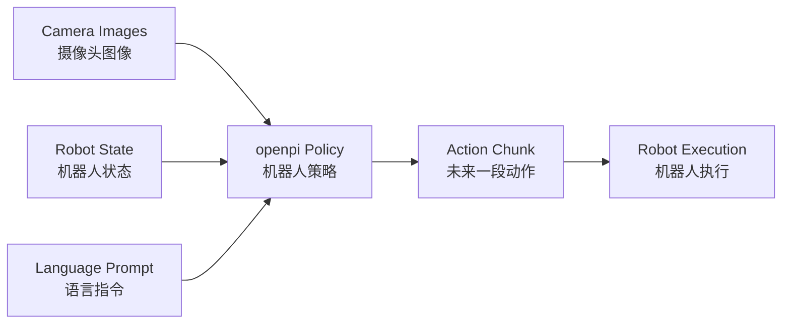

---

## 2. README 里的核心信息

README 主要讲了这些事情：

| README 部分 | 中文理解 | 你应该关注什么 |
|---|---|---|
| Project Introduction | 项目介绍 | openpi 包含哪些机器人模型 |
| Requirements | 硬件和系统要求 | GPU 显存、Ubuntu 版本 |
| Installation | 安装方法 | `uv`、submodules、Docker |
| Model Checkpoints | 模型权重 | base checkpoints 和 fine-tuned checkpoints |
| Running Inference | 跑推理 | 怎么用几行代码调用 policy |
| Fine-Tuning | 微调自己的数据 | 数据格式、config、norm stats、训练命令 |
| PyTorch Support | PyTorch 支持 | 哪些功能支持，哪些还不支持 |
| Examples / Docs | 示例和文档 | DROID、ALOHA、LIBERO、remote inference |

README 中有一句很重要的话：这个仓库目前包含三类模型：

1. **π₀ model**：flow-based VLA。
2. **π₀-FAST model**：autoregressive VLA，基于 FAST action tokenizer。
3. **π₀.₅ model**：π₀ 的升级版，强调更好的 open-world generalization。

同时 README 也提醒：这些模型原本主要为 Physical Intelligence 自己的机器人系统开发，迁移到你自己的机器人平台时不一定一定成功。

---

## 3. 三个模型：π₀、π₀-FAST、π₀.₅

### 3.1 π₀：flow-based VLA

`π₀` 是 **flow-based vision-language-action model**。这里的 “flow-based” 可以理解为：模型不是直接一次性吐出动作，而是从噪声动作开始，逐步修正，最后得到真实可执行动作。

更通俗地说：

> 它像是在“从一团乱动作中慢慢修出合理动作”。

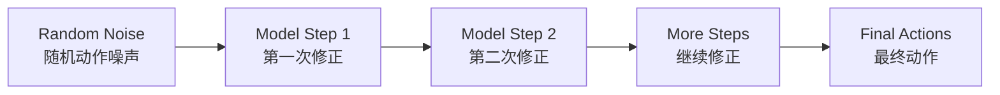

在代码上，`models/pi0.py` 是核心文件之一：

- `compute_loss()`：训练时使用，让模型学会从 noisy actions 预测真实动作方向。
- `sample_actions()`：推理时使用，从 noise 开始逐步生成动作。

### 3.2 π₀-FAST：autoregressive VLA

`π₀-FAST` 是 **autoregressive VLA**。Autoregressive 的意思是：像 GPT 预测下一个词一样，模型一步一步预测动作 token。

它依赖 **FAST action tokenizer**：

- 把连续动作（continuous actions）变成离散 token（discrete tokens）。
- 模型像语言模型一样预测 token。
- 最后再把 token 解码回机器人动作。

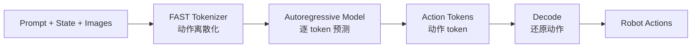

一句话区别：

| 模型 | 动作生成方式 | 类比 |
|---|---|---|
| π₀ | Flow matching / diffusion-like | 从噪声中修动作 |
| π₀-FAST | Autoregressive token generation | 像 GPT 写动作 token |

### 3.3 π₀.₅：升级版 π₀

`π₀.₅` 是 π₀ 的升级版本。README 说明它有更好的 **open-world generalization（开放世界泛化能力）**，并且使用了 **knowledge insulation** 的训练思想。

这里可以这样理解：

- `π₀`：基础 flow-based VLA。
- `π₀.₅`：更强的升级版，尤其强调在更多场景中泛化。
- 当前仓库里，π₀.₅ 主要支持 flow matching head 的训练和推理。

---

## 4. 核心术语表：中英对照

| 中文 | English | 在 openpi 里的意思 |
|---|---|---|
| 视觉-语言-动作模型 | VLA, Vision-Language-Action model | 同时理解图像、语言和动作的机器人模型 |
| 策略 | Policy | 推理时真正调用的接口，输入 observation，输出 actions |
| 观测 | Observation | 图像、状态、语言 prompt 等模型输入 |
| 动作 | Action | 机器人要执行的控制量 |
| 动作片段 | Action chunk | 一次推理输出的一段未来动作 |
| 动作维度 | Action dimension / action_dim | 每一步动作向量的长度 |
| 动作长度 | Action horizon | 一次输出多少步动作 |
| 归一化 | Normalization | 把 state/action 转成适合模型学习的数值范围 |
| 反归一化 | Unnormalization | 把模型输出变回真实机器人动作范围 |
| 微调 | Fine-tuning | 在自己的机器人数据上继续训练 base model |
| 权重 | Checkpoint | 已训练好的模型参数 |
| 基础模型 | Base model | 预训练模型，通常用于微调 |
| 专家模型 | Expert checkpoint | 已在某个机器人或任务上微调好的模型 |
| 数据转换 | Transform | 把原始数据整理成模型需要的格式 |
| 远程推理 | Remote inference | GPU server 跑模型，机器人电脑通过网络请求动作 |
| 低秩适配 | LoRA, Low-Rank Adaptation | 一种省显存的微调方法 |
| 全量微调 | Full fine-tuning | 更新模型大部分或全部参数 |
| 自回归 | Autoregressive | 每次预测下一个 token |
| Flow matching | Flow matching | 从噪声逐步生成动作的一类训练/采样方式 |

---

## 5. 仓库总览

openpi 顶层目录大致可以这样理解：

```text
openpi/
├── docs/                       # 文档：Docker、remote inference、norm stats
├── examples/                   # 具体机器人/benchmark 示例
├── packages/openpi-client/     # 轻量客户端，用于远程请求 policy server
├── scripts/                    # 命令行入口：训练、推理 server、norm stats
├── src/openpi/                 # 主源码
├── third_party/                # 第三方依赖或 benchmark 子模块
├── README.md                   # 项目总说明
├── pyproject.toml              # Python 依赖与项目配置
└── uv.lock                     # uv 锁定依赖版本
```

### 仓库心智图

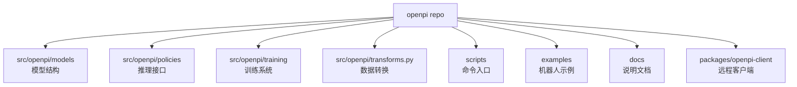

---

## 6. `src/openpi/` 主源码目录

`src/openpi/` 是项目最重要的目录。它大概分成这些模块：

```text
src/openpi/
├── models/             # JAX 模型：π₀、π₀-FAST、tokenizer、vision encoder 等
├── models_pytorch/     # PyTorch 模型实现与 transformers patch
├── policies/           # Policy 封装：把模型变成可调用接口
├── serving/            # Policy server / websocket 服务相关
├── shared/             # 共享工具：下载、数组类型、归一化、nnx utils 等
├── training/           # 训练配置、数据加载、优化器、checkpoint 等
├── transforms.py       # 数据格式转换中心
├── transforms_test.py  # transforms 的测试
└── py.typed            # 类型标记文件
```

其中最值得先看的四块是：

1. `models/`：模型大脑。
2. `policies/`：如何把模型包装成可推理对象。
3. `transforms.py`：如何把各种机器人数据转成统一格式。
4. `training/`：如何训练和微调。

---

## 7. `models/`：模型的大脑

`src/openpi/models/` 下面包括这些重要文件：

```text
models/
├── gemma.py             # 语言模型部分 / PaliGemma-style language backbone
├── gemma_fast.py        # FAST 相关语言模型实现
├── lora.py              # LoRA 微调相关
├── model.py             # 通用模型接口与数据结构
├── pi0.py               # π₀ / π₀.₅ JAX 模型主体
├── pi0_config.py        # π₀ / π₀.₅ 配置
├── pi0_fast.py          # π₀-FAST 模型主体
├── siglip.py            # 视觉编码器相关
├── tokenizer.py         # prompt / action tokenizer
├── vit.py               # Vision Transformer 相关
└── utils/               # 模型辅助工具
```

### 7.1 `model.py`：统一接口

`model.py` 的作用是定义模型的通用输入输出接口。可以把它看成 openpi 模型系统的“合同”。

常见概念：

- `Observation`：模型输入，包含图像、图像 mask、state、prompt tokens 等。
- `Actions`：模型输出或训练标签。
- `BaseModel`：模型基类，约定模型要支持训练 loss 和动作采样。
- `BaseModelConfig`：模型配置基类。

模型最终想看到的输入大概长这样：

```python
observation = {
    "image": {
        "base_0_rgb": ...,          # 外部摄像头
        "left_wrist_0_rgb": ...,    # 左腕部摄像头
        "right_wrist_0_rgb": ...    # 右腕部摄像头
    },
    "image_mask": {...},
    "state": ...,                   # 机器人状态
    "tokenized_prompt": ...,        # 语言指令 token
    "tokenized_prompt_mask": ...
}
```

### 7.2 `pi0.py`：π₀ / π₀.₅ 的主体

`pi0.py` 的核心职责是：

- 接收 observation。
- 编码图像和语言。
- 结合 robot state。
- 在训练时计算 flow matching loss。
- 在推理时通过 `sample_actions()` 生成 action chunk。

训练时可以理解为：

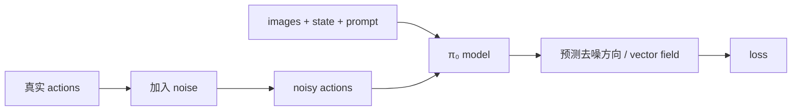

推理时可以理解为：

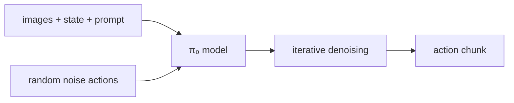

### 7.3 `pi0_fast.py`：π₀-FAST 的主体

`pi0_fast.py` 的关键不同点是：动作被 tokenizer 离散化，然后模型用自回归方式预测 token。

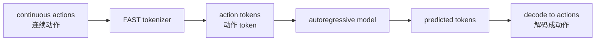

### 7.4 `tokenizer.py`

`tokenizer.py` 负责把语言 prompt 或动作转成模型能理解的 token。

两类 tokenizer 很重要：

- **PaligemmaTokenizer**：处理语言 prompt，有时也会处理 state。
- **FASTTokenizer**：用于 π₀-FAST，把 prompt、state、actions 组织成 token 序列。

### 7.5 `lora.py`

`lora.py` 实现 **LoRA（Low-Rank Adaptation，低秩适配）**。

LoRA 的目标：

> 不更新全部大模型参数，只训练一小部分低秩矩阵，从而节省显存和训练成本。

在 README 的硬件表里，LoRA fine-tuning 需要的显存明显低于 full fine-tuning。

---

## 8. `policies/`：把模型变成可调用策略

`src/openpi/policies/` 里面的文件大概是：

```text
policies/
├── aloha_policy.py       # ALOHA 机器人相关输入/输出处理
├── droid_policy.py       # DROID 机器人相关输入/输出处理
├── libero_policy.py      # LIBERO benchmark 相关输入/输出处理
├── policy.py             # 通用 Policy 类
├── policy_config.py      # 从 config + checkpoint 创建 Policy
└── policy_test.py
```

### 8.1 model 和 policy 的区别

这是 openpi 里非常重要的区别：

| 概念 | 作用 | 类比 |
|---|---|---|
| Model | 神经网络本体 | 大脑 |
| Policy | 对外可调用的推理接口 | 把大脑装进机器人系统的控制器 |

你直接操作机器人时，通常不是直接调用 `model`，而是调用 `policy.infer()`。

### 8.2 `policy_config.py`

`policy_config.py` 里最重要的函数是：

```python
create_trained_policy(config, checkpoint_dir)
```

它做的事情包括：

1. 下载或定位 checkpoint。
2. 判断 checkpoint 是 JAX 还是 PyTorch。
3. 加载模型权重。
4. 根据 training config 创建 data transforms。
5. 加载 normalization stats。
6. 返回可以调用的 `Policy` 对象。

### 8.3 `policy.py`

`Policy.infer()` 是推理入口。它的逻辑可以这样看：

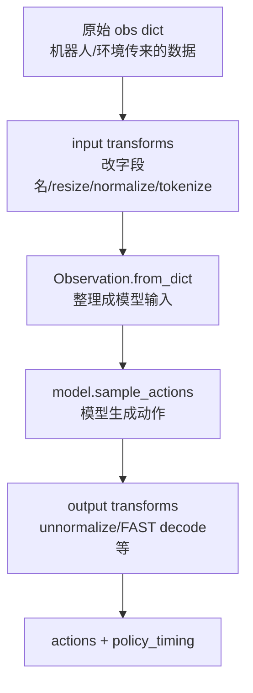

也就是说，`Policy.infer()` 不只是简单调用模型，它还负责推理前后的数据整理。

---

## 9. `transforms.py`：最容易被低估但最重要的文件

机器人数据非常不统一。不同机器人有不同摄像头、不同字段名、不同动作维度、不同 state 表示。`transforms.py` 的作用就是把这些乱七八糟的数据整理成模型能吃的统一格式。

### 9.1 为什么 transforms 很重要？

如果你把 openpi 接到自己的机器人上，最可能需要改的不是模型结构，而是 transform。

例如：

```text
你的原始数据字段：
observation.images.front
observation.images.wrist
observation.joint_pos
control.action

模型想要：
image/base_0_rgb
image/left_wrist_0_rgb
state
actions
prompt
```

中间就需要 `RepackTransform`、`Normalize`、`ResizeImages`、`TokenizePrompt` 等步骤。

### 9.2 transforms 的整体流程

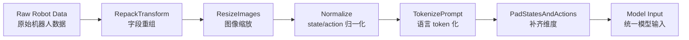

### 9.3 重要 transform 一览

| Transform | 中文解释 | 什么时候用 |
|---|---|---|
| `RepackTransform` | 字段重组 | 把原始数据 key 改成模型需要的 key |
| `InjectDefaultPrompt` | 注入默认 prompt | 没有语言指令时自动补一个 |
| `Normalize` | 归一化 | 训练/推理前缩放 state 或 actions |
| `Unnormalize` | 反归一化 | 把模型输出转回真实动作范围 |
| `ResizeImages` | 调整图像大小 | 模型通常要求固定图像尺寸 |
| `SubsampleActions` | 动作下采样 | 降低动作序列频率 |
| `DeltaActions` | 绝对动作转相对动作 | 用 state 作为参考，动作表示成变化量 |
| `AbsoluteActions` | 相对动作转绝对动作 | 推理后恢复成实际动作 |
| `TokenizePrompt` | prompt tokenization | 给 π₀ / π₀.₅ 使用 |
| `TokenizeFASTInputs` | FAST 输入 tokenization | 给 π₀-FAST 使用 |
| `ExtractFASTActions` | FAST token 解码 | 把 π₀-FAST 输出 token 转成动作 |
| `PromptFromLeRobotTask` | 从 LeRobot task 取 prompt | 数据集中用 task_index 表示任务时使用 |
| `PadStatesAndActions` | state/action 补维度 | 不同机器人 action_dim 不一致时使用 |

### 9.4 `Group` 和 input/output transforms

`transforms.Group` 把 transforms 分成两类：

- `inputs`：模型推理/训练前使用。
- `outputs`：模型输出后使用。

例如：

```text
input transforms:
raw data → repack → resize → normalize → tokenize → pad

output transforms:
model actions → unnormalize → absolute actions → final robot command
```

这就是为什么 policy 不只是 model wrapper，它还要管理 transforms。

---

## 10. `training/`：训练和微调系统

`src/openpi/training/` 目录包括：

```text
training/
├── checkpoints.py          # checkpoint 保存/加载
├── config.py               # 训练配置中心
├── data_loader.py          # 数据加载
├── droid_rlds_dataset.py   # DROID RLDS 数据支持
├── optimizer.py            # 优化器配置
├── sharding.py             # 多设备/分片相关
├── utils.py                # 训练辅助函数
├── weight_loaders.py       # 权重加载逻辑
└── misc/                   # 额外配置，如 RoboArena configs
```

### 10.1 `config.py`：训练系统的大脑

`config.py` 是整个训练系统最核心的文件之一。它定义：

- 用哪个模型（model config）
- 用哪个数据集（data config）
- 数据如何 transform
- 加载哪个 base checkpoint
- batch size 多大
- 训练多少步
- optimizer 怎么设置
- 是否 LoRA
- checkpoint 保存到哪里
- 是否用 EMA / FSDP 等训练策略

可以把 `TrainConfig` 理解成一张训练总表：

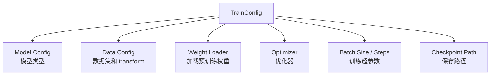

### 10.2 `data_loader.py`

`data_loader.py` 负责把训练数据读出来，并应用数据处理流程。

支持的方向包括：

- LeRobot dataset
- DROID / RLDS dataset
- fake dataset，用于调试或测试

训练时的数据流：

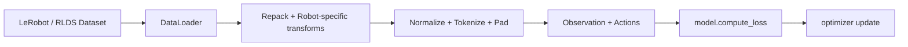

### 10.3 `checkpoints.py` 和 `weight_loaders.py`

- `checkpoints.py`：负责保存和恢复模型参数。
- `weight_loaders.py`：负责从 base model 或已有 checkpoint 初始化模型。

这两个文件在微调时很重要，因为 openpi 通常不是从零训练，而是从已经预训练好的 base checkpoint 开始。

---

## 11. `scripts/`：命令行入口

`scripts/` 目录是用户最常直接运行的地方：

```text
scripts/
├── compute_norm_stats.py  # 计算 normalization statistics
├── serve_policy.py        # 启动 policy server
├── train.py               # JAX 训练入口
├── train_pytorch.py       # PyTorch 训练入口
├── train_test.py          # 训练测试
└── docker/                # Docker 相关脚本
```

### 11.1 `compute_norm_stats.py`

训练前经常需要先运行：

```bash
uv run scripts/compute_norm_stats.py --config-name pi05_libero
```

它的作用是根据训练数据计算 state/action 的统计量，例如 mean、std 或 quantile stats。没有这些统计量，模型可能看到尺度混乱的数据，训练和推理都会不稳定。

### 11.2 `train.py`

JAX 版本训练入口：

```bash
XLA_PYTHON_CLIENT_MEM_FRACTION=0.9 \
uv run scripts/train.py pi05_libero --exp-name=my_experiment --overwrite
```

其中：

- `pi05_libero`：config 名字。
- `--exp-name`：实验名。
- `--overwrite`：允许覆盖已有 checkpoint。
- `XLA_PYTHON_CLIENT_MEM_FRACTION=0.9`：让 JAX 使用更多 GPU 显存。

### 11.3 `train_pytorch.py`

PyTorch 版本训练入口。README 说明 PyTorch 版本使用与 JAX 类似的 API，但部分功能暂时不支持，例如 π₀-FAST、LoRA、EMA、FSDP 等。

### 11.4 `serve_policy.py`

启动 policy server：

```bash
uv run scripts/serve_policy.py policy:checkpoint \
  --policy.config=pi05_libero \
  --policy.dir=checkpoints/pi05_libero/my_experiment/20000
```

启动后，机器人或仿真环境可以通过网络发送 observation，server 返回 actions。

---

## 12. `examples/`：具体机器人和 benchmark 示例

`examples/` 目录包括：

```text
examples/
├── aloha_real/                    # ALOHA 真机
├── aloha_sim/                     # ALOHA 仿真
├── droid/                         # DROID 平台
├── libero/                        # LIBERO benchmark
├── simple_client/                 # 简单客户端示例
├── ur5/                           # UR5 机械臂示例
├── convert_jax_model_to_pytorch.py # JAX checkpoint 转 PyTorch
├── inference.ipynb                # 推理 notebook
└── policy_records.ipynb           # policy 记录分析 notebook
```

### 12.1 DROID 示例

DROID 示例展示如何在真实 DROID 机器人平台上运行 π₀.₅-DROID policy。

典型方式：

1. GPU 机器启动 policy server。
2. DROID 控制电脑安装轻量 `openpi-client`。
3. 控制电脑采集图像和 state。
4. 通过网络请求 server。
5. server 返回 action chunk。
6. DROID 执行动作。

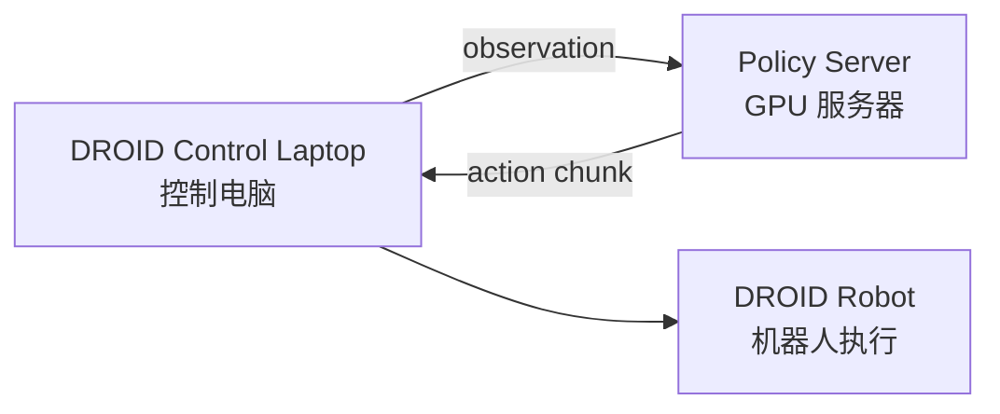

### 12.2 LIBERO 示例

LIBERO 是一个机器人操作 benchmark，常用于评估模型在仿真任务上的表现。

LIBERO 示例推荐使用 Docker，因为涉及 Mujoco、OpenGL、仿真环境等依赖。README 里还给出了 `pi05_libero` checkpoint 在 LIBERO 任务套件上的结果。

### 12.3 ALOHA Sim 示例

ALOHA Sim 示例展示如何在仿真环境里跑 policy。通常需要两个终端：

- 终端 1：启动仿真。
- 终端 2：启动 policy server。

这和真实机器人部署很像，只是 robot execution 换成了 simulator execution。

---

## 13. `docs/`：补充文档

`docs/` 目录包括：

```text
docs/
├── docker.md             # Docker 安装和运行说明
├── norm_stats.md         # normalization statistics 说明
└── remote_inference.md   # 远程推理说明
```

### 13.1 Docker

Docker 不是必须，但官方文档推荐用于示例环境，因为机器人项目经常有复杂依赖，例如 ROS、Mujoco、GPU runtime、OpenGL 等。

Docker 的优势：

- 环境更稳定。
- 避免污染本机 Python 环境。
- 对需要 ROS 的示例更友好。

### 13.2 Remote inference

远程推理的思想：

> 模型很大，机器人电脑可能没有强 GPU，所以让 GPU server 跑模型，让机器人电脑只负责发送 observation 和执行 actions。

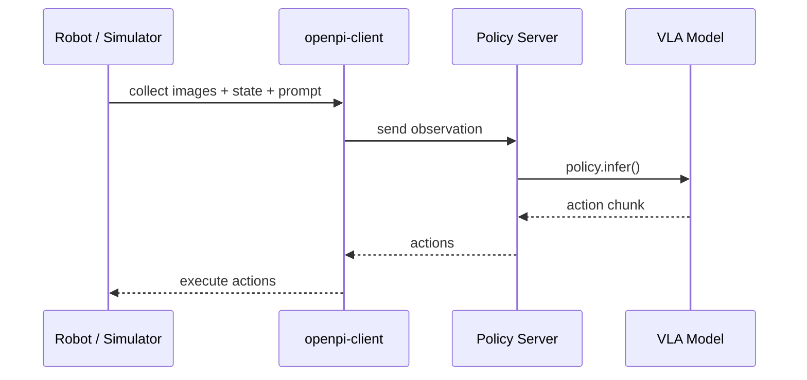

### 13.3 Norm stats

Normalization statistics 是训练和推理一致性的关键。

如果训练时 action 被归一化了，推理时模型输出也需要用相同的统计量反归一化。否则机器人收到的动作尺度会不对。

---

## 14. 安装与环境

README 中说明，仓库主要在 Ubuntu 22.04 上测试。硬件要求大致如下：

| 模式 | 显存需求 | 示例 GPU |
|---|---:|---|
| Inference | > 8 GB | RTX 4090 |
| Fine-tuning with LoRA | > 22.5 GB | RTX 4090 |
| Full fine-tuning | > 70 GB | A100 80GB / H100 |

### 14.1 克隆仓库

注意要带 submodules：

```bash
git clone --recurse-submodules git@github.com:Physical-Intelligence/openpi.git
```

如果已经克隆了：

```bash
git submodule update --init --recursive
```

### 14.2 使用 uv 安装

README 使用 `uv` 管理 Python 依赖：

```bash
GIT_LFS_SKIP_SMUDGE=1 uv sync
GIT_LFS_SKIP_SMUDGE=1 uv pip install -e .
```

这里的 `GIT_LFS_SKIP_SMUDGE=1` 是为了处理 LeRobot 依赖。

### 14.3 使用 Docker

如果本机环境复杂，建议优先看 Docker 文档。机器人项目非常容易因为 CUDA、Mujoco、OpenGL、ROS 版本不一致而出问题。

---

## 15. Checkpoints：base model 和 expert model

README 里把 checkpoints 分为两类：

### 15.1 Base checkpoints

Base checkpoint 是在大量机器人数据上预训练好的基础模型，通常用于继续微调。

| 模型 | 用途 | checkpoint |
|---|---|---|
| π₀ | Fine-tuning base | `gs://openpi-assets/checkpoints/pi0_base` |
| π₀-FAST | Fine-tuning base | `gs://openpi-assets/checkpoints/pi0_fast_base` |
| π₀.₅ | Fine-tuning base | `gs://openpi-assets/checkpoints/pi05_base` |

### 15.2 Fine-tuned / expert checkpoints

Expert checkpoint 已经在某个机器人或任务上微调过，可以直接尝试运行。

| 模型 | 场景 | checkpoint |
|---|---|---|
| π₀-FAST-DROID | DROID 桌面操作 | `pi0_fast_droid` |
| π₀-DROID | DROID，flow matching | `pi0_droid` |
| π₀-ALOHA-towel | ALOHA 毛巾折叠 | `pi0_aloha_towel` |
| π₀-ALOHA-tupperware | ALOHA 食物盒操作 | `pi0_aloha_tupperware` |
| π₀-ALOHA-pen-uncap | ALOHA 拔笔帽 | `pi0_aloha_pen_uncap` |
| π₀.₅-LIBERO | LIBERO benchmark | `pi05_libero` |
| π₀.₅-DROID | DROID，语言跟随更强 | `pi05_droid` |

注意：expert checkpoint 不保证在你的机器人上一定能用，因为相机位置、动作空间、机器人结构、任务分布都可能不同。

---

## 16. 推理流程：从 observation 到 actions

README 给出的核心推理代码大概是：

```python
from openpi.training import config as _config
from openpi.policies import policy_config
from openpi.shared import download

config = _config.get_config("pi05_droid")
checkpoint_dir = download.maybe_download("gs://openpi-assets/checkpoints/pi05_droid")

policy = policy_config.create_trained_policy(config, checkpoint_dir)

action_chunk = policy.infer(example)["actions"]
```

### 16.1 这几行代码背后发生了什么？

```mermaid
flowchart TD
    A[get_config("pi05_droid")] --> B[读取训练配置]
    B --> C[download checkpoint]
    C --> D[create_trained_policy]
    D --> E[加载模型权重]
    D --> F[创建 transforms]
    D --> G[加载 norm stats]
    E --> H[Policy]
    F --> H
    G --> H
    H --> I[policy.infer(example)]
    I --> J[action_chunk]
```

### 16.2 example 里应该有什么？

真实输入取决于具体 config 和 robot policy。DROID 例子里可能包括：

```python
example = {
    "observation/exterior_image_1_left": ...,
    "observation/wrist_image_left": ...,
    "observation/joint_position": ...,
    "prompt": "pick up the fork"
}
```

但模型最终不是直接吃这些原始 key，而是经过 transforms 转成统一格式。

### 16.3 action chunk 是什么？

`action_chunk` 是一段未来动作，不是单步动作。

形状通常类似：

```text
actions.shape = (action_horizon, action_dim)
```

其中：

- `action_horizon`：一次输出多少步。
- `action_dim`：每一步动作向量多长。

机器人一般不会盲目执行完整 chunk 很久，而是执行其中几步后重新观察环境，再请求下一段动作。这叫 receding horizon control，有点像“边看边走”。

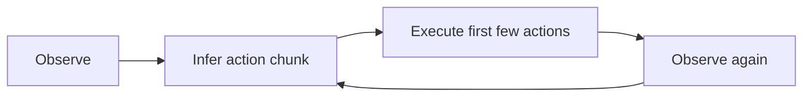

---

## 17. 训练 / 微调流程

README 把微调分成三步：

1. 把你的数据转成 LeRobot dataset。
2. 定义 training configs 并运行训练。
3. 启动 policy server 做推理。

### 17.1 总体流程图

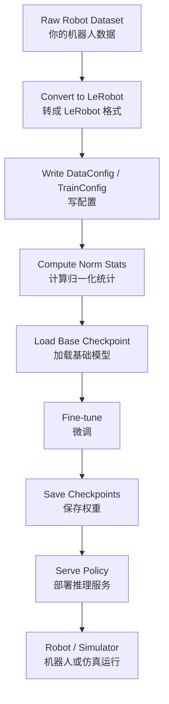

### 17.2 Step 1：转成 LeRobot dataset

openpi 训练流程使用 LeRobot dataset 格式。你自己的数据至少应该能表达：

- 图像：camera images
- 状态：robot state
- 动作：actions
- 任务文本：prompt / task

LIBERO 示例提供了转换脚本：

```bash
uv run examples/libero/convert_libero_data_to_lerobot.py \
  --data_dir /path/to/your/libero/data
```

### 17.3 Step 2：定义 config

你需要告诉 openpi：

- 数据在哪里。
- 原始字段如何映射成模型字段。
- 使用哪个模型。
- 从哪个 checkpoint 加载。
- 训练多少步。
- batch size 是多少。
- 使用 LoRA 还是 full fine-tuning。

这通常在 `src/openpi/training/config.py` 中完成。

### 17.4 Step 3：计算 norm stats

运行：

```bash
uv run scripts/compute_norm_stats.py --config-name pi05_libero
```

为什么要做？

机器人动作可能有不同尺度：

- 关节角度可能在 `[-3.14, 3.14]`。
- 夹爪开合可能在 `[0, 1]`。
- 末端位置可能是米或厘米。

如果不归一化，模型训练会很困难。

### 17.5 Step 4：开始训练

JAX 训练命令：

```bash
XLA_PYTHON_CLIENT_MEM_FRACTION=0.9 \
uv run scripts/train.py pi05_libero \
  --exp-name=my_experiment \
  --overwrite
```

### 17.6 Step 5：启动 policy server

训练好以后：

```bash
uv run scripts/serve_policy.py policy:checkpoint \
  --policy.config=pi05_libero \
  --policy.dir=checkpoints/pi05_libero/my_experiment/20000
```

然后机器人或仿真环境就可以连接这个 server 请求动作。

---

## 18. JAX 与 PyTorch 支持

openpi 原始主线是 JAX，但 README 现在也说明支持 PyTorch 实现。

| 方面 | JAX | PyTorch |
|---|---|---|
| π₀ | 支持 | 支持 |
| π₀.₅ | 支持 | 支持 |
| π₀-FAST | 支持 | README 说明暂不支持 |
| LoRA training | 支持 | README 说明暂不支持 |
| EMA weights | 支持 | README 说明暂不支持 |
| FSDP training | 相关配置存在 | README 说明 PyTorch 暂不支持 |
| 适合谁 | 想用官方完整功能的人 | 更熟悉 PyTorch 的人 |

PyTorch 推理 API 与 JAX 类似，主要区别是 checkpoint 需要先转换或指向 PyTorch 格式。

---

## 19. 远程推理：为什么要 policy server？

真实机器人控制电脑通常不适合跑大模型，因为：

- 没有大显存 GPU。
- 要保持控制系统稳定。
- 机器人端环境和模型端环境依赖可能冲突。

所以 openpi 支持 remote inference：

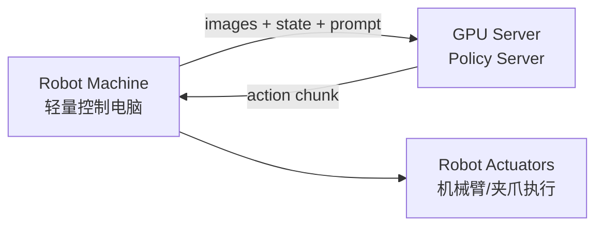

这种设计的好处：

- 机器人电脑只安装轻量 client。
- GPU server 可以用 4090 / A100 / H100。
- 模型和机器人环境隔离，调试更方便。

缺点：

- 网络延迟会影响控制。
- 需要保证 IP、port、firewall、网络稳定。
- 如果 action chunk 太短，延迟影响更明显。

---

## 20. 如果我要接自己的机器人，需要改哪里？

一般不是一上来改模型，而是先改数据和 policy。

### 20.1 你要准备的数据

| 数据 | 说明 |
|---|---|
| camera images | 至少一个外部摄像头，最好还有 wrist camera |
| robot state | 当前关节、夹爪、末端位姿等 |
| actions | 训练标签，表示机器人实际执行的动作 |
| prompt | 每段数据对应的语言任务 |
| timestamps | 最好有，用于对齐图像、state、action |

### 20.2 你最可能要写/改的地方

| 位置 | 为什么要改 |
|---|---|
| `transforms.py` 或 robot-specific transform | 你的字段名和模型字段名不同 |
| `policies/*_policy.py` | 你的机器人 action/state 格式不同 |
| `training/config.py` | 需要定义自己的数据集和训练配置 |
| LeRobot conversion script | 需要把原始数据转成标准数据集 |
| `serve_policy.py` 参数 | 部署时选择自己的 config 和 checkpoint |

### 20.3 接入自己的机器人：现实流程

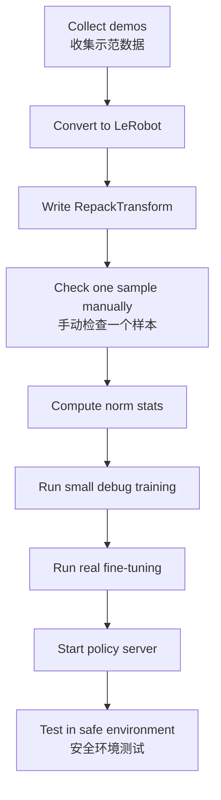

重点：先 debug 数据，再训练大模型。机器人学习项目里，数据字段错了比模型不够强更常见。

---

## 21. 代码调用链总结

### 21.1 推理调用链

```text
README / notebook
    ↓
_config.get_config("pi05_droid")
    ↓
policy_config.create_trained_policy(...)
    ↓
Policy(...)
    ↓
Policy.infer(obs)
    ↓
input transforms
    ↓
Observation.from_dict(...)
    ↓
model.sample_actions(...)
    ↓
output transforms
    ↓
actions
```

对应文件：

```text
src/openpi/training/config.py
src/openpi/policies/policy_config.py
src/openpi/policies/policy.py
src/openpi/transforms.py
src/openpi/models/model.py
src/openpi/models/pi0.py 或 pi0_fast.py
```

### 21.2 训练调用链

```text
scripts/train.py
    ↓
TrainConfig
    ↓
create_data_loader
    ↓
dataset + transforms
    ↓
Observation + Actions
    ↓
model.compute_loss
    ↓
optimizer update
    ↓
checkpoint save
```

对应文件：

```text
scripts/train.py
src/openpi/training/config.py
src/openpi/training/data_loader.py
src/openpi/transforms.py
src/openpi/models/pi0.py
src/openpi/training/checkpoints.py
```

---

## 22. 建议阅读源码顺序

不要一开始直接打开 `pi0.py` 死磕。推荐顺序如下：

### Level 1：先跑起来

1. `README.md`
2. `examples/inference.ipynb`
3. `scripts/serve_policy.py`

目标：知道怎么加载 checkpoint，怎么跑 `policy.infer()`。

### Level 2：理解推理数据流

1. `src/openpi/policies/policy_config.py`
2. `src/openpi/policies/policy.py`
3. `src/openpi/transforms.py`

目标：知道 raw observation 怎么变成模型输入，模型输出怎么变成 robot actions。

### Level 3：理解训练配置

1. `src/openpi/training/config.py`
2. `src/openpi/training/data_loader.py`
3. `scripts/compute_norm_stats.py`
4. `scripts/train.py`

目标：知道如何微调自己的数据。

### Level 4：理解模型结构

1. `src/openpi/models/model.py`
2. `src/openpi/models/pi0_config.py`
3. `src/openpi/models/pi0.py`
4. `src/openpi/models/pi0_fast.py`
5. `src/openpi/models/tokenizer.py`

目标：理解 VLA 模型本体。

---

## 23. 常见坑

### 23.1 显存不够

现象：OOM / CUDA out of memory。  
解决：

- 推理先用更小 batch。
- 微调用 LoRA 而不是 full fine-tuning。
- 使用更强 GPU。
- JAX 训练时设置 `XLA_PYTHON_CLIENT_MEM_FRACTION=0.9`。

### 23.2 忘记初始化 submodules

现象：LIBERO、third_party 相关代码找不到。  
解决：

```bash
git submodule update --init --recursive
```

### 23.3 norm stats 不匹配

现象：模型输出动作尺度怪异，机器人动作过大或过小。  
解决：训练和推理必须使用同一套 norm stats。

### 23.4 摄像头字段不匹配

现象：KeyError，或者模型拿不到图像。  
解决：检查 `RepackTransform` 和 robot policy 里的字段映射。

### 23.5 policy server 连不上

现象：client 无法请求动作。  
解决：检查 IP、port、防火墙、server 是否启动、同一网络是否可达。

### 23.6 模型在你的机器人上效果不好

可能原因：

- 相机角度和训练数据差异太大。
- action space 不一致。
- prompt 和训练任务分布不同。
- 物体、光照、桌面环境差异大。
- 数据量太少或示范质量不稳定。

README 也明确提醒：这些模型不保证适配所有机器人平台。

---

## 24. 一句话总结每个关键文件

| 文件 / 目录 | 一句话总结 |
|---|---|
| `README.md` | 项目总说明，包含安装、checkpoint、推理、微调 |
| `src/openpi/models/model.py` | 定义模型统一输入输出接口 |
| `src/openpi/models/pi0.py` | π₀ / π₀.₅ flow-based 模型主体 |
| `src/openpi/models/pi0_fast.py` | π₀-FAST 自回归动作 token 模型 |
| `src/openpi/models/tokenizer.py` | 语言和动作 tokenization |
| `src/openpi/models/lora.py` | LoRA 微调实现 |
| `src/openpi/transforms.py` | 数据清洗、字段映射、归一化、tokenize、padding |
| `src/openpi/policies/policy.py` | `Policy.infer()` 推理主流程 |
| `src/openpi/policies/policy_config.py` | 从 config 和 checkpoint 创建 policy |
| `src/openpi/policies/droid_policy.py` | DROID 平台适配 |
| `src/openpi/policies/libero_policy.py` | LIBERO benchmark 适配 |
| `src/openpi/policies/aloha_policy.py` | ALOHA 平台适配 |
| `src/openpi/training/config.py` | 训练配置中心 |
| `src/openpi/training/data_loader.py` | 数据加载和训练数据 pipeline |
| `src/openpi/training/checkpoints.py` | checkpoint 保存与加载 |
| `src/openpi/training/optimizer.py` | optimizer 设置 |
| `scripts/compute_norm_stats.py` | 计算 normalization stats |
| `scripts/train.py` | JAX 训练入口 |
| `scripts/train_pytorch.py` | PyTorch 训练入口 |
| `scripts/serve_policy.py` | 启动远程或本地 policy server |
| `examples/droid/` | DROID 真实机器人示例 |
| `examples/libero/` | LIBERO benchmark 示例 |
| `examples/aloha_sim/` | ALOHA 仿真示例 |
| `docs/remote_inference.md` | 远程推理说明 |
| `docs/docker.md` | Docker 使用说明 |
| `docs/norm_stats.md` | normalization stats 说明 |

---

## 25. 最后的整体图

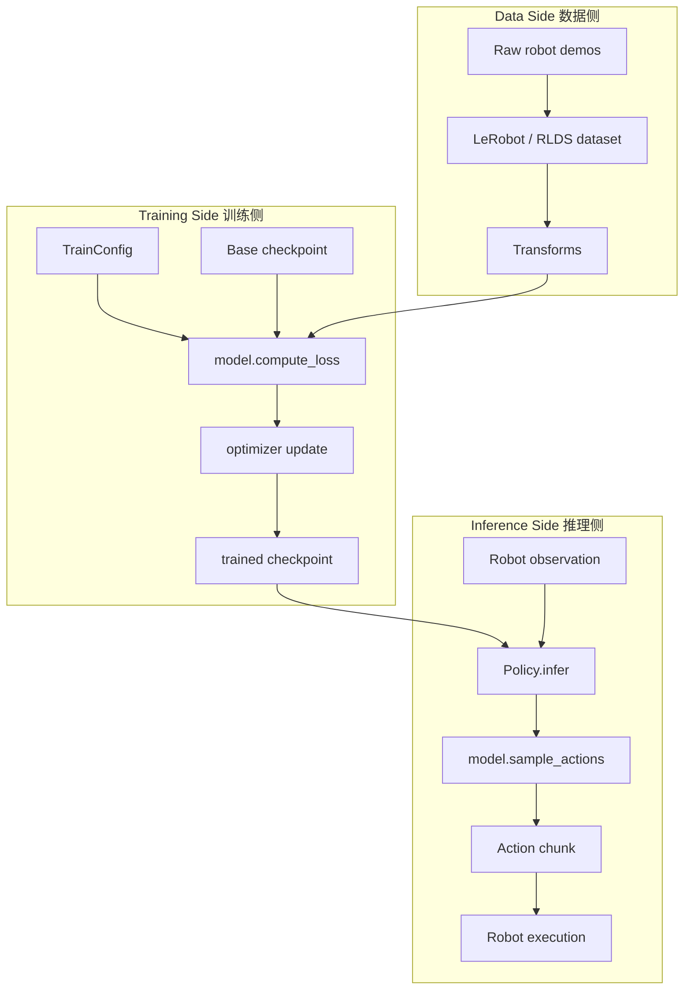

---

## 26. 这份 repo 的学习重点

如果你是第一次读 openpi，不要把注意力全放在神经网络公式上。真正的项目重点是：

1. **模型输入输出格式**：observation 和 actions 到底长什么样。
2. **数据转换**：raw robot data 如何经过 transforms 变成模型输入。
3. **policy 封装**：为什么机器人端调用的是 policy，而不是裸 model。
4. **checkpoint 和 norm stats**：模型参数和数据尺度必须匹配。
5. **微调流程**：LeRobot dataset → config → norm stats → train → serve。
6. **真实部署**：remote inference 是机器人系统里很常见的设计。

可以用一句话收尾：

> openpi 的难点不只是“模型很大”，更是“如何把真实机器人世界的数据整理成模型可以稳定学习和稳定执行的格式”。

---

## 27. 参考资料

- openpi GitHub README: https://github.com/Physical-Intelligence/openpi
- `src/openpi/` 主源码目录: https://github.com/Physical-Intelligence/openpi/tree/main/src/openpi
- `src/openpi/models/`: https://github.com/Physical-Intelligence/openpi/tree/main/src/openpi/models
- `src/openpi/policies/`: https://github.com/Physical-Intelligence/openpi/tree/main/src/openpi/policies
- `src/openpi/training/`: https://github.com/Physical-Intelligence/openpi/tree/main/src/openpi/training
- `src/openpi/transforms.py`: https://github.com/Physical-Intelligence/openpi/blob/main/src/openpi/transforms.py
- DROID example: https://github.com/Physical-Intelligence/openpi/tree/main/examples/droid
- LIBERO example: https://github.com/Physical-Intelligence/openpi/tree/main/examples/libero
- ALOHA Sim example: https://github.com/Physical-Intelligence/openpi/tree/main/examples/aloha_sim
- Remote inference docs: https://github.com/Physical-Intelligence/openpi/blob/main/docs/remote_inference.md
- Docker docs: https://github.com/Physical-Intelligence/openpi/blob/main/docs/docker.md

